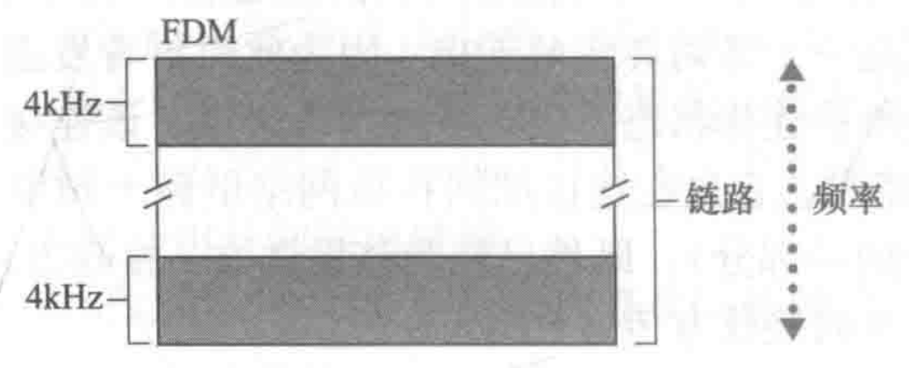
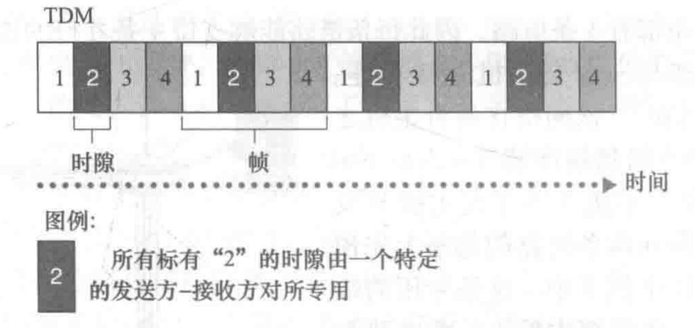
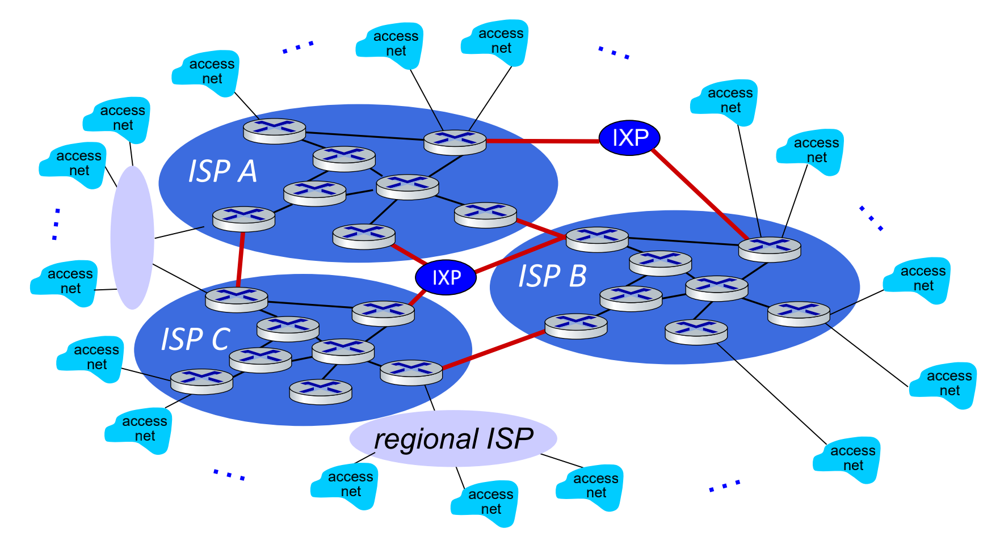
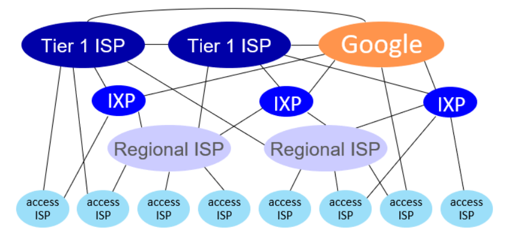
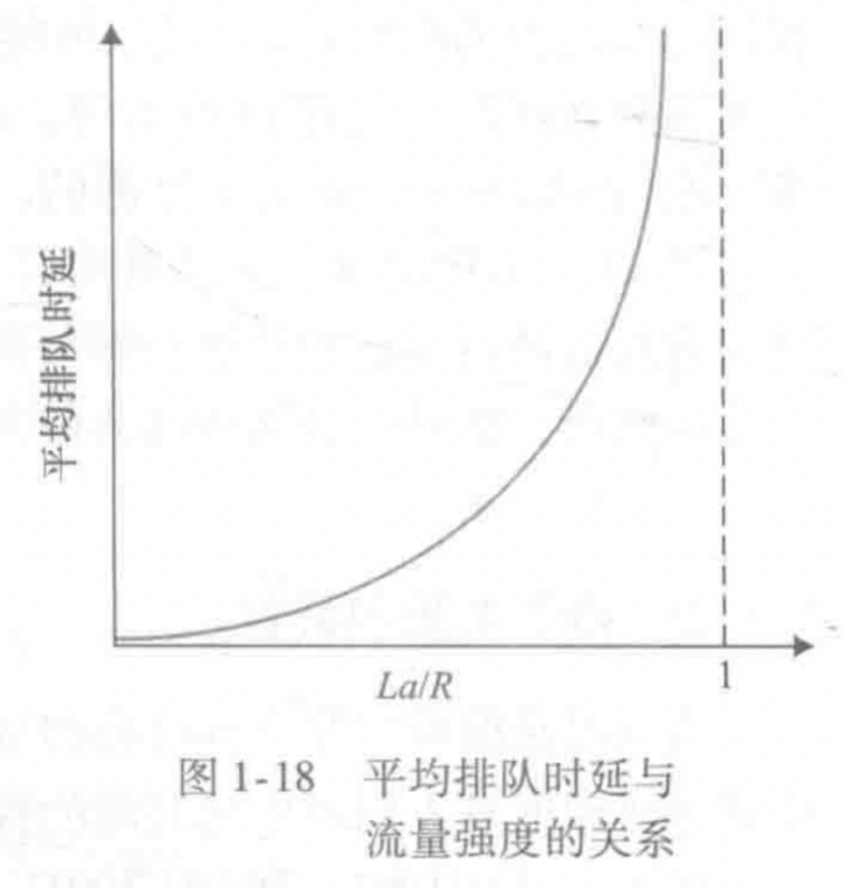
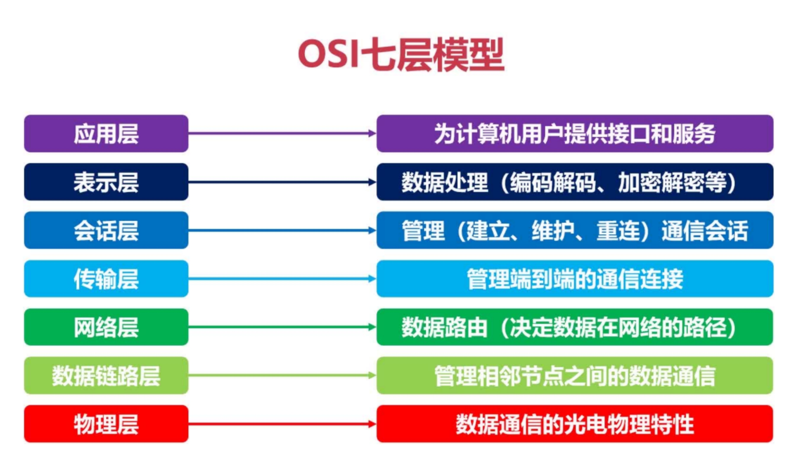

[TOC]

---

# § 第一章 计算机网络和因特网

## § 1.1 因特网概念

> ###### 基础概念
>
> | 概念                                 | 说明                                                         |
> | ------------------------------------ | ------------------------------------------------------------ |
> | 因特网                               | 一个世界范围的计算机网络;                                    |
> | 协议 (protocol)                      | 协议定义了在两个或多个通信实体之间交换的报文的格式和顺序, 以及报文发送、报文接收、事件接收等时所采取的动作; |
> | 主机 (host; 端系统, end system) | 与因特网相连的计算机和其他设备;                              |
> | 边缘路由器 (edge router)        | 端系统到任何其他远程端系统的路径上的第一台路由器;            |
>
> ---
>
> ###### 主机 (host) 的分类
>
> -   客户 (client): 如PC、智能手机等;
> -   服务器 (server): 用于存储和发布Web页面、流视频、中继电子邮件等的机器;
>
> ---
>
> ###### 主机之间的两种 communication modes
>
> -   C/S (Clien/Server), 如: 浏览器-服务器;
> -   P2P (Peer-to-Peer)

---

## § 1.2 网络边缘

> ###### 接入网 (Access net): 将端系统物理连接到边缘路由器的网络
>
> -   个人网络接入
>     -   数字用户线 (DSL, Digital Subscribe Line)
>         使用本地电话线进行接入;
>     -   电缆因特网接入 (cable Internet access)
>         使用现有的有线电视线缆进行接入;
>     -   光纤到户 (FTTH, Fiber To The Home)
>         从本地中心局直接到家庭提供一根光纤路径;
> -   企业接入: 以太网、WiFi
> -   广域网无线接入: LTE、4G、5G
>
> ---
>
> ###### 物理媒体 (physical medium)
>
> -   导引型媒体 (guided media)
>     电波沿着固体媒体前行, 如: 光缆、双绞铜线、同轴电缆……
> -   非导引型媒体 (unguided media)
>     电波在空气或外层空间中传播, 如: 无线局域网、数字卫星频道……

---

## § 1.3 网络核心

> ###### 通信网络的分类
>
> - 电路交换网络
>     - FDM (频分复用)
>     - TDM (时分复用)
> - 分组交换网络
>     - 虚电路网络
>     - 数据报网络

### A. 电路交换 (circuit switching) 网络

> ###### 概述
>
> - 不考虑需求, 预先分配了链路的使用;
>     - 连接建立期间, 该链路不管是否闲置都将被保留给此连接, 直到连接断开;
>
> ---
>
> ###### 电路交换网络的分类: 按照复用方法
>
> <left>  </left>
>
> -   频分复用 (Frequency-Division Multiplexing, FDM)
>     -   链路的**频谱**被跨越该链路创建的所有的连接共享, **每条链路占用一定宽度的频率**, 例如: 每个频段的带宽是4KHz;
> -   时分复用 (Time-Division Multiplexing, TDM)
>     - 时间被划分为固定期间的**帧**, 每个**帧被划分为固定的时隙**;
>     - 每一帧相当于一个 "周期", 周期中的每个时隙对应 (分配给) 一个发送方-接收方对;
>
> ----
>
> ###### 不适合计算机之间的通信
>
> - 连接建立时间长;
> - 计算机之间的通信有突发性, 如果使用线路交换, 则浪费的片较多;
>     - 即使这个呼叫没有数据传递, 其所占据的片也不能够被别的呼叫使用;
> - 可靠性低, 需要维持很多链路之间的关系;

---

### B. 分组交换 (packet switching) 网络

> ###### 概述
>
> - 按需分配链路的使用;
>
> ---
>
> ###### 相关概念
>
> | 概念                       | 说明                                                    |
> | -------------------------- | ------------------------------------------------------- |
> | 分组 (packet)              | 将长的报文划分为许多较小的数据块, 称为分组;             |
> | 分组交换机 (packet switch) | 分为: 路由器 (router), 链路交换机 (link-layer switch)   |
> | 转发表 (forwarding table)  | 用于将目的地址 (或者是目的地址的一部分) 映射成输出链路; |
>
> ---
>
> ###### 分组交换网络的分类: 按照有无网络层的连接
>
> - 数据报 (datagram) 网络
>     - 在通信之前, 无须建立起一个连接, 有数据就传输;
>     - 每个分组有独立路由;
>     - 路由器根据分组目标地址决定下一路由;
>     - 在不同阶段, 路由可以改变;
>     - 类似于每个分组 "问路";
> - 虚电路网络
>     - 每个分组都带标签 (虚电路标识 VC ID), 标签决定下一跳;
>     - 在**呼叫建立时决定路径, 整个呼叫中保持该路径不变**;
>     - 路由器维持每个呼叫的状态信息;
>
> ----
>
> ###### 特点
>
> - 具有比电路交换**更好的带宽共享**;
> - 比电路交换**简单有效, 成本低**;
> - **端到端时延不可预测** (因为排队时延是变动的, 不可预测的);

#### 分组交换网络实现方法: 存储转发传输 (store-and-forward transmission)

> ###### 概述
>
> - 在分组交换机发送某一组数据前, 必须先接收到该组的所有数据;
> - 分组交换机中存在缓存区, 用来暂时存储一些分组;
>
> ---
>
> ###### 输出缓存 (output buffer; 输出队列, output queue)
>
> - 分组交换机中, 对每一条连接的链路分配一个输出缓存, 用来存储路由器准备发往该链路的分组;
>
> ---
>
> ###### 时延
>
> - 端到端时延 (简化版): $\large d_{端到端}=N\cdot\frac{L}{R}$
>     - 其中: $L$ 为分组长度 (bit), $R$ 为链路的传输速率 (bit/s);
> - 排队时延 (queuing delay)
>     - 当某条链路正忙时, 路由器中的对应分组必须**在输出缓存中等待**, 该时延称为排队时延;
>     - 该时延时根据网络的拥塞程度而**变化的**;
>
> ---
>
> ###### 分组丢失 (丢包, packet loss)
>
> - 当输出缓存被用完时, 新到达的分组, 或者已经在排队的分组之一将会丢失, 称为丢包;

---

### 因特网结构: 网络的网络

> ###### 图示
>
> <left>  </left>
>
> ---
>
> ###### 不同的 ISP
>
> - `接入 ISP (access net)`
>     - `端系统` 经过 `接入 ISP` 与因特网相连;
>     - `接入 ISP` 与 `区域 ISP` 连接, 并向其付费;
>     - `接入 ISP` 如: 电信局, 大学, 公司等;
> - `区域 ISP (ragional ISP)`
>     - `区域 ISP` 与 `第一层 ISP` 相连, 并向其付费;
>     - `区域 ISP` 可以具有**多个层级**, 例如我国的城市区域, 省级区域, 国家级区域 ISP;
> - `第一层 ISP (tier-1 ISP)`
>     - 最大规模的 ISP, 位于顶部;
>     - 多个 `第一层 ISP` 之间互相对等, 如: Level 3 Communications, AT&T, NTT, Sprint......
>     - 第一层 ISP **不向任何人付费**;
>
> ---
>
> ###### 一些实体
>
> - `存在点 (PoP, Point of Presence)`
>     - 存在于除了底层 (接入 ISP) 以外所有层次中, 是指提供商网络中的一台或多台路由器群组;
>
>     - PoP 中的路由器群组在同一个物理位置上;
>
>     - `客户 ISP` 将自己的路由器连接到 PoP 中的一台路由器上, 即可与对应的 `提供商 ISP` 相连;
>
> - `IXP (Internet Exchange Point)`
>     - 一个汇合点, **多个 ISP 可以在这里一起对等**;
>
> ---
>
> ###### 几种关系
>
> - 多宿 (multi-home)
>
>     - 多宿是指某个 ISP 可以**与一个或多个其上级的 `提供商 ISP` 相连接**;
>
>     - 除了 `第一层 ISP` 外, 其余 ISP 均可以选择多宿;
>
>     - 可以提高所提供服务的**可靠性**, 即使提供商 ISP 其中之一故障, 仍能正确转发分组;
>
> - 对等 (Peer; peering link)
>
>     - 相同等级结构层次的邻近一对 ISP 能够建立对等连接: 将它们的网络直接连接在一起;
>
>     - 对等 ISP 之间**通常不进行结算**;
>
>     - 对等 ISP 之间的分组可以直接相互传输, 而不需要经由其上级 ISP, **降低了费用**;
>
>
> ---
>
> ###### 内容提供商网络 (Content provider network) 例子: 谷歌专用网络
>
> - 仅承载特定的流量;
> - 通过专用的 TCP / IP 网络进行互联;
> - 跨越全球, 独立于公共互联网;
> - 尝试经过 IXP 或直接连接的方式, 与较低层的 ISP 对等, 从而绕过**较高层的 ISP**;
>     - 减少费用, 提高服务质量, 掌握更多控制权;
>     - 但**仍然与第一层 ISP 连接**, 因为个别 ISP 只能通过第一层 ISP 到达;

---

## § 1.4 分组交换网中的时延、丢包和吞吐量

### 节点总时延 $d_{nodal}$

> ###### 总时延
>
> - 下述时延的综合: $d_{nodal}=d_{proc}+d_{queue}+d_{trans}+d_{prop}$
>
> ---
>
> ###### 细分
>
> - 节点处理时延 (nodal processing delay, $d_{proc}$ )
>
>     -   路由器检查分组首部、决定将该分组导向何处所需的时间;
>
> - 排队时延 (queuing delay, $d_{queue}$ )
>
>     -   在队列中, 分组在链路上等待传输时所经历的时延;
>
>     -   它的长短取决于正在排队等待向链路传输的分组数量;
>
> - 传输时延 (transmission delay, $d_{trans}$ )
>
>     -   对于以先到先服务的方式传播的分组传输方式, 假设其速率 $R = a~Mbps$ , 由于传输长度为 $L$ 的数据需要时间 $\frac{L}{R}$ , 该时延称为传输时延;
>
>     -   对于低速率的链路而言, 这个时延较长, 达到微秒, 毫秒级;
>
>     -   即: 分组交换器将整个分组全部发送到链路中所需要的时间;
>
> - 传播时延 (propagation delay, $d_{prop}$ )
>
>     -   比特信号在传播信号的物理媒体中传输所需要的时间;
>
>     -   由距离决定;
>
>     -   对于光纤、双绞铜线等媒体, 其速率范围为 $2\times10^8$ ~ $3\times10^8$ ;
>
>
> ---
>
> ###### 端到端时延 (end-to-end delay, $d_{end-end}$)
>
> -   下式为不考虑排队时延时的情况;
> -   $d_{end-end} = N(d_{proc}+d_{trans}+d_{prop})$ , 其中: $N-1$ 为源与目的主机之间的路由器数量;
> -   即: 源主机和中间的 $N-1$ 个路由器的节点处理时延, 传输时延, 传播时延的总和;

---

### 流量强度 (traffic intensity) 

>###### 计算公式
>
>$$
>\Large流量强度 = \frac{比特到达队列的速率}{比特从队列 推出的速率}
>$$
>
>---
>
>###### 说明
>
>- 当 `流量强度` $\gt$ 1 时, 队列趋向于无限增加, 平均排队时延将逐渐增至无穷大 (如果队列无限大);
>    <left></left>
>- 流量工程中有一条原则是: 设计系统时流量强度不能大于 1;

---

### 吞吐量

> - 瞬时吞吐量 (instantaneous throughput): 点对点传输时, 等于接收方接收到数据的速率;
>
> - 瓶颈链路 (bottleneck link): 路径中速率最小的链路;
>
> - 两个端之间的吞吐量
>
>     -   在没有干扰流量的情况下, 等于 $min\{R_1,R_2,\cdots ,R_N\}$, $R_i$ 为两端之间的各个链路的传输速率;
>        -   即: 两个端之间的吞吐量其瓶颈链路;
> 
>    -   若有干扰流量需要具体分析;

---

## § 1.5 协议层次及其服务类型

> ###### 协议和服务
>
> - 协议 (Protocol)
>
>     - 对等层实体 (peer entity) 之间在相互通信的过程中, 需要遵循的规则的集合;
>
>     - **是对等的水平关系**;
>
> - 服务 (Service)
>
>     - 低层实体向上层实体提供它们之间的通信的能力;
>
>     - **是垂直关系**: 通过原语 (primitive) 来操作;
>
>     - 例子: 服务提供者 (service provider): TCP / 服务用户 (service user): TELNET, FTP, WEB......
>
> - **两者的联系**
>     - 本层协议要靠下层提供的服务来实现;
>     - 本层实体通过协议为上层提供更高级的服务;
>
> ---
>
> ###### "形式与地点"
>
> - 形式: 原语 (primitive)
>
>     - 上层使用下层服务的形式;
>
>     - 高层使用低层提供的服务, 以及低层向高层提供服务都是通过服务访问原语来进行交互的, 此即上述 "形式";
>
> - "地点": 服务访问点 (Service Access Point, SAP)
>
>     - 上层使用下层提供的服务所通过的层间接口;
>
>     - 是一个 "地点";
>
>     - 例如: 传输层的 SAP 是端口;
>
>
> ---
>
> ###### 封装 (encapsulation)
>
> - 一个分组 (有效载荷字段) 在传输过程中被各个协议层附加上一些辅助信息 (首部字段);
>
>     - 首部字段: 各个应用层给分组增加的位于首部的辅助信息;
>
>
>     - 有效载荷字段 (payload field): 原分组数据;

### 因特网协议栈 (protocol stack)

> ###### 概述
>
> - 协议栈是指各个协议分层中的所有协议;
>
> ---
>
> ###### 每层协议栈: 实现了网络复杂功能中的一个或一组
>
> - 本层协议实体相互交互执行本层的协议动作;
>     - 目的是实现本层功能;
> - 所实现的功能中, 一部分可以通过**接口**提供给其上一层: **服务**;
> - 在实现本层协议的时候, 直接利用了下层所提供的服务;
>
> ---
>
> ###### 5 层因特网协议栈
>
> | 层数 |     名称      | 作用                                                         |   信息分组名称    |
> | :--: | :-----------: | :----------------------------------------------------------- | :---------------: |
> |  5   |    应用层     | 网络应用程序及它们的应用层协议存留的地方, 包括如: HTTP、SMTP、FTP、DNS等; 支持端用户的服务和网络应用; |  报文 (message)   |
> |  4   |    运输层     | 因特网的运输层在应用程序端点之间传送应用层报文, 包括如: TCP、UDP; 端到端数据传输; | 报文段 (segment)  |
> |  3   | 网络层 (IP层) | 因特网的网络层负责将数据报从一台主机移动到另一台主机, 包括如: IP; 从源到目的路由数据报; | 数据报 (datagram) |
> |  2   |    链路层     | 因特网的网络层通过源和目的地之间的一系列路由器路由数据报, 而将数据报从一个节点移动到路径上的下一个节点, 需要使用链路层的服务; |    帧 (frame)     |
> |  1   |    物理层     | 物理层与链路相关, 并进一步与实际的传输媒体相关; 传输比特; |     位 (bit)      |

---

### OSI (开放系统互连) 模型

>###### 概述
>
><left></left>
>
>- 包括: 应用层、表示层、会话层、运输层、网络层、数据链路层和物理层;
>- 因特网协议栈中不包含的这两层 (表示层, 会话层), 一般交由应用程序开发者处理;
>
>---
>
>###### 比 5 层多出的 2 层
>
>- 表示层
>    - 作用: 使通信的应用程序能够解释交换数据的含义;
>    - 提供的服务包括:
>        - 数据压缩和数据加密 (它们是自解释的);
>        - 数据描述 (这使得应用程序不必担心在各台计算机中表示/存储的内部格式不同的问题);
>- 会话层: 提供了数据交换的定界和同步功能,  包括了建立检査点和恢复方案的方法;

---

## § 1.6 面对攻击的网络

### 恶意软件 (malware) 相关概念

> | 概念              | 说明                                            |
> | ----------------- | ----------------------------------------------- |
> | 病毒 (virus)      | 需要某种形式的用户交互来感染用户设备的恶意软件; |
> | 蠕虫 (worm)       | 无需任何明显用户交互就能进入设备的恶意软件;     |
> | 僵尸网络 (botnet) | 被恶意软件感染的受害设备所组成的网络;           |

---

### 常见的攻击方法

> ###### 拒绝服务攻击 (Denial-of-Server(DoS) attack)
>
> | 概念                                            | 说明                                                         |
> | ----------------------------------------------- | ------------------------------------------------------------ |
> | 弱点攻击 (Vulnerability attack)            | 向易受攻击的应用程序或者操作系统发送恶意报文, 使其崩溃;      |
> | 宽带洪泛 (Bandwidth flooding)              | 攻击者向目标 host 发送大量的分组 (大约需要等同于服务器接入速率 R 的速率来发送流量), 使得接入链路拥堵, 阻止合法用户的分组的到达; |
> | 分布式拒绝服务攻击 (DDoS, Distributed Dos) | 使用多个源 (来自僵尸网络) , 向被攻击的 host 发送大量流量;    |
> | 连接洪泛 (Connection flooding)             | 攻击者在目标主机中创建大量的半开或全开 TCP 连接, 使得主机因为这些连接而停止接受合法的连接; |
>
> ---
>
> ###### 嗅探分组
>
> - 分组嗅探器 (packet sniffer): 记录每个流经的分组副本的被动接收机被称为分组嗅探器;
>
> ---
>
> ###### 伪装
>
> -   IP 哄骗 (IP spoofing): 将具有虚假源地址的分组注入因特网的能力;
>     -   端点鉴别: 一种使我们能够确信一个报文源自我们认为它应当来自的地方的机制, 可以防范 IP 哄骗技术;
>

---

### 攻击的分类

> ###### 主动 (active) / 被动 (passive) 攻击
>
> | 要点     | 主动攻击                                                     | 被动攻击                                                     |
> | -------- | ------------------------------------------------------------ | ------------------------------------------------------------ |
> | 攻击方法 | 1. 假冒: 如冒充 IP; 2. 中间人攻击 (MITM, man-in-the-middle): 改放 (replay attack), 改写消息 (tampering) 3. 拒绝服务 (DoS) | 1. 消息窃听: 伪造基站, 钩子...... 2. 流量分析: 模式识别, 侧信道攻击...... |
> | 特点     | 易发现, 难防范;                                              | 隐蔽;                                                        |
>
> ---
>
> ###### 一般 / 定向攻击
>
> - 一般攻击
>     -  规模化扫描、攻击任何有“特定漏洞”的系统
>     -  如: log4shell 漏洞检测;
> - 定向攻击
>     - 针对“特定目标”发起的攻击;
>     - 高持续性攻击 (Advanced Persistent Threat, APT);

---

### 一些防御方法

> - 认证 (authentication): 例如 SIM 卡;
> - 保密 (confidentiality): 加密, 模糊处理等;
> - 完整性检查 (integrity checks): 数字签名;
> - 访问限制 (access restrictions): 密码保护的 VPN;
> - 防火墙 (firewalls): "middleboxes", 默认关闭以限制发件人, 可应对 DoS 攻击;
> - 详见第八章......

---

