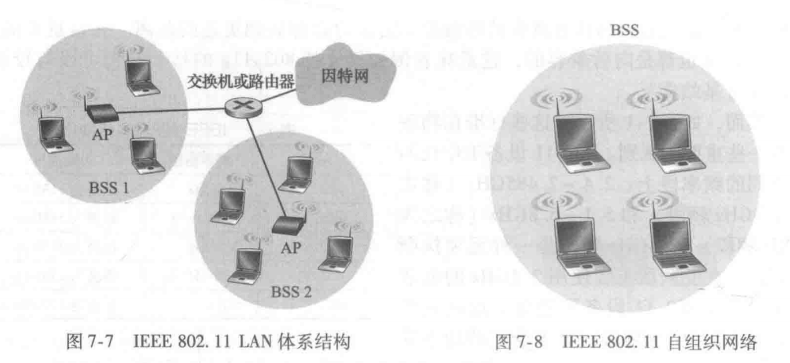
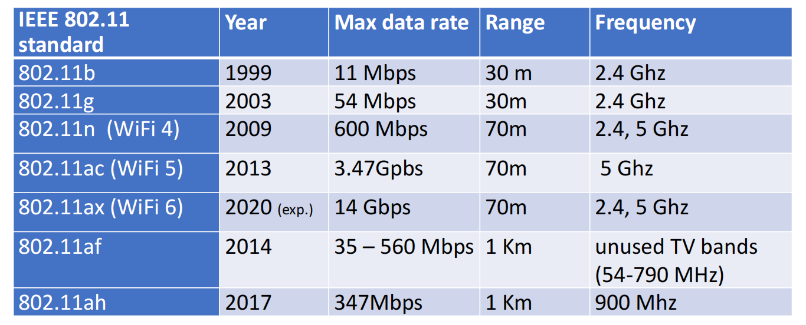
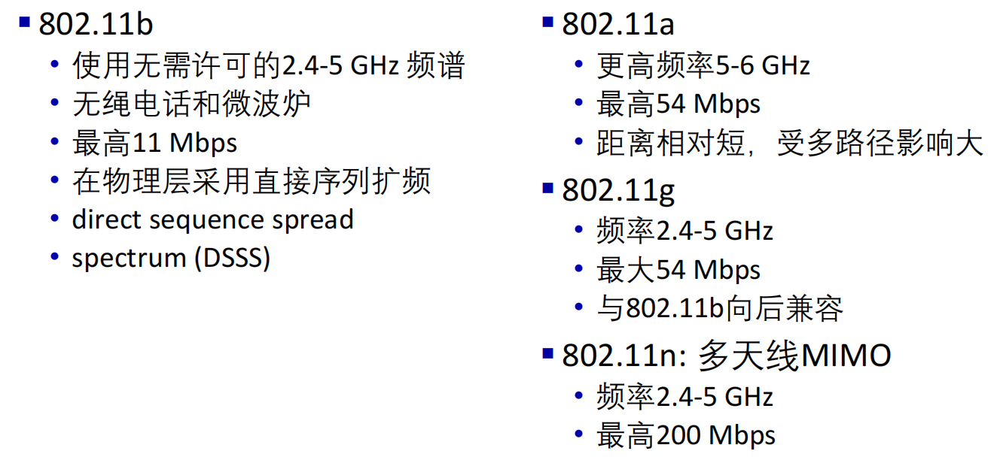
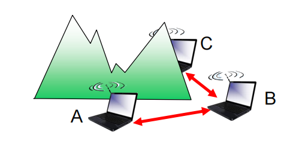
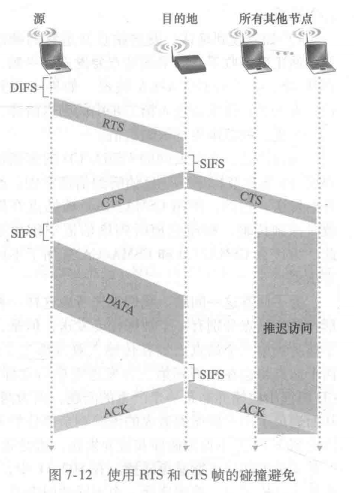

[TOC]

---

# § 第七章 无线网络和移动网络

## IEEE 802.11 标准

### IEEE 802.11 体系结构

> ###### 构成
>
> <left></left>
>
> - 基本服务集 (BSS, Basic Service Set): 是 802.11 的基本构建模块, 包含一个或多个无线站点和一个中央基站;
> - 接入点 (AP, Access Point): 即中央基站(BS, Basic Station);
>
> ---
>
> ###### 信道与关联
>
> - 管理员必须为一个被安装的 AP 分配一个信道号以及一个 SSID;
>     - 信道: 所工作的频率被分为多个区间, 管理员为 AP 指定一个信道 (频率区间);
>     - 服务集标识符 (SSID, Service Set IDentifier): 1 或 2 字长的标识符;
> - AP 周期性发送信标帧 (beacon frame): 包含该 AP 的 SSID 和 MAC 地址;
> - 一个到达的 host 必须要与一个 AP 相 ==关联(associate)== 才能在两者之间建立一条虚拟链路;
>     - 先扫描信道, 监听信标帧, 并选择一个 AP 进行关联;
>     - 关联后可能进行认证 (第 8 章);
>     - 认证后一般运行 DHCP 在 AP 的子网中得到 IP 地址;
>
> ---
>
> ###### 被动 / 主动扫描
>
> - 被动扫描 (passive scanning)
>     - AP 周期性发送信标帧;
>     - host 收到信标帧后, 选择一个 AP 并发送关联请求帧;
>     - 对应 AP 发送关联响应帧;
> - 主动扫描 (active scanning)
>     - host 发送探测请求帧;
>     - AP 收到探测请求帧后, 发送探测响应帧;
>     - host 选择一个 AP 并发送关联请求帧;
>     - AP 发送关联响应帧;

---

### IEEE 802.11 标准参数

> <left>  </left>
>
> - 都使用 CSMA/CA 进行多路访问;
> - 都具有基站模式和自组织网络模式;

---

### IEEE 802.11 的 MAC 协议: 带碰撞避免的 CSMA (CSMA/CA)

> ###### 概述
>
> - 没有冲突检测
>     - 因为自身的信号远大于其他节点的信号, 无法实现边发送边侦听;
> - 一旦开始发送, 则一次性全部发送完毕;
> - 发送前进行碰撞避免;
>
> ---
>
> ###### 工作过程
>
> 1. 发送站点在传输之前侦听信道:
>
>     - 如果在分布式帧间间隔 (DIFS, Distributed Inter-Frame Space) 的短时间段内, 信道一直空闲, 则发送整个帧, 发送完后监听是否收到 ACK;
>         - 发送过程中没有碰撞检测;
>
>     - 如果信道正在忙碌, 则在一个窗口内随机选择一个回退值;
>         - 信道空闲时, 递减该回退值;
>         - 信道忙碌时, 该值不变;
>
> 2. 发送站点的回退值减到 0 时, 发送整个帧;
>    - 发送只会发生在信道空闲时, 因为空闲时回退值才会减小;
> 
>3. 接收站点在短帧间间隔 (SIFS, Short Inter-Frame Space) 后发送一个确认帧 (ACK);
> 
>    - 如果发送站点收到该 ACK
>         - 如果发送站点不需要发送帧了: 结束;
>         - 如果发送站点还需要发送新的帧: 回到 `步骤 1: 信道忙碌情况` 选择一个回退值等待;
>     - 如果发送站点在一定时间内没有收到对应的 ACK: 认为出现错误
>         - 重新回到 `步骤 1: 信道忙碌情况` , 并**增加碰撞窗口**, 然后选择一个回退值, 尝试重传;
> 
>---
> 
>###### 为什么一定要等到回退值减到 0 才发送?
> 
>- 当多个站点需要发送时, 如果检测到信道空闲就立刻发送, 信道将会因为发送无用的冲突帧而被浪费;
> 
>    - 因为没有碰撞检测, 需要发送的节点一旦发送就不会停下, 直到传输完完整的帧;
> 
>- 一般情况下, 这样可以事先避免一些冲突, 因为回退值较小的站点会胜利并占用节点, 其他节点将会检测到信道被占用而停止递减, 从而防止了冲突;
> 
>    - 主动放弃的代价, 相比冲突导致帧被浪费的代价小很多;
> 
>- 无法完全避免冲突
> 
>    - 当两个站点相互隐藏时 (被障碍物遮挡等情况)
>         <left></left>
> 
>        1. A, C 相互隐藏, B 在传输, 让 A, C 各自选择了随机回退值;
>         2. 一个节点 (如 A) 胜利了, 开始发送, 而 C 节点收不到, 继续顺利递减回退值;
>         3. C 也开始发送, A 和 C 的发送在 B 附近形成了干扰;
> 
>    - 当选择了十分靠近的随机回退值时
> 
>        - A, B 选择了十分相近的回退值;
>         - A 先开始发送, 但在 A 发出的信号尚未到达 B 时, B 也递减到 0, 开始了发送;
>         - 没有冲突检测, 出现冲突帧;

---

### IEEE 802.11 可选扩展: RTS/CTS 预约

> ###### 概述
>
> - 允许发送方 "预约" 信道, 而不是通过随机回退的方式访问信道;
> - 使用小的预约分组, 完全避免了长数据帧的冲突;
>
> ---
>
> ###### 工作过程
>
> <left></left>
>
> 1. 发送方首先使用 CSMA 向基站发送一个小的 RTS (Request to Send) 分组
>     - RTS 分组可能会冲突, 但是因为分组较小, 代价不大;
> 2. 基站广播 CTS (Clear to Send) 作为 RTS 的响应;
>     - 这样, 对应 RTS 的发送方将可以发送数据帧, 而其他节点将会被抑制发送;

---

