[TOC]

---

# § 第三章 运输层(1)

## § 3.1 概述和运输层服务

> ###### 概念
>
> - 报文段(Segment)
>     - 从应用进程收到的报文, 将被转换成运输层分组, 该分组称为运输层**报文段**;
>
> - 尽力而为交付服务(best-effort delivery service)
>     - 尽最大努力在通信的主机之间交付报文段, 但它不作任何保证 (不保证是否成功交付, 不保证按序交付, 不保证数据的完整性);
>
>     - 是一种不可靠服务(unreliable service);
>
> - 运输层的多路复用(transport-layer multiplexing;多路分解, demultiplexing)
>     - 将主机间的交付拓展为进程之间的交付;
>
>
> ---
>
> ###### 运输层与网络层
>
> - 即使底层网络协议是不可靠的 (即: 网络层协议会使分组丢失、篡改、冗余), 运输层协议也能为应用程序提供可靠的数据传输服务;
> - 即使网络层不能保证运输层报文段的机密性, 运输层协议也能使用加密来确保报文不被入侵者读取;

---

## § 3.2 多路复用与多路分解

> ###### 端口号
>
> - 一个 16 bit 的数, 大小在 0~65535 之间;
> - 周知端口号 (well-known port number)
>     - 0~1023 范围的端口号, 是受限制的, 因为它们被保留给许多应用层协议来使用;
>     - 例如: HTTP 使用 80 端口号、FTP 使用 21 (20) 端口号, 具体在 RFC 1700、RFC 3232 中给出;

### 多路分解(demultiplexing)

> ###### 概述
>
> - 将运输层报文段中的数据交付到正确的套接字的工作;
>- 对于服务器主机, 每个 TCP 连接对应一个服务器端的套接字, 该套接字可以是服务器新创建的进程, 也可以是同一个进程的一个线程;
> - 许多连接可以共用一个目的端口, 源主机与服务器套接字的对应由运输层多路分解实现;
>
> ---
> 
>###### 例子
> 
><left>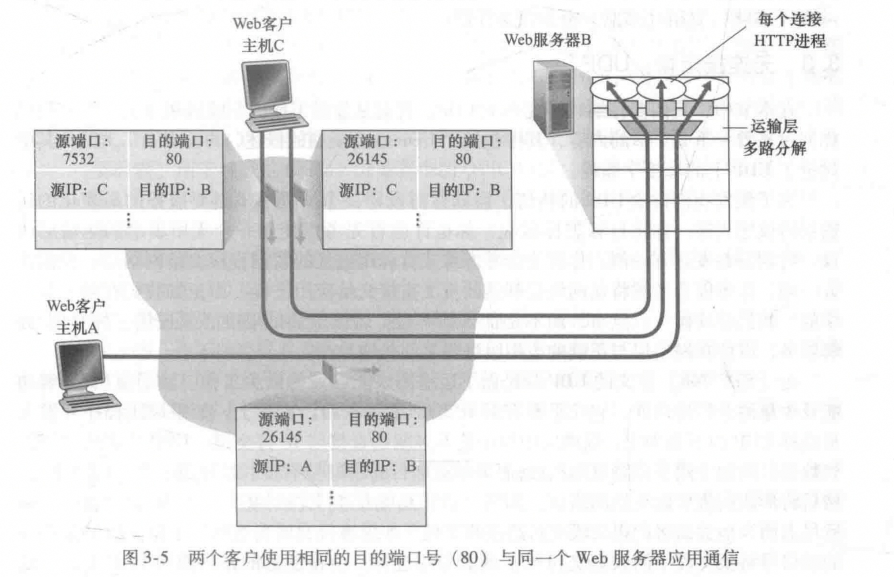</left>
> 
>- 虽然主机 A 与主机 C 都有一个进程的源端口为 26145 , 但是服务器可以通过 IP 地址分辨它们;
> - 因为服务器通过四元组: `(源IP地址, 源端口号, 目的IP地址, 目的端口号)` 来实现各个连接到套接字的对应;

---

### 多路复用(multiplexing)

> ###### 概述
>
> - 多路复用是指: 在源主机从不同套接字中收集数据块, 并为每个数据块封装上首部信息 (之后将被用于分解工作), 从而生成报文段, 然后将报文段传递到网络层的工作;
>
> ---
>
> ###### 要求
>
> - 每个套接字都有唯一标识符;
> - 每个报文段都有特殊字段, 来指示该报文段所要交付到的套接字;
>     - 特殊的字段包括: 源端口号字段(source port number field), 目的端口号字段(destination port number field) ......

---

### 多路复用/分解 的实现

> - 无连接的: UDP
>     - 一个 UDP 套接字由一个二元组唯一标识: `(目的IP地址, 目的端口号)`;
>
>     - 请求报文段中, 会附上发送方的源端口号, 这将作为返回报文段的 “返回地址” 的一部分;
>
> - 有连接的: TCP
>     - 一个 TCP 套接字是由一个四元组来标识的: `(源IP地址, 源端口号, 目的IP地址, 目的端口号)`;
>     - 这个四元组对于使用 TCP 的应用来说, 是一个具有本地意义的标示;
>

---

## § 3.3 无连接运输: UDP

### UDP 概述

> ###### 为什么使用 UDP
>
> - 必要性: IP 服务不能区分不同的进程;
> - TCP 的拥塞控制机制, 以及完全可靠而不计时间代价的服务模型**不适合实时应用**等类型的应用的需要;
> - UDP 没有拥塞控制/流量控制, 因此应用可以按照设定的速度发送数据;
> - UDP **无需建立连接**, 因此没有建立连接带来的时延;
> - UDP **无连接状态**, 不像 TCP 一样需在端系统中维护如接受和发送缓存, 拥塞控制参数, 序号与确认号等连接状态, 从而可以**支持更多的活跃用户**;
> - UDP 报文段的**首部开销小**, 每个 TCP 报文段都有 20 字节开销, 而 UDP **只有 8 字节**;
>
> ---
>
> ###### UDP 下实现可靠传输
>
> - UDP 协议本身并不能提供可靠传输, 仅提供差错检测;
>     - 为什么 UDP 提供差错检测: 端到端原则(end-end principle)
>     - “端到端原则”: 与在较高级别提供这些功能的代价相比, 在较低级别上设置的功能可能是冗余的或几乎没有价值的;
> - 可以通过应用层的可靠性机制 (如确认重传机制), 可以实现可靠数据传输;
>     - 例如: Chrome 浏览器的 QUIC 协议;
>
> ---
>
> ###### UDP 不进行拥塞控制导致的风险
>
> - 无控制的 UDP 发送方将引起链路的拥塞, 可能会导致: 
>
>     - UDP 发送方和接收方之间的高丢包率;
>
>     - 可能会挤垮 TCP 会话, 因为 TCP 协议具有拥塞控制, 进而大部分带宽被 UDP 传输占据, TCP 连接只能使用很小的传输速率;

---

### UDP报文段结构

> ###### 图示
>
> <left>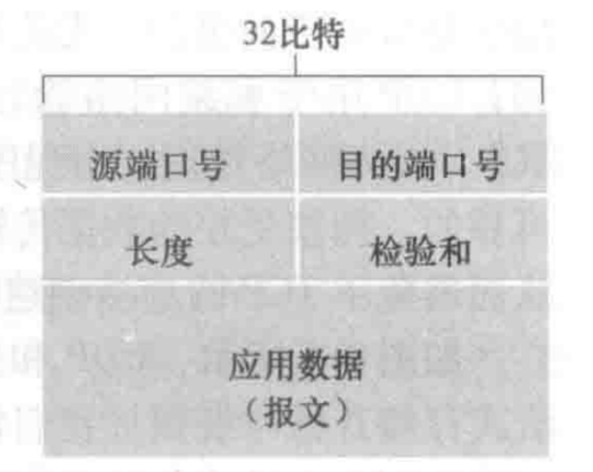</left>
>
> ---
>
> ###### 长度字段
>
> - `首部行 + 应用数据的字节数` , 即这个报文段的总长度;
>
> ---
>
> ###### 检验和字段
>
> - 用于检查报文段中是否出现了差错;
>     - 检验和用于确定当 UDP 报文段从源到达目的地移动时, 其中的**比特是否发生了改变**;
>     - 例如: 由于链路中的噪声干扰或者存储在路由器中时引入的问题;
> - 检验和的生成
>     1. 将所有的数据相加;
>         - 如果出现溢出则回卷 (将溢出的 1 加回最低位);
>     2. 将最终得到的和按位取反, 得到的就是检验和;
> - 检验方法
>     1. 接收方将接收到的数据报文执行同样的求和运算 (包括回卷);
>     2. 将所求出的和 (没有取反) 与来自发送方的检验和 (经过取反) 相加: 
>         - 如果得到的是全 1 (也就是原码 0), 则说明数据没有出现差错;
>         - 如果结果的任何位出现 0, 则说明有比特出现了差错;

---

## § 3.4 可靠数据传输原理

> ###### 术语
>
> - 单向数据传输(unidirectional data transfer)
> - 双向数据传输(bidirectional data transfer; 全双工数据传输)
> - 接受者的反馈信息: 肯定确认(positive acknowledgment, ACK) / 否定确认(negative acknowledgment, NAK);
>
> ---
>
> ###### 可靠数据传输协议(reliable data transfer protocol)
>
> - 责任: 为上层实体提供以下服务抽象
> - 数据可以通过一条可靠的信道进行传输:
>     - 传输数据的比特不会受到损坏 (由 0 变为 1 , 或相反) 或丢失;
>     - 保证所有数据都是按照其发送顺序进行交付;
>
> ---
>
> ###### 有限状态机 (FSM, Finite-State-Machine)
>
> <left>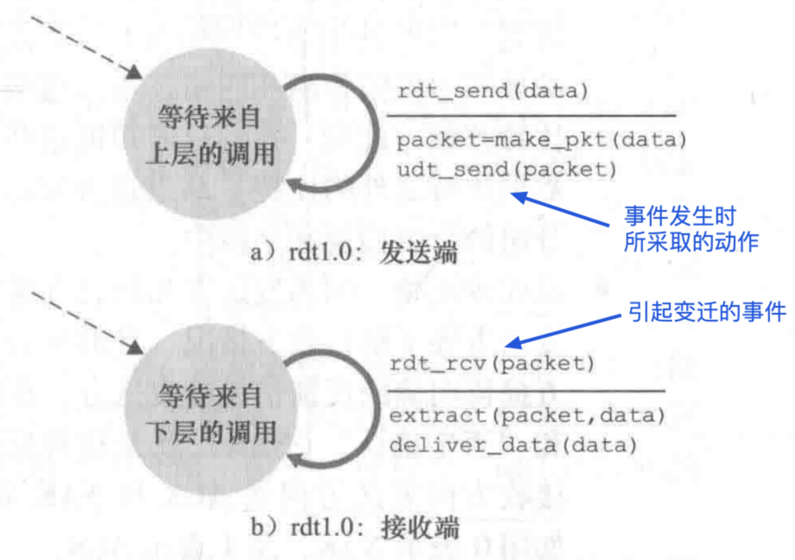</left>
>
> - 初始状态: 虚线箭头表示;
>
> - 状态转移: 箭头表示;
>
> - 缺失状态或动作: 用 $\Lambda$ 表示;

### 构建可靠数据传输协议

#### rdt 1.0

> ###### 概述
>
> - 基于可靠底层信道的 rdt ;
>
> ---
>
> ###### 状态机图示
>
> <left>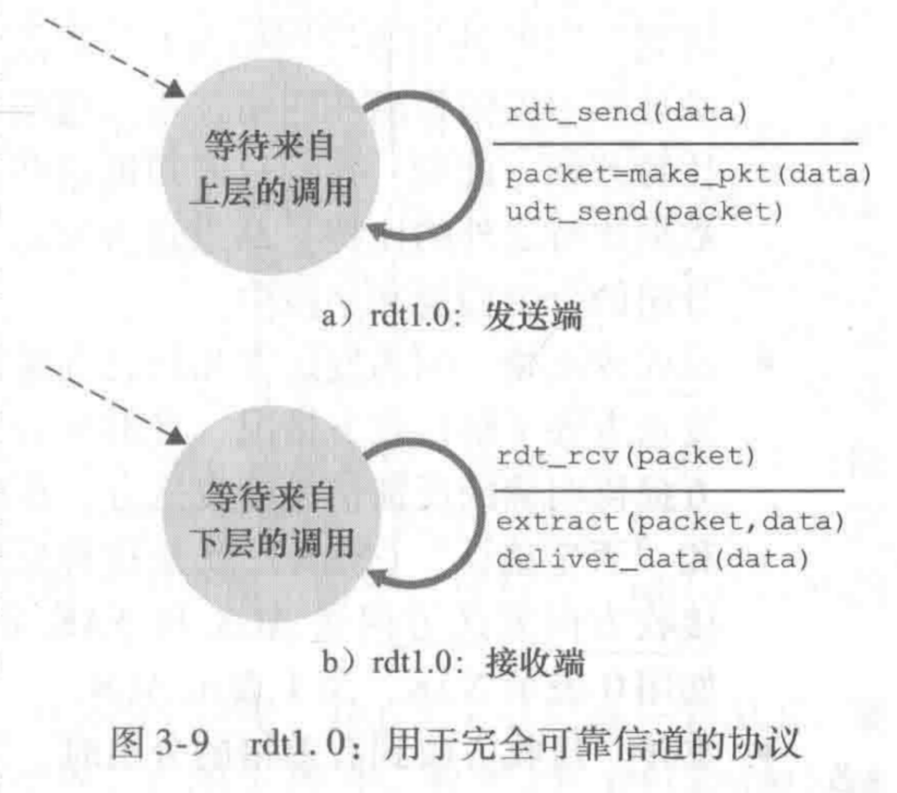</left>

---

#### rdt 2.0

> ###### 概述
>
> - 假设信道能保证数据顺序正确, 不丢包, 但是可能出现比特翻转;
>
> ---
>
> ###### 改进
>
> - **解决了比特翻转导致的错误**;
>
> ---
>
> ###### 特点
>
> - 自动重传请求协议 (ARQ, Automatic Repeat reQuest): 基于重传机制的可靠数据传输协议
>     - 差错检测
>         使用额外的比特来检测差错的出现;
>     - 接收方反馈
>         接收方提供明确的反馈信息给发送方;
>         - 比如: 使用肯定确认(ACK, positive acknowledgment)、否定确认(NAK, negative acknowledgment) ;
>     - 重传机制
>         接收方收到有差错的分组时, 发送方重传该分组;
> - **等停 (stop-and-wait) 协议**
>     当发送方未确认接收方已经正确地收到分组时(即发送方没有收到ACK分组), 发送方会等待而不是继续发送;
>
> ---
>
> ###### 状态机图示
>
> <left>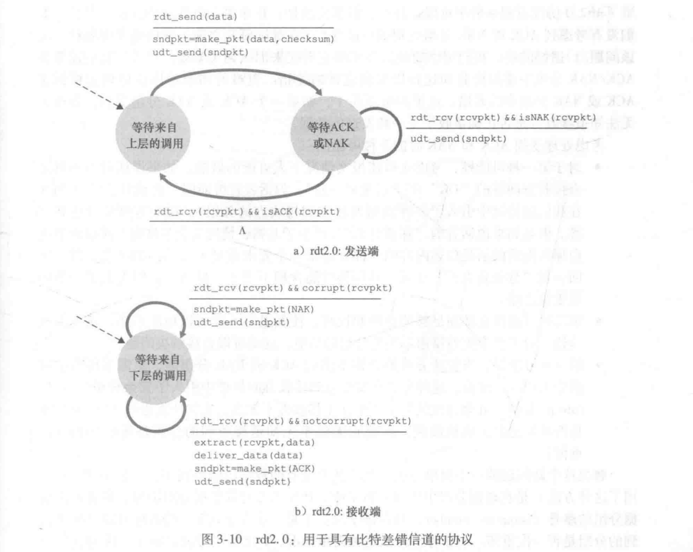</left>

---

#### rdt 2.1

> ###### 概述
>
> - 假设信道不发生丢包;
> - **解决了 ACK、NAK 出错的问题**;
>
> ----
>
> ###### 改进
>
> - 解决了接收方的反馈信息出错导致的问题: 在数据包、反馈信息中都加入了占 1 bit 的序号
>
>     - 发送方两种状态
>         - 发送 0 号数据包
>         - 发送 1 号数据包;
>
>     - 接收方两种状态
>         - 等待 0 号数据包
>         - 等待 1 号数据包;
>
>     - 反馈信息错误检测机制
>         - ACK 翻转为 NAK
>             假设发送方向接收方发送 0 号数据包, 如果接收方正确接收到 0 号数据包, 返回 ACK, 但是 ACK 翻转为了 NAK, 此时, 接收方处于等待 1 号数据状态, 但发送方接收到了 NAK, 于是重发 0 号数据, 进而接收方会拒绝此 0 号数据, 避免重复;
>         - NAK 翻转为 ACK
>             如果接收方接收到 0 号数据包出现错误, 返回 NAK, 但是 NAK 翻转为了 ACK, 此时, 接收方处于等待 0 号数据状态, 但发送发收到了 ACK, 于是发送方发送了 1 号数据, 进而接收方会拒绝 1 号数据, 避免错序;
>
>
> ---
>
> ###### 状态机图示
>
> <left>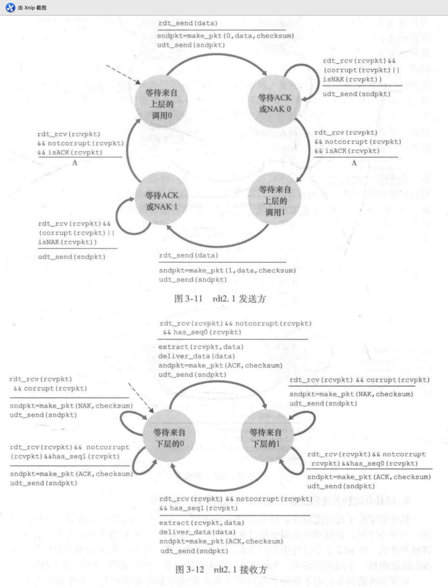</left>

---

#### rdt 2.2

> ###### 概述
>
> - 在 rdt 2.1 的基础上, 取消 NAK, **使用冗余 ACK** (duplicate ACK) 代替它;
>
> ---
>
> ###### 改进
>
> - 当接收方没有正确地接受分组时:
>     - 接收方重新发送一个针对错误分组的上一个分组的 ACK(冗余 ACK);
>         - 而不是像 rdt 2.1 一样发送 NAK;
>     - 当接收方发现接收到两个针对同一个分组的 ACK 时, 就知道这个被两次确认的分组的下一个分组传输失败, 需要重传;
>
> ---
>
> ###### 状态机图示
>
> <left>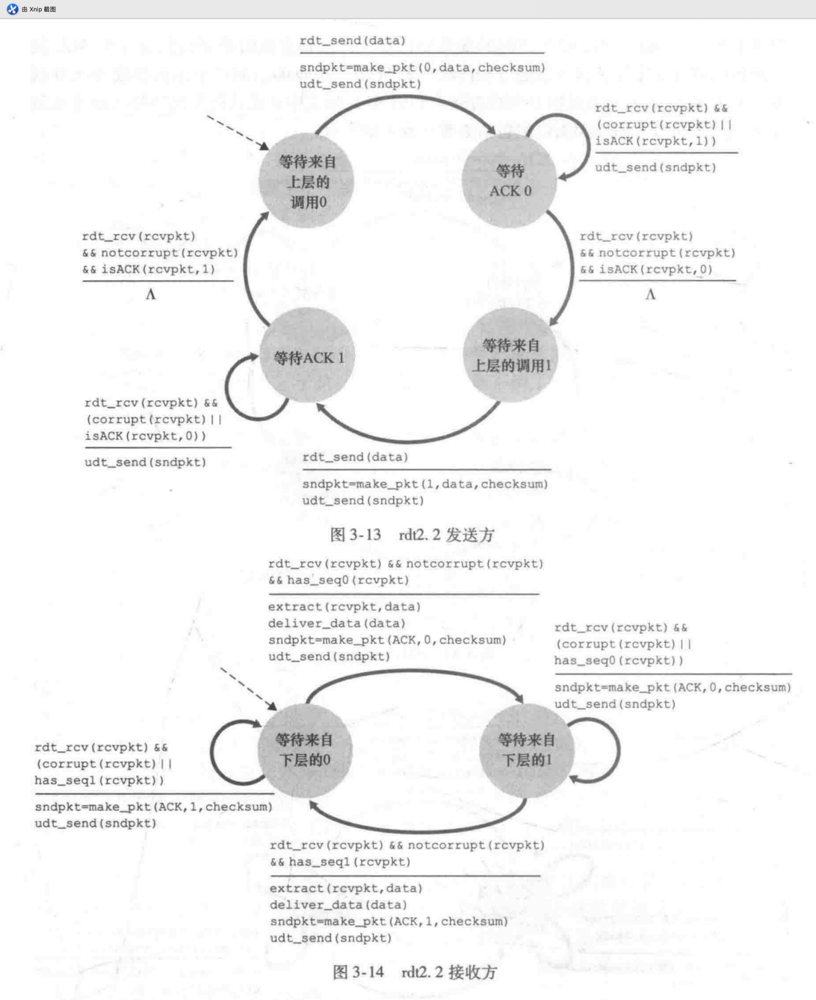</left>

---

#### rdt 3.0 (比特交替协议, alternating-bit protocol)

> ###### 概述
>
> - 增加**计时器机制**, 如果在一定时间内发送方没有收到任何的反馈信息, 就重传该分组, 从而进一步解决丢包的问题;
> - rdt 3.0 是一个**可靠数据传输协议**;
>
> ---
>
> ###### 改进
>
> - 发送方可能遇到的情况
>
>     1. 发送的数据分组丢失, 没有传输到接收方;
>     2. 接收方返回的 ACK 丢失, 没有传输到发送方;
>     3. 数据分组或 ACK 经历了较大的延时, 从而超出了 RTT;
>
> - 发送方增加: 倒计数定时器(countdown timer)
>
>     - 每次发送一个分组(包括重传的分组)时, 都启动一个定时器: 
>         - 在定时器发出超时中断时, 响应中断, 即重传分组;
>         - 在定时器没有超时时, 如果收到对应的 ACK, 则终止定时器;
>
> - 4 种情况
>
> - |  情况  |                             图示                             |   情况   | 图示                                                         |
>     | :----: | :----------------------------------------------------------: | :------: | ------------------------------------------------------------ |
>     | 无丢包 | 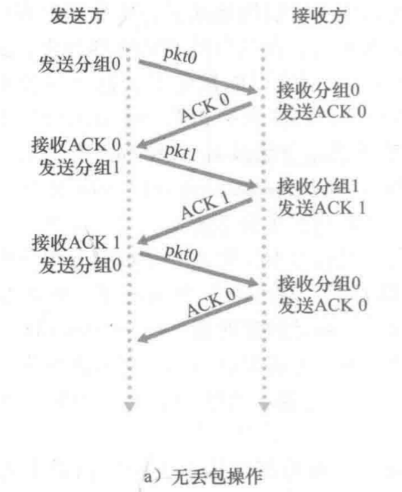 | 丢失 ACK | 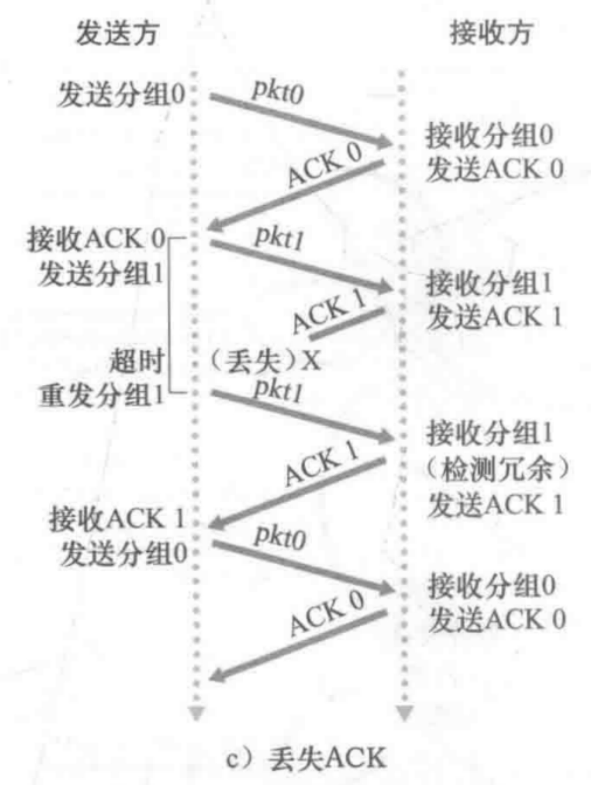 |
>     |  丢包  | 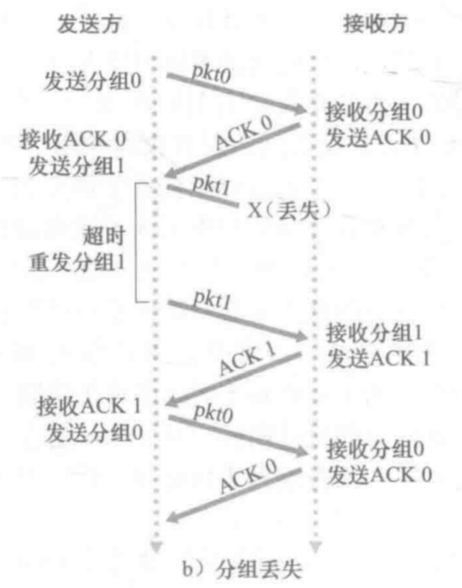 | 过早超时 | 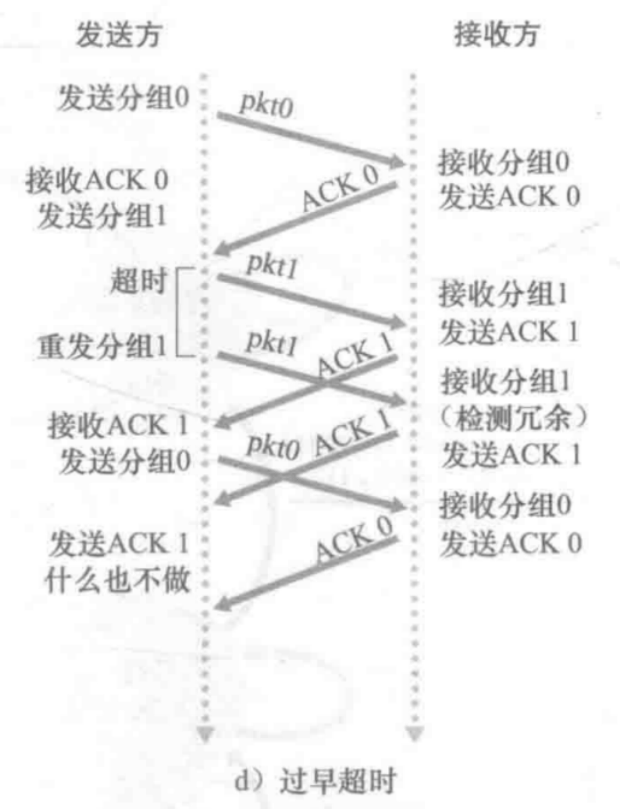 |
>
>     针对 “过早超时” 情况的说明: 图中出现了冗余数据分组 (duplicate data packet): `pkt1` ;
>
> ---
>
> ###### 状态机图示
>
> <left>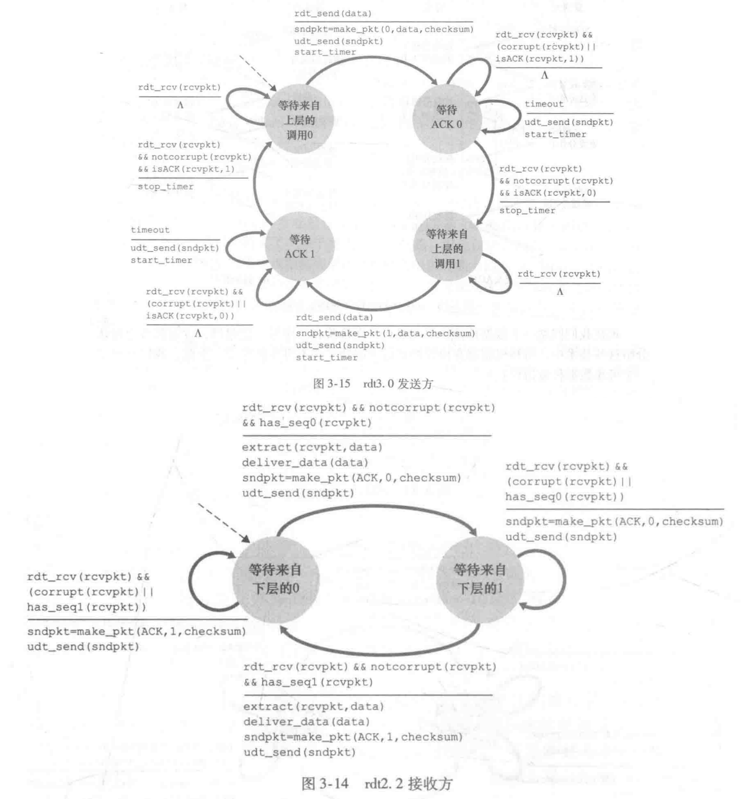</left>
>
> - 接收方与 rdt 2.2 相同
>     - 超时的引⼊增加了在发送⽅到接收⽅数据流中重复数据包的可能性, 然⽽, rdt 2.2 中的接收⽅已经可以处理重复的数据包: 
>         - 如果接收⽅发送的 ACK 丢失了, 发送⽅就会重新传输旧数据, 则接收方会收到错误序号的分组(接收方已经在等待另一个序号), 进而丢弃该重复的旧数据(接收方仍会再发送一次丢失的 ACK, 以告诉发送方可以发送下一个数据包了);
>         - 因此, rdt 2.2 中的接收器也将作为协议 rdt 3.0 中的接收器⼯作;

---

### 流水线可靠数据传输协议: `GBN` 和 `SR`

> ###### rdt 3.0 的不足: rdt 3.0 是一个等停 (stop-and-wait) 协议, 性能低下
>
> - 定义: 利用率(utilization)
>    $$
>     \Large \frac{传输时延}{传输时延 + 传播时延}
>    $$
> 
>     - 发送方实际忙于将发送比特送进信道的时间 (传输时延) , 与发送时间 (传输 + 传播时延) 之比;
> 
> - 使用模 $2^k$ 运算: 所有涉及序号的运算, 都需要先使用模 $2^k$ 运算得到一个 $[0, 2^k-1]$ 的新序号之后, 对新序号进行操作;

#### A. 回退 N 步 (GBN, Go-Back-N) 协议 (滑动窗口协议, sliding-window protocol)

##### 序号

> <left>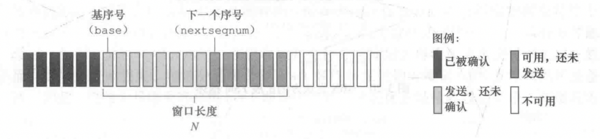</left>
>
> - 序号空间如上图所示, 将 rdt 3.0 中的 2 种序号状态扩增为 $2^k$ 种 ($k$ 位序号比特);
>
> | 概念                    | 含义                                          |
> | ----------------------- | --------------------------------------------- |
> | 基序号 (base)           | 最早未确认分组的序号;                         |
> | 下一个序号 (nextseqnum) | 最小的未使用的序号, 即下一个待发送分组的序号; |
> | 窗口长度                | $N$($N < 2^k$)                                |

##### GBN 发送方: 需要响应的事件

> ###### 响应上层的调用
>
> 1. 上层调用 `rdt_sent()` ;
> 2. 发送方检查窗口中的未被确认的分组数量: 
>     1. 若窗口中未确认的分组数量小于 N, 则产生一个分组并发送, 同时更新对应的变量(待补充);
>     2. 若窗口已满, GBN 发送方将数据返回给上层, 同时隐式地通知上层窗口已满;
>         - 多种解决方法
>             1. GBN 发送方缓存这些数据, 暂时不发送;
>             2. 使用同步机制, 即使用一个信号量或标志, 只在窗口不满时才允许上层调用 `rdt_sent()` ;
>
>
> ---
>
> ###### 收到 ACK: 累积确认(cumulative acknowledge)
>
> - 如果收到针对序号 $k$ 的 ACK, 则认为接收方已经正确地收到了 $k$ 号及 $k$ 号以前的所有分组;
>
> ---
>
> ###### 超时事件
>
> 发送方使用定时器, 用于恢复数据或确认分组的丢失: 
>
> 1. **发送方只有一个定时器**, 可以被当作是**最早的已发送但未收到 ACK 的分组的定时器**;
> 2. 当出现超时: 发送方重传所有已发送的但是还没有收到 ACK 的分组, 即超时的分组和后面的分组;
> 3. 当收到一个 ACK: 
>     - 如果仍然有已发送但未收到 ACK 的分组, 则重新启动该定时器;
>     - 如果所有已发送分组都已收到 ACK, 则停止该计时器;

##### GBN 接收方: 累积确认

> ###### 如果收到序号为 $k$ 的分组
>
> 1. 如果上一个收到的分组序号为 $k-1$, 则 GBN 接收方为该序号为 $k$ 的分组发送一个 ACK, 并将该分组中的数据交付给上层;
> 2. 如果上一个收到的分组序号不是 $k-1$, 而是 $m$ (这说明 $m$ 以前的分组已经被正确且按序交付), 则丢弃该 $k$ 号分组, 并重新向 GBN 发送方发送一个冗余的 $m$ 号 ACK;
>
> ---
>
> ###### 特点
>
> - 如果第 $k$ 号分组已经被正确地接受并交付给上层, 那么前面的 $1, 2, \cdots, k-1$ 号分组也一定被正确且按序接受并交付给上层;

##### GBN 图示

> ###### GBN 协议发送方/接收方状态机
>
> <left>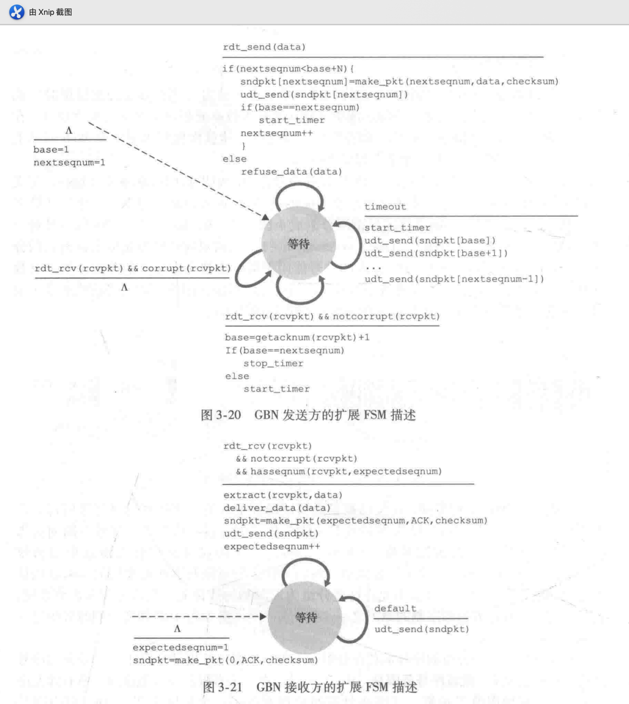</left>
>
> ---
>
> ###### 运行中的 GBN
>
> <left>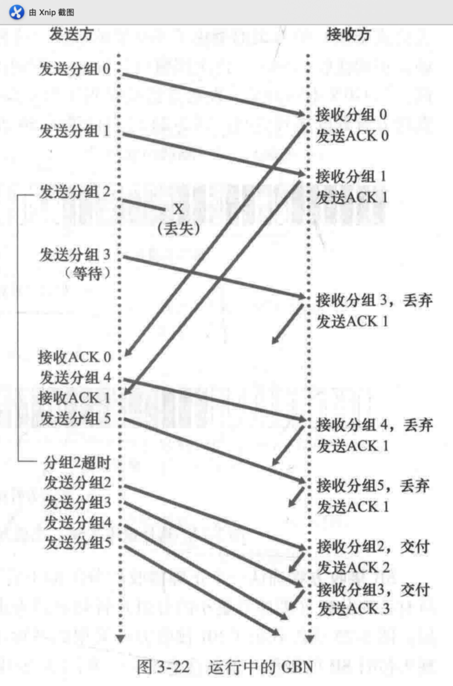</left>

##### GBN 的局限性

> - 流水线中未确认的分组数不能超过某个最大允许数 N;

---

#### B. 选择重传 (SR, Selective Repeat) 协议

> ###### 概述
>
> <left>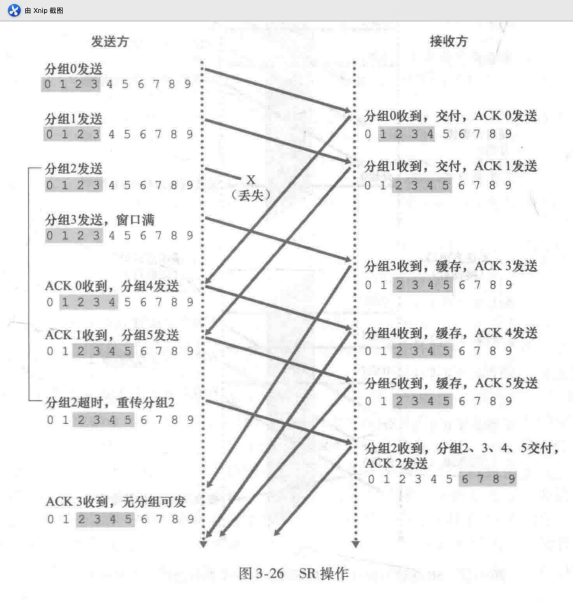</left>
>
> - 让发送方仅重传那些它怀疑在接收方出错的分组, 从而避免不必要的重传;
> - “出错” 包括: 丢失, 受损;

##### SR 发送方: 事件与动作

> ###### 从上层收到数据
>
> SR 发送方检查下一个可用于该分组的序号: 
>
> - 如果序号位于发送方的窗口内, 则将数据打包、发送;
> - 否则, 可采取多种解决方法: 
>     1. 将数据缓存, 等待发送;
>     2. 将数据返回给上层, 以便以后传输;
>
> ---
>
> ###### 定时器超时: 防止丢失分组
>
> - **每个分组**都必须有一个自己的逻辑定时器, 因为超时发生后只能重传一个分组;
>     - 可以用单个硬件定时器模拟多个逻辑定时器的操作;
>
> ---
>
> ###### 收到 ACK
>
> - 如果该 ACK 序号 = $\text{send\_base}$, 则将窗口向后移动, 使得 $\text{send\_base}$  = 具有最小序号的未收到 ACK 的分组;
> - 如果该 ACK 序号在窗口内, 则 SR 发送方将该 ACK 对应的分组标记为已接收;
>
> ---
>
> ###### 发送窗口内的分组
>
> - 如果窗口移动了, 且新的窗口内存在未发送的分组, 则发送这些分组;

##### SR 接收方: 事件与动作

> ###### 收到的分组序号在 $[\text{rcv\_base}, ~~\text{rcv\_base}+N-1 ]$ 中: 正确地收到一个窗口内的分组
>
> 1. 一个选择 ACK 被送回给发送方;
> 2. 检查该分组之前是否收到过: 
>     - 如果没有收到过: 
>         1. 如果该分组序号为 $\text{rcv\_base}$, 则将缓存中的序号从 $\text{rcv\_base}$ 开始向后连续的分组一起交付给上层, 然后移动窗口($\text{rcv\_base}$ 改为交付的连续的分组的最后一个的下一位);
>         2. 如果该分组序号在 $[\text{rcv\_base}+1, ~~\text{rcv\_base}+N-1 ]$(还有序号比该分组小的分组没有收到, 即存在丢失分组),  则先将该分组缓存起来;
>     - 如果已经收到过: 忽略该分组;
>
> ---
>
> ###### 收到的分组序号在 $[\text{rcv\_base}-N, ~~\text{rcv\_base}-1 ]$ 中: 正确地收到一个以前的分组
>
> 产生一个对应该分组序号的 ACK, 不管之前是否已经确认过该分组;
>
> - 为什么需要确认这些分组: 防止 ACK 丢失导致的接收方和发送方的窗口不一致的问题
>     - 当发送方发送一个序号为 $\text{rcv\_base}$ 的分组,  且接收方成功接收到后, 接收方的窗口将向前滑动, 同时发送对应于 $\text{rcv\_base}$ 的 ACK;
>     - 如果这个 ACK 丢失, 发送方的窗口将不会向前滑动, 从而会重传这个分组 (位于此范围内, 该范围在接收方窗口之前);
>
> ---
>
> ###### 其他情况
>
> - 直接忽略该分组;

##### SR 的序号窗口长度限制: 窗口长度必须小于等于序号空间大小的一半;

> ###### 序号空间
>
> <left>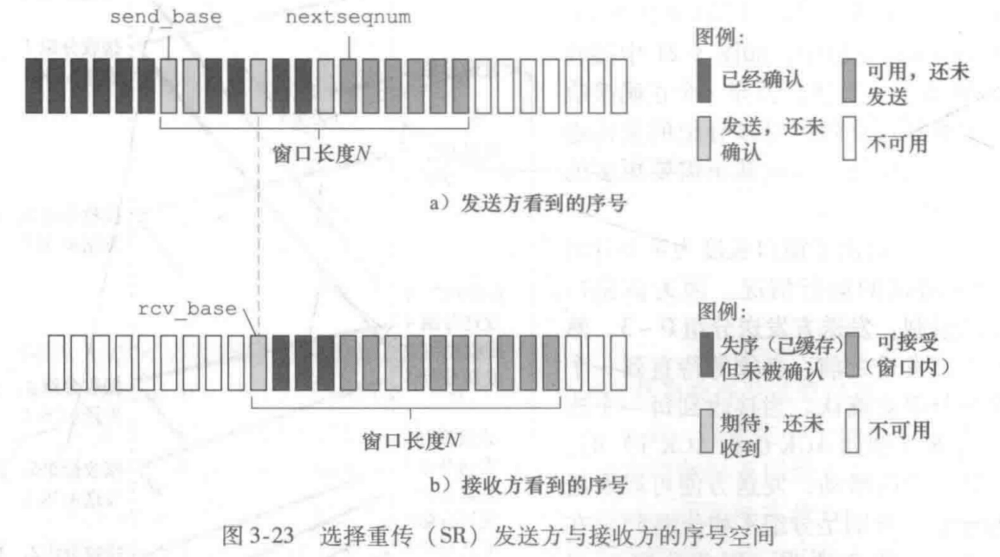</left>
>
> ---
>
> ###### 原因
>
> - 序号空间实际是一个环 (模 $2^k$ 除), 因此应避免接收方的窗口前缘 (序号最大处) 与发送方的窗口后缘 (序号最小处) 在环中重叠;
>
> - 例子: 假设序号共有 2 位, 则序号空间长度为 4
>
>     - 如果发送方、接收方的窗口长度都为 3, 则当某次发送方发送的 3 个分组对应的 3 个ACK 均丢失时, 接收方无法获知一个新到来的分组到底是第 1 个分组的重传还是第 5 个分组的首次传输;
>
>     - 图示
>         <left>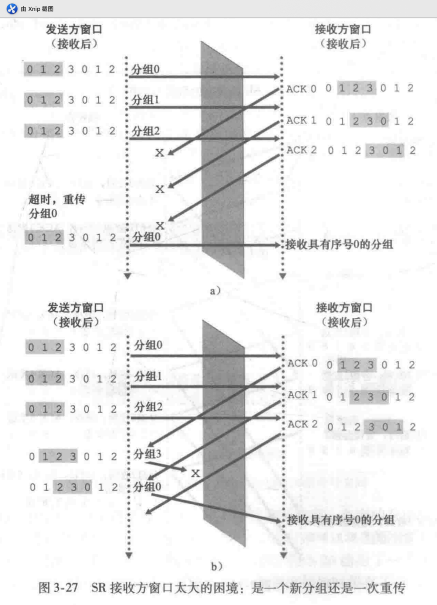</left>
>
>         - a 对应第 1 个分组的重传, b 对应第 5 个分组的首次传输;
>         - 上述两者在接收方看是无法分辨的;

---

#### SR 与 GBN 的异同

> ###### 不同点
>
> - 接受窗口不同
>     - GBN 接收窗口 = 1, 只能顺序接收;
>
>     - SR 接收窗口 $\gt$ 1, 可以乱序接收;
>
> - **出现数据间隔 (接收到失序分组) 的反应不同**
>     - SR 接收方不会直接丢弃正确接收到的失序的分组, 而是将它们**缓存**, 并发送对应的 **ACK**;
>
>     - GBN 接收方会**直接丢弃**失序的分组, **重复发送接收到的有序数据流中最后一个 ACK (冗余 ACK)**, 即窗口大小为 1 ;
>
> - 计时器不同
>     - SR 对**每个发送的分组**都要设定一个计时器
>
>     - GBN 只对**最早发送但未确认的分组**设定一个计时器;
>
> - 分组确认方式不同: SR **逐个**分组进行确认, 而 GBN 采用**累积确认**;
>
> - 网络效率不同: 一般 SR 的效率更高, 因为 GBN 在出现错误后, 可能需要重发很多分组;
>
> - 实现的复杂性不同: SR 因为需要缓存, 实现起来更复杂;
>
>
> ---
>
> ###### 相同点
>
> - SR、GBN 发送方一般都存在缓冲区 (即: 发送窗口 $\gt$ 1);
> - 一次能发送多个未经确认的分组;
>
> ---
>
> ###### 适用范围
>
> - GBN: 适合出错率低的场景, 没必要使用复杂的 SR;
> - SR: 链路容量大 / 延迟大 / 带宽大 的场景, 因为一点出错带来的代价太大;
>
> ---
>
> ###### 总结
>
> | 协议 |      发送方缓存      |      接收方缓存      | 数据分组计时                       | 接收正确的乱序分组 | 累积确认 |
> | :--: | :------------------: | :------------------: | ---------------------------------- | :----------------: | :------: |
> | GBN  | 是, 发送窗口 $\gt$ 1 |   否, 接收窗口 = 1   | 同步计时:  只采用一个计时器   |         否         |    是    |
> |  SR  | 是, 发送窗口 $\gt$ 1 | 是, 接收窗口 $\gt$ 1 | 独立计时:  每个分组一个计时器 |         是         |    否    |

---

### 可靠数据传输原理总结

> - 检验和: 用于检测在一个传输分组中的比特错误;
>
> - 定时器: 用于检测超时, 进而重传一个分组;
>     - 超时可能因为该分组 (或其 ACK ) 在信道中丢失了;
>     - 其他超时事件: 未丢包的情况
>         因为这两种情况, 接收方可能会收到一个分组的多个冗余副本;
>         1. 分组超时但未丢失 (过早超时);
>         2. 分组已被接收方收到, 但返回的 ACK 丢失;
> - 序号: 用于为从发送方流向接收方的数据分组按顺序编号;
>     - 所接收分组的序号间的空隙可使接收方检测出丢失的分组;
>
>     - 具有相同序号的分组可使接收方检测出一个分组的冗余副本;
>
> - 确认(ACK): 接收方用于告诉发送方一个分组或一组分组已被正确地接收到了;
>     - 确认报文通常携带着被确认的分组或多个分组的序号;
>
>     - 确认可以是逐个的或累积的, 这取决于协议;
>
> - 否定确认(NAK)
>     - 接收方用于告诉发送方某个分组未被正确地接收;
>
>     - 否定确认报文通常携带着未被正确接收的分组的序号;
>
> - 窗口、流水线: 发送方被限制仅发送那些序号落在一个指定范围内的分组;
>     - 通过允许一次发送多个分组但未被确认, 发送方的利用率可在停等操作模式的基础上得到增加;
>     - 窗口长度可根据接收方接收和缓存报文的能力、网络中的拥塞程度或两者情况的综合来进行设置;

---

