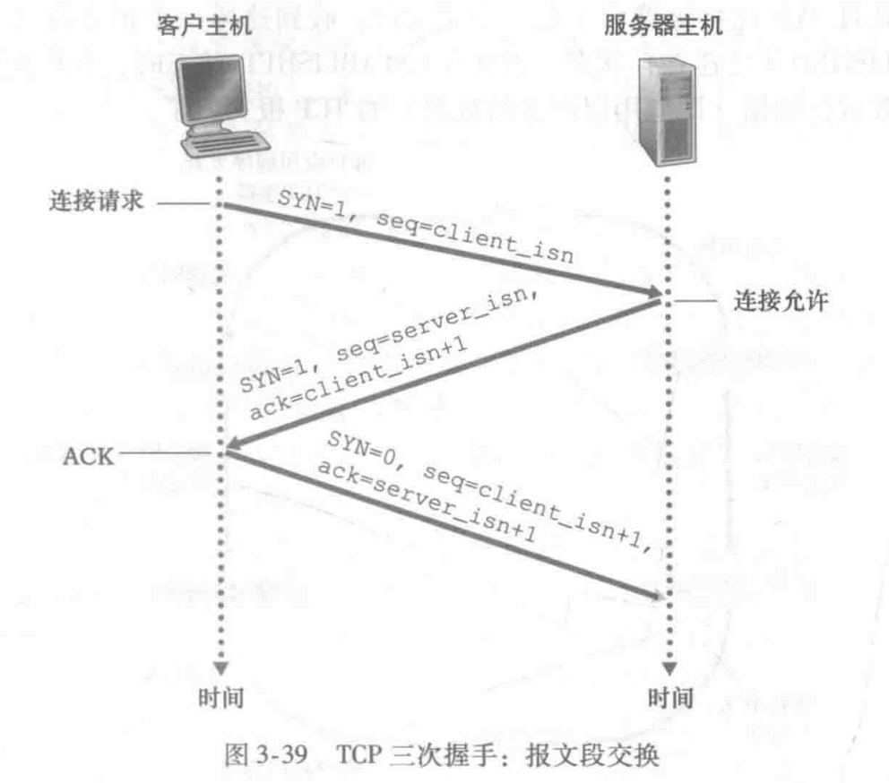

[TOC]

---

# § 第三章 运输层(2)

## § 3.5 面向连接的传输: TCP

### TCP 连接

> ###### 特点
>
> | 特点                                                         | 说明                                                         |
> | ------------------------------------------------------------ | ------------------------------------------------------------ |
> | 面向连接的 (connection-oriented)                             | 在一个应用进程可以向另一个应用进程发送数据前, 两个进程必须进行“三次握手 (three-way handshake)”; |
> | 点对点的 (point-to-point)                                    | 单个发送方, 单个接收方, 不存在第三者, 无法直接实现一对多、多对多; |
> | 全双工数据传输 (双向数据传输, bidirectional data transfer) | 1. 连接双方的进程可以在此连接上同时进行报文收发; 2. 当应用程序结束报文发送时, 必须拆除该连接; |
>
> ---
>
> ###### TCP 连接的组成
>
> - 一台主机上的一组缓存、变量和与进程连接的套接字;
>
> - 另一台主机上的另一组缓存、变量和与进程连接的套接字;
>

---

### TCP 报文段大小约束

> ###### 最大报文长度 (Maximum Segment Size, MSS)
>
> - TCP 从缓存中取出并放入报文段的数据量的最大值;
>     - 该限制对应应用层的数据的最大长度, 即: 进程交付给 TCP 缓存的数据大小;
>     - 典型值为 MSS = 1460 bytes ( = 1500 - 40 );
>
> ---
>
> ###### 最大传输单元 (Maximum Transmission Unit, MTU)
>
> - 本地发送主机发送的**最大链路层帧长度**;
>     - 该限制对应网络层 (IP 层) 交付给链路层的数据大小;
>     - 应保证, TCP 报文段 + TCP/IP 首部(通常为 40 bytes) $\le$ MTU;
>     - 以太网、PPP 链路层协议都具有 1500 bytes 的 MTU;

---

### TCP 报文段结构

> <left></left>

#### A. 首部字段

##### 1. 源端口号 / 目的端口号

> 用于指示主机上的进程, 进而 多路复用 / 分解 数据;

##### 2. 序号字段 (sequence number field)

> ###### 概述
>
> - 占 32 bit, 用于实现可靠数据传输;
>
> ---
>
> ###### 一个报文段的序号 (sequence number for a segment) 
>
> <left></left>
>
> - TCP 所发送的整个数据被根据字节编号, 然后根据 MSS 分成多个 TCP 报文段, 该报文段的首个字节的编号就是该序号的值;
> - 图中: MSS = 1000, 文件大小 500000 Bytes, 文件被分为 500 个 TCP 报文段, 每个报文段的序号为 0、1000、……、499000;
> - 实际情况下, 初始序号往往是随机选择的, 而不是 0 ;
>
> ---
>
> ###### 初始序号的选择
>
> - 通常是随机选择的, 而不是 0 ;
> - 随机选择的优点
>     - 有利于减少 `仍在网络中存在的、来自两台主机之间的、之前的已经终止的连接的报文段` 被误认为是 `相同的这个主机对之间的、后来建立的连接的、有效的报文段` 的可能性;
>     - 此时, 这两个连接 (新的和旧的) 应当是使用了相同的端口号;
>
> ---
>
> ###### 序号的作用
>
> - 接收方去除重复数据, 并按序接收;
> - 标识发出的数据包中, 哪些已经收到 (通过 ACK 序号);

##### 3. 确认号字段 (acknowledgement number field)

> ###### 概述
>
> - 占 32 bit, 用于实现可靠数据传输;
>
> ---
>
> ###### 含义
>
> - 主机 A 填入TCP报文段 (即将发给主机 B ) 的确认号, 是主机 A 期望从主机 B 收到的下一个字节的序号;
>
> ---
>
> ###### 累积确认 (cumulative acknowledgement)
>
> - TCP 只确认这些字节: 从流中的第一个字节开始, 到流中的第一个丢失的字节的前一个字节 (与 GBN 类似);
> - 例如: 主机 A 接收到了 0~500 字节、900~1200 字节 的报文段, 但是主机 A 的 TCP 只确认 0~500 字节, 接下来发送的 TCP 报文段的确认号将被设置为 501;
>
> ---
>
> ###### 如何处理失序的报文段
>
> - 失序的报文段如: 已经收到 0~500 , 却在接下来收到了 900 ~ 1000, 这个序号为 900~1000 的报文段就是一个失序的报文段;
> - 处理方法
>     1. 直接丢弃, 可以简化接收方的设计;
>     2. 保留失序的字节, 并等待缺少的字节以填补中间的间隔, 实践中通常采用这种方法, 从而节省网络带宽;
>
> ---
>
> ###### RFC 5681 中关于 TCP 产生 ACK 的建议
>
> | 情况 | 事件                                                         | TCP接收方的动作                                              |
> | :--: | :----------------------------------------------------------- | ------------------------------------------------------------ |
> |  1   | 具有所期望序号的按序报文段到达 (所有在期望序号及以前的数据都已经被确认) | 延迟的ACK: 对另一个按序报文段的到达最多等待 500 ms, 如果下一个按序报文段在这 500 ms 内没有到达, 则发送一个ACK; |
> |  2   | 具有所期望序号的按序报文段到达, 另一个按序报文段等待 ACK 传输  (对应情况 1 的 500 ms 内收到下一个按序报文段的情况) | 立即发送单个累积 ACK , 以确认两个按序报文段;                 |
> |  3   | 比期望序号大的失序报文段到达, 出现报文段间隔                 | 立即发送冗余 ACK , 该 ACK 指示下一个期待字节的序号 (即间隔的低端的序号) |
> |  4   | 能部分或完全填充接收间隔的报文段到达                         | 倘若该报文段起始于间隔的低端, 则立即发送 ACK                 |

##### 4. 首部长度字段 (header length field)

> - 占 4 bit, 单位为 `字(32 bit)` ;
> - 指示了 TCP 首部长度;

##### 5. 标志字段 (flag field)

> | 名称 | 含义                                                         |
> | ---- | ------------------------------------------------------------ |
> | ACK  | 指示确认号字段中的值是否是有效的 (TCP 不使用 NAK) ;          |
> | RST  | 当被置为 1 时, 表示发送这个报文段的一方收到了一个错误的 TCP 报文, 即: 端口号或源 IP 地址与主机上运行中的 API 都不匹配的情况; RST==1 的报文段的含义是: "我没有与此对应的套接字, 请不要再发送该报文段了"; |
> | SYN  | 三次握手中, 前两次置为 1, 代表希望建立连接;                  |
> | FIN  | 四次挥手中, 第 1 次挥手, 第 3 次挥手, 置为 1 , 表示希望断开连接; |
> | CWR  | 待补充                                                       |
> | ECE  | 待补充                                                       |
> | PSH  | 待补充                                                       |
> | URG  | 指示报文段里存在着被发送端的上层实体置为“紧急”的数据, 紧急数据的最后一个字节由紧急数据指针字段指出; |

##### 6. 接收窗口字段 (receive window field)

> - 占 16 bit;
> - 用于流量控制, 指示了接收方愿意接受的字节数量;

##### 7. 因特网检验和

> - 检验和字段 (checksum field), 与 UDP 一致;

##### 8. 紧急数据指针字段 (urgent data pointer field)

> - 占 32 bit;
> - 当紧急数据存在并给出指向紧急数据尾的指针时, TCP 必须通知接收端的上层实体;

##### 9. 选项字段 (options field)

> - 可选的、可变长的;
> - 用于发送方和接收方之间协商最大报文段长度 (MSS), 或用于在高速网络环境下作为窗口调节因子;
> - 首部字段中还定义了时间戳选项;

---

#### 数据字段

> - MSS 限制了数据字段的最大长度;

---

### 可靠数据传输: TCP 差错恢复

#### 1. 超时

##### 往返时间的估计: 三个变量

> ###### SampleRTT
>
> 从某报文段发出 (即交付给网络层) , 到该报文段的确认被收到之间的时间间隔
>
> - 大多数 TCP 实现仅在某个时刻进行一次 SampleRTT 的测量, 而不是为每个发送的报文段测量一个 SampleRTT;
> - TCP 不会为任何重传的报文计算 SampleRTT, 只为传输一次的报文段测量, 因为 (待补充) ;
>
> ---
>
> ###### EstimatedRTT
>
> TCP 所维护的一个 SampleRTT 的均值
>
> - 指数加权移动平均 (Exponential Weighted Moving Average , EWMA) 
>
>     - 每次计算得到一个 SampleRTT, 就使用下述公式更新一次 EstimatedRTT;
>
>     - 移动公式: 
>         $$
>         \text{EstimatedRTT} = (1-\alpha)\cdot \text{EstimatedRTT} + \alpha\cdot \text{SampleRTT}
>         $$
>         其中 $\alpha$ 一般取 0.125, 即:
>         $$
>         \text{EstimatedRTT} = 0.875\cdot \text{EstimatedRTT} + 0.125\cdot \text{SampleRTT}
>         $$
>
> - 采用 EWMA 的原因
>
>     - 最近的 SampleRTT 更能反映当前的网络拥塞情况, 因此对最近获得的 SampleRTT 加以更大的权重;
>
>
> ---
>
> ###### DevRTT (RTT 偏差)
>
> $$
> \text{DevRTT} = (1-\beta)\cdot\text{DevRTT}+\beta\cdot|\text{SampleRTT}-\text{EstimatedRTT}|
> $$
>
> - 它是 SampleRTT 与 EstimatedRTT 之间差值的 EWMA;
> - 当 SampleRTT 的波动较小时, DevRTT 较小, 反之则会很大;

##### 设置和管理重传超时间隔

> ###### 更新公式
>
> $$
> \text{TimeoutInterval} = \text{EstimatedRTT} + 4\cdot\text{DevRTT}
> $$
>
> - 以 EstimatedRTT 为基准, 加上一定的余量, 该余量根据 SampleRTT 的波动来确定 (即 DevRTT) ;
>
> ---
>
> ###### 说明
>
> - 初始值一般设为 1 秒;
> - 当出现超时后, TimeoutIntercval 加倍, 以免即将被确认的后继报文段过早出现超时 (简化的 TCP 模型中, 如果不断超时, 则不断加倍, 因此 TimeoutIntercval 在这种情况下将呈指数级增长);
> - 只要收到报文段就立即使用公式更新 TimeoutInterval, 这可以中止不断加倍过程;

#### 2. 单一的重传定时器

> - **只为最早发出的, 未被确认的报文设定一个定时器** (与 GBN 类似), 因为如果为每一个发出但未确认的分组设定一个定时器, 则发送方在定时器方面开销过大;

#### 3. 快速重传 (fast retransmit)

> ###### 概述
>
> - 当收到 **对同一个数据的 3 个冗余 ACK** 后, TCP 才执行快速重传;
> - 快速重传即: **不再等待超时, 立刻重传丢失的报文段**;
>
> ---
>
> ###### 为什么等待 3 个冗余 ACK, 而不是收到冗余 ACK 立刻启动快速重传
>
> 假设发送方向接收方顺序发送了 5 个分组: A, B, C, D, E
>
> 以发送方的视角来看, 收到 A 的一个冗余 ACK 可能的情况有两种:
>
> 1. 分组 B 确实在链路中丢失了, 需要重传;
> 2. 顺序发送的分组在链路中乱序了, 即 C 可能比 B 先到达接收方, 从而导致了对于 A 的冗余 ACK (这种情况是经常发生的);
>
> 因此, 为了**尽可能减少乱序带来的不必要的重传**, 只有当收到 3 个针对同一分组的冗余 ACK 后, 才执行快速重传, 因为这三个冗余 ACK 表明: A 后面已经出现了 3 个正确传输的分组 (可能是 C, D, E) 了, 但仍然没有收到 B, 所以 B 大概率是丢失了 (小概率是分组 B 乱序, 且经历了相对别的分组很长的时延), 需要快速重传;

#### 4. TCP: GBN 和 SR 的结合

> ###### TCP: 选择确认 (selective acknowledgement, SACK) 
>
> - 允许 TCP 接收方选择地确认失序的报文段, 而不是单纯地采用累积确认 (仍采用累积确认, 但还支持选择确认);
> - 具体实现: 在 TCP 连接建立过程中协商, 确定双方均支持 SACK 时, 激活 SACK 选项, 并在选项后附上失序的、但已经被正确接受、已经缓存起来的数据包的列表, 从而让发送方只重传数据间隔中的数据包, 而不重传列表中的数据包;
>
> ---
>
> ###### TCP: 选择重传
>
> - 基于选择确认 (SACK), 在累积确认的数据包后面的、本应需要全部重传的数据包中剔除已经被标记为 SACK 的数据包, 只重传真正缺失的数据包的机制;
>
>
> ---
>
> ###### 总结
>
> | 协议 | 发送方缓存 | 接收方缓存 | 数据分组计时       | 接收正确的乱序分组 | 累积确认 |
> | :--: | :--------: | :--------: | ------------------ | :----------------: | :------: |
> | GBN  |     是     |     否     | 只采用一个计时器   |         否         |    是    |
> |  SR  |     是     |     是     | 每个分组一个计时器 |         是         |    否    |
> | TCP  |     是     |     是     | 只采用一个计时器   |         是         |    是    |

---

### TCP 流量控制

> ###### 概述
>
> - 接收到的数据被先存放在缓存中, 可能需要一段时间才能被应用程序取走;
>- TCP 为应用程序提供流量控制服务 (flow-control service) 来消除缓存溢出的可能性;
>     - 是一个速度匹配服务: 发送方发送速率与接收方应用读取速率的匹配;
>     - 不同于拥塞控制: 拥塞控制是由于 IP 网络的拥塞导致的发送方遏制;

#### 接收窗口

> <left></left>
>
> ---
>
> ###### 公式
>
> $$
> \large \text{rwnd}= \text{RcvBuffer}-(\text{LastByteRcvd}-\text{LastByteRead})
> $$
>
> 1) 接收窗口 `rwnd`: 用于给发送方一个指示, 指示接收方还有多少可用的接受缓存空间, 初始值设为 RcvBuffer;
> 2) `LastByteRead` 变量: 接收方主机上的应用程序从缓存中读取出的数据流的最后一个字节的编号;
> 3) `LastByteRcvd` 变量: 接收方已经接收到并放入缓存中的数据流的最后一个字节的编号;
> 4) `RcvBuffer` : 接受缓存的总大小
>
> ---
>
> ###### 条件: 缓存不能溢出
>
> $$
> \text{LastByteRcvd}-\text{LastByteRead}\le\text{RcvBuffer}
> $$
>
> ---
>
> ###### 说明
>
> - 因为 TCP 是全双工的, 所以在两方都维护有接收窗口 rwnd 和两个变量 LastByteRead、LastByteRcvd;
> - 接收窗口是随着时间变化的;

#### 发送方要求

> ###### 维护两个变量
>
> - `LastByteSent` : 数据流中最后一个发送出去的字节的编号;
> - `LastByteAcked` : 数据流中最后一个被确认的字节的编号;
>
> ---
>
> ###### 发送方在连接整个生命周期中要保证
>
> $$
> \text{LastByteSent}-\text{LastByteAcked} \le \text{rwnd}
> $$
>
> - 左侧为: 发送方发送到连接中, 但是未被确认的数据量;
> - 右侧为: 接收方反馈的接受窗口大小;

#### 接收缓存已满处理

> ###### 情况举例
>
> - 假设主机 A 向主机 B 发送文件;
>- 当主机 B 的 rwnd = 0 时, 主机 B 通过 TCP 报文中的窗口字段告知了主机 A: rwnd = 0, 但如果之后主机 B 没有任何数据需要发送给主机 A 了, 那么就会出现问题: 主机 A 不知道后续的 rwnd 的变化, 进而被阻塞, 不再继续发送数据给主机 B;
> 
>---
> 
>###### 解决方案
> 
>- 当主机 A 被告知主机 B 的 rwnd = 0 时, 主机 A 会开始周期性地发送一个只有 1 Byte 数据的**探测报文**, 这些探测报文段将被接收方确认, 进而告知主机 A 当前的主机 B 的 rwnd, 最终当缓存中出现空间时 (主机 A 收到一个 rwnd $\ne$ 0 的报文) , 传输将会继续;

---

### TCP 连接管理

#### TCP 连接的建立: 三次握手 (three-way handshake)

> <left></left>
>
> ---
>
> ###### 过程
>
> 1. 客户端发送 SYN 报文段 (SYN Segment):
>     1. 不包含应用层数据;
>     2. SYN 标志位置为 1 ;
>     3. 客户端随机选择一个初始序号 (client_isn), 包含在序号字段中(这有利于防范安全性攻击);
>
> 2. 服务器收到 SYN 报文段, 返回 SYNACK 报文段 (SYNACK Segment):
>     1. 服务器为 TCP 连接分配缓存和变量 (这使得服务器端容易受到 SYN 洪泛攻击);
>     2. SYN 标志位置为 1 ;
>     3. 确认号字段置为 client_isn + 1 ;
>     4. 服务器端随机选择一个初始序号 (server_isn), 包含在序号字段中;
>
> 3. 客户端收到 SYNACK 报文段:
>     1. 客户端为 TCP 连接分配缓存和变量;
>     2. SYN 标志位置为 0 ;
>     3. 确认号字段设为 server_isn + 1 ;
>     4. 本报文可以携带应用层数据, 因为连接已经建立;
>
> ---
>
> ###### 为什么要三次握手
>
> 1. 避免历史连接
>     - 过程
>         1. 当客户端发送了多个 SYN, 希望建立连接 (多次发送可能是因为网络拥塞, 旧的 SYN 延时过长), 但是旧的 SYN 先于新的 SYN 到达, 导致服务端返回了对应于旧 SYN 的 SYN+ACK;
>         2. 这时, 客户端发现返回的 SYN+ACK 与自己期待的 ACK (对应新的 SYN) 不对应, 于是可以发送 RST 来中止旧的 TCP 连接;
>     - 两次握手无法判断当前连接是否是历史连接, 三次握手则可以在第三次握手时, 让客户端有充足的上下文判断是否是历史连接;
>         - 如果是历史连接, 发送 RST 中止旧连接;
>         - 如果正常, 发送 ACK, 成功建立连接;
> 2. 同步双方的初始序号
>     - 四次握手也能可靠地同步序号, 但是可以简化为三次握手;
> 3. 避免资源浪费
>     - 客户端可能重复发送到网络中多个 SYN, 这可能是由于旧的 SYN 在网络中阻塞造成的;
>         - 如果只采用两次握手, 服务器端在接收到这些重复的 SYN 后, 会建立多个 TCP 连接而不释放, 导致资源浪费;
>         - 如果采用三次握手, 可以确认哪个连接是客户端需要的, 释放旧的连接, 节约资源;

#### TCP 连接的拆除: 四次挥手

> <left></left>
>
> ---
>
> ###### 过程
>
> 假设主机 A 准备拆除 TCP 连接;
>
> 1. 主机 A 发送一个特殊的 TCP 报文段: FIN 标志位置为 1 ;
>
> 2. 主机 B 收到来自主机 A 的报文段 (FIN = 1), 返回一个 ACK;
>
> 3. 主机 B 向主机 A 发送一个自己的 FIN = 1, ACK = 1 的 TCP 报文段;
>
> 4. 主机 A 向主机 B 发送对应于 `步骤 (3)` 中报文段的 ACK, 并等待 2 MSL(最长报文段寿命);
>     - 当等待时间内没有收到冗余 ACK 时 (即主机 B 成功收到 ACK ), 则主机 A 将释放资源, 然后关闭该 TCP 连接;
>     - 主机 B 在收到 `步骤 (4)` 中来自主机 A 的 ACK 后, 将会释放资源, 关闭该 TCP 连接;
>
> ---
>
> ###### 特点
>
> - TCP 连接的两个进程中的任意一方都能终止该连接;
> - 连接结束后, 主机中的缓存\变量将会被释放;
>
> ---
>
> ###### 为什么需要 TIME_WAIT 状态
>
> 1. 保证连接正确关闭
>
>     - 是为了防止最后一个 ACK 的丢失, 保证被动关闭方正确收到最后一个 ACK, 进而帮助被动关闭方正确关闭连接;
>     - 当第二个 ACK 丢失后, 被动关闭方会因为超时, 重传第二个 FIN, 足够的 `TIME_WAIT` 持续时间可以保证主动关闭方收到重传的第二个 FIN, 从而重发 ACK, 帮助被动关闭方正确关闭连接;
>
> 2. 防止已失效的报文段干扰服务器
>     <left></left>
>
>     - 这些失效的报文段拥有相同的四元组, 且属于旧的, 已经释放的连接;
>     - 让网络中残留的, 这条连接所产生的报文段全部消失 (超过寿命);
>
> ---
>
> ###### 为什么要四次挥手
>
> - 客户端的 FIN 代表客户端不再需要发送数据, 但是仍然可以接收;
> - 服务端在收到客户端的 FIN 后, 可能还有数据尚未发送至客户端, 所以需要在返回对应的 ACK 后, 处理并发送完未发送至客户端的数据, 然后再发送 FIN 至客户端, 表示自己也不再需要发送新的数据;

#### TCP 状态序列

##### 客户端 / 服务器端

> <left> </left>
>
> - TIME_WAIT 阶段: 该状态主要用来防止 FIN_WAIT_2 时返回的 ACK 丢失
>     1. 如果丢失, 即服务器端发现刚才的 FIN 报文段超时, 传来一个冗余 ACK 指示丢包, 此时客户重传该 ACK;
>     2. 如果没有丢失, 则在 TIME_WAIT 阶段客户端将不会受到任何信息, 因为服务器端已经收到 ACK 而断开连接, 释放了资源, 因此会超时

##### TCP 有限状态机

> <left></left>
>
> - 实际情况下, 由于 TCP 是全双工的, 所以不区分客户端/服务器端, TCP 中的任何一方都可能具有上述 11 中状态的任何一个;
> - 图中粗实线是客户端状态序列, 粗虚线是服务端状态序列;

#### 防范 SYN 洪泛攻击(SYN flood attack): 使用 SYN cookie

> 1. 当收到 SYN 时, 服务器使用源/目的IP以及对应的端口号, 再加上自己的一个秘钥作为参数, 调用散列函数, 生成一个初始序号: cookie;
> 2. 服务器将该 cookie 附带在 SYNACK 分组中, 发送给客户端(或是攻击者), 此时服务器并没有分配任何的资源(服务器也不会记录这个 cookie), 因此攻击者不会对服务器造成太大的伤害;
> 3. 合法的客户将会返回一个 ACK 报文段, 其确认字段为原 cookie + 1, 服务器使用源/目的IP以及对应的端口号, 还有自己的秘钥重新调用散列函数: 如果散列函数返回的结果等于该确认字段 - 1, 那么就可以判断该客户是合法的, 进而生成一个具有套接字的全开的连接;

---

### nmap: 端口扫描工具

> ###### 概述
>
> 可以探测打开的 TCP/UDP 端口, 侦测防火墙及其配置, 侦测应用程序的版本和操作系统;
>
> ---
>
> ###### 探测特定的 TCP 端口的实现方法: nmap 向目标主机发送对应的目标端口的特殊的 TCP SYN 报文段
>
> - nmap 从目标主机接收到一个 TCP SYNACK 报文段:
>     这意味着在目标主机上一个应用程序使用该 TCP 端口运行, nmap 返回 “打开”;
> - nmap 从目标主机接收到一个 TCP RST 报文段:
>     这意味着该SYN报文段到达了目标主机, 但目标主机没有运行一个使用该 TCP 端口的应用程序, 但可以知道: 所发送的这个报文段没有被源和目标主机之间的任何防火墙所阻挡;
> - 什么也没有收到:
>     这很可能表明该 SYN 报文段被中间的防火墙所阻挡, 无法到达目标主机;

---

## § 3.6 拥塞控制原理

> ###### 概念
>
> | 名称                                   | 含义                                                      |
> | -------------------------------------- | --------------------------------------------------------- |
> | 供给载荷(offered load, $\lambda_{in}$) | 运输层向网络中发送报文段 (包含初始数据和重传数据) 的速率; |
>
> ---
>
> ###### 拥塞的代价
>
> 1. 当分组的到达速率接近链路容量时, 分组将会经理巨大的排队时延;
> 2. 发送方必须执行重传以补偿因为缓存溢出而丢失的分组;
> 3. 发送方在遇到很大的时延时所进行的不必要重传会引起路由器利用其链路带宽来转发不必要的分组副本;
> 4. 当一个分组沿一条路径被丢弃时, 每个上游路由器用于转发该分组而使用的传输容量最终都被浪费掉了;

---

### 拥塞控制方法

#### 1. 端到端拥塞控制

> - 网络层没有为运输层拥塞控制提供显式的支持, 即使网络拥塞, 也需要端系统通过观察分组丢失或时延等, 来自行推测网络的拥塞程度;

#### 2. 网络辅助的拥塞控制

> ###### 概述
>
> - 路由器向发送方提供关于网络中拥塞状态的反馈信息;
>
> ---
>
> ###### 拥塞信息从网络反馈给发送方的两种方式
>
> 1. 经由接收方的网络反馈;
>     - 路由器标记或更新分组中的某个特定的字段, 从而指示拥塞的产生;
>     - 接收方收到一个标记的分组后, 向发送方通知该网络拥塞指示;
>     - 该方法至少需要一个 RTT;
> 2. 直接网络反馈(来自网络路由器);
>     - 通常采用阻塞分组的形式: 网络路由器向发送方发送一个完整的分组, 该分组表示了拥塞情况;
>
> ---
>
> ###### 案例: ATM ABR 拥塞控制
>
> - 发送方周期性在数据信元中间插入 RM (资源管理) 信元:
>     - RM 信元由发送途中的交换机, 路由设置;
>     - 接收端不对其进行修改, 返回给发送方;
>     - 包含两个比特位:
>         - NI bit: no increase in rate (轻微拥塞)
>             - 代表: 出现轻微拥塞, 速率不要增加了;
>         - CI bit: congestion indication (拥塞指示)
>             - 代表: 已经出现拥塞;
>     - 待补充: PPT 3-4 P17

---

## § 3.7 TCP 拥塞控制

> ###### 概述
>
> - TCP 采用端到端拥塞控制, 因为 IP 层并不会向端系统显式地提供网络的拥塞反馈信息;
> - 这种服务不一定能为通信进程带来直接好处, 但能为因特网带来整体的好处;

### TCP 如何限制发送流量: 拥塞窗口(congestion window, cwnd)

> 拥塞窗口对一个 TCP 发送方能向网络中发送流量的速率进行了**间接的**限制;
>
> 1. 一个发送方中未被确认的数据量不会超过 $\text{min\{cwnd, rwnd\}}$ :
>     $$
>     \text{LastByteSent}-\text{LastByteAcked}\le\text{min}\{\text{cwnd}, \text{rwnd}\}
>     $$
>
> 2. 为了更加关注拥塞控制, 暂且假定接收窗口很大 (接收方剩余缓存很多), 从而拥塞窗口中的数据都需要被发出, 且考虑对于丢包和发送时延均忽略不计的连接, 这样的情况下, 发送方发送速率大概是 cwnd/RTT (byte/s);

---

### TCP 如何感知路径上的拥塞: 感知丢包事件

> 当发送方到接收方的路径拥塞时, 路径上的一台甚至多台路由器的缓存会溢出, 进而导致丢包事件, 丢包事件以以下两种方式被发送方感知:
>
> 1. 超时;
> 2. 收到来自接收方的 3 个针对同一分组的冗余 ACK;
>
> 当丢包事件发生时, 发送方就认为在路径上发生了拥塞;

---

### TCP 发送方感知到拥塞后, 如何改变发送速率

#### TCP 是 "自计时(self-clocking)" 的

> TCP 使用确认来触发, 或者使用计时, 来增大它的拥塞窗口长度, 进而间接控制向网络发送数据的速率;

#### TCP 的指导性原则

> 1. 一个丢失的报文段即意味着拥塞, 因此当出现丢失报文段(超时 / 3个冗余 ACK)时, 应当降低 TCP 发送方的发送速率;
> 2. 一个确认报文段指示着: 该网络正在向接收方交付发送方发送的报文段(这暗示着一切都在顺利进行), 因此当收到针对先前发出报文段的 ACK 时, 可以增加发送方的发送速率;
> 3. 带宽探测: 通过 "收到 ACK 便增加发送速率/出现丢包降低速率" 的方式, 探测 "拥塞开始的速率", 当因丢包降低速率后的一段时间, 再次尝试提高速率, 来观察 "拥塞开始的速率" 是否发生了改变;

---

### TCP 拥塞控制算法(TCP congestion control algorithm)

> 包含三个部分: 慢启动, 拥塞避免, 快速恢复;
>
> 1. TCP 的强制部分是前两者, 而快速恢复是 TCP 的推荐部分, 对于发送方来说不是必需的;
> 2. 慢启动相比拥塞避免, 能够更快速地增加 cwnd 长度, 两者的区别在于收到 ACK 后增加 cwnd 长度的方式;

#### 1. 慢启动

> 1. 启动
>
>     1. cwnd 的初始值一般被设置为 1 个 MSS, 该值较小, 对应的初始发送速率约为: $\frac{MSS}{RTT}$;
>     2. 每当发送方收到一个 ACK, 就将 cwnd += MSS, 即增加 1 个 MSS 的大小;
>     3. 通过这样的方式, cwnd 以及 TCP 的发送速率将以**指数级增长(平均每 RTT 翻一倍)**;
> 2. 结束
>
>     1. 情况 1 : 当出现一次丢包 (超时或 3 个冗余 ACK ) 时, 将 cwnd 设置为 1 并重新开始慢启动过程, 同时记录 $\text{ssthresh} = \frac{\text{cwnd}}{2}$ (慢启动阈值);
>     2. 情况 2 : 当 cwnd 到达 ssthresh 时, 转到拥塞避免模式; (待补充, 到达阈值马上停止)
>     3. 情况 3 : 检测到 3 个冗余的 ACK, TCP 执行快速重传, 同时进入快速恢复状态;
>
>
> ---
>
> - 有关 "结束" 的说明: 丢包的两种情况
>
>     - 超时
>         - 不管是否支持快速恢复, 一律视为情况 1 ;
>
>     - 3 个针对同一分组的冗余 ACK
>         - 如果发送方不支持快速恢复, 则视为情况 1 ;
>         - 如果发送方支持快速恢复, 则对应情况 3 ;

#### 2. 拥塞避免

> 进入拥塞避免状态时, cwnd 大约是上次遇到拥塞时的值的 $\frac{1}{2}$ , 此时距离导致拥塞的传输速率已经不远, 不能再继续像慢启动一样翻番;
>
> 1. 线性增长: 拥塞避免状态下, 每个 RTT 内, cwnd 只增加 1 个 MSS;
> 2. 实现线性增长的一个通用的方法如下:
>     1. 假设 MSS = 1460, cwnd = 14600, 则一个 RTT 内会发送 a 个报文段;
>     2. 每当接收到一个新的确认, cwnd += $\frac{1}{a}$ MSS, 这样, 当 a 个报文段都收到确认时, cwnd 只增加了 1 个 MSS (对应 1 个 RTT);
> 3. 结束线性增长 (针对支持快速恢复的 TCP 版本):
>     1. 情况 1 超时 : 较为"激烈"的反应 (同慢启动的结束情况 1 一致)
>         1. ssthresh = $\frac{\text{cwnd}}{2}$;
>         2. cwnd = 1 MSS;
>         3. 进入慢启动;
>     2. 情况 2 针对同一分组的 3 个冗余 ACK : 较为"平缓"的反应
>         1. ssthresh = $\frac{\text{cwnd}}{2}$, 此处的 cwnd 没有计入 (2) 中所述的 3 MSS;
>         2. cwnd = $\frac{\text{cwnd}}{2}$ + 3, 即减半后记入收到的 3 个冗余 ACK 带来的 += 3 MSS;
>         3. 执行快速重传 (重传丢失的报文段: 包括引起 3 个冗余 ACK 的报文段) ;
>         4. 快速重传的同时, 进入快速恢复;
> 4. 结束线性增长 (针对不支持快速恢复的 TCP 版本): 不管是超时, 还是 3 个冗余的 ACK, 都执行 "激烈" 的反应
>     1. ssthresh = $\frac{\text{cwnd}}{2}$;
>     2. cwnd = 1 MSS;
>     3. 进入慢启动;

#### 3. 快速恢复

> ###### 说明
>
> - 下文中 "丢失报文段" 对应 "拥塞避免" 结束情况 2 的丢失报文段, 是它导致了 TCP 进入快速恢复状态;
>
> ---
>
> ###### 主要步骤
>
> 1. 每收到一个针对丢失报文段的冗余 ACK: cwnd += 1 MSS;
> 2. 当针对丢失报文段的 ACK 被收到, 执行:
>     1. ssthresh = $\frac{\text{cwnd}}{2}$;
>     2. cwnd = ssthresh (对应 "拥塞避免" 结束情况 2 中被更新后的 ssthresh);
>     3. 进入拥塞避免状态;
> 3. 若针对丢失报文段的 ACK 没有被收到, 即发生了**超时**, 执行:
>     1. ssthresh = $\frac{\text{cwnd}}{2}$;
>     2. cwnd = 1 MSS;
>     3. 进入慢启动状态;

#### 一些不同版本的 TCP 实现

> Reno 版 TCP: 支持快速恢复;
>
> Tahoe 版 TCP: 不支持快速恢复, 拥塞避免的结束反应一律参照前述 "激烈" 的反应;

#### TCP 拥塞控制的状态机描述

> <left></left>

---

### 补充: TCP 分岔(TCP splitting)

> 对响应速度要求高, 传输文件并不大的应用:
>
> 1. 如果直接使用客户与数据中心之间的 TCP 连接传递数据, 将会因为拥塞控制(慢启动)/距离远等原因, 导致 RTT 较大;
> 2. 一般需要多次请求(对应多个 RTT, 假设为 a 个)来传输所有内容, 服务器会将大量的时间用在维护 TCP 状态上, 因此响应时间不佳;
>
> ---
>
> ###### 解决方法
>
> 维护一个接近客户的前端服务器(**接受请求**的服务器), 该前端服务器实现了 "TCP 分岔" 的功能: 负责接受并打包发送请求, 分裂 TCP 连接:
>
> 1. 前端服务器以很大的窗口 (很大的 cwnd/rwnd) 同数据中心(**处理请求**的服务器)建立 TCP 连接(这是**被分岔的连接**);
> 2. 客户向前端服务器建立 TCP 连接(这是**分岔出的连接**), 虽然仍然需要多次请求, 但是由于距离近, RTT 较小甚至可忽略;
> 3. 传输时延从原来的 a 个长 RTT(客户到数据中心, 因为多种原因导致该 RTT 很长), 变为 a 个几乎可以忽略不计的短 RTT(客户到前端服务器) + 1 个长 RTT(前端服务器到数据中心, 但由于窗口很大, 响应速度相对更快), 从而大大降低响应时间, 提高用户体验;
> 4. 这一技术被广泛应用于搜索引擎, 社交软件等高响应速度需求, 且文件小且零碎的应用;

---

### TCP 拥塞控制回顾

#### AIMD: 加性增, 乘性减 (Additive-Increase, Multiplicative-Decrease)

> 忽略一开始的慢启动阶段, 不考虑超时, 则 TCP 拥塞控制在每个 RTT 内线性(加性)增加 1 MSS, 当出现 3 个冗余 ACK 时, cwnd 减半(乘性减);

#### TCP Vegas 算法

> 1. 在分组丢失发生之前, 在源与目的地之间检测路由器中的拥塞;
> 2. 当检测出快要发生的分组丢失时, 线性地降低发送速率;
>     - 快要发生的分组丢失是通过观察RTT来预测的: 分组的RTT越长, 路由器中的拥塞越严重;

---

### TCP 吞吐量

#### 宏观描述

> 假设窗口长度为 $W$, 当前的往返时间是 $RTT$ :
>
> $\large 一条连接的平均吞吐量 = \frac{0.75\times W}{RTT}$;
>
> ---
>
> - TCP 的传输速率在 $\frac{ W}{RTT}$ 到 $\frac{W}{2\times RTT}$ 之间变化;

#### 经由高带宽路径的 TCP

> $$
> \large 一条连接的平均吞吐量 = \frac{1.22\times MSS}{RTT \sqrt{L}}
> $$
>
> - 其中: $L$ 为丢包率;
>
> ---
>
> - 对于使用高带宽的路径的 TCP , 为了保证足量的吞吐量, 其能容忍的丢包率是很小的, 这是不现实的, 因此需要对旧的 TCP 做出一些改进;

---

### TCP 拥塞控制公平性

#### 公平

> - 如果对于 $k$ 条 TCP 连接, 都经过了一个传输速率为 $R~bps$ 的瓶颈链路, 假设无 UDP 流量经过, 当这些 TCP 连接都在以能使用的最大速率传输时, 如果每条连接的平均传输速率都能接近 $\frac{R}{K}~bps$, 即每条连接都得到相同份额的链路带宽, 则认为该拥塞控制机制是公平的;

#### 理想条件下: TCP 将收敛于公平

> <left></left>
>
> - 在理想化情形中, 我们假设:
>     - 仅有 TCP 连接穿过瓶颈链路;
>     - 所有的连接具有相同的 RTT 值;
>     - 对于一个主机-目的地对而言, 只有一条 TCP 连接与之相关联;
> - 满足上述假设时, 如图所示, TCP 将能逐渐收敛于公平(交点处);
> - 实践中, 这些条件通常是得不到满足的:
>     - 客户-服务器应用因此能获得非常不平等的链路带宽份额;
>     - 研究表明, 当多条连接共享一个共同的瓶颈链路时, 那些具有较小 RTT 的连接能够在链路空闲时更快地抢到可用带宽 (即: 较快地打开其拥塞窗口), 因而将比那些具有较大 RTT 的连接享用更高的吞吐量;

---

### 明确拥塞通告(Explicit Congestion Notification, ECN)

> - 涉及 TCP 和 IP 协议;
> - 能够由网络向 TCP 发送方/接收方发出拥塞信号;

---

