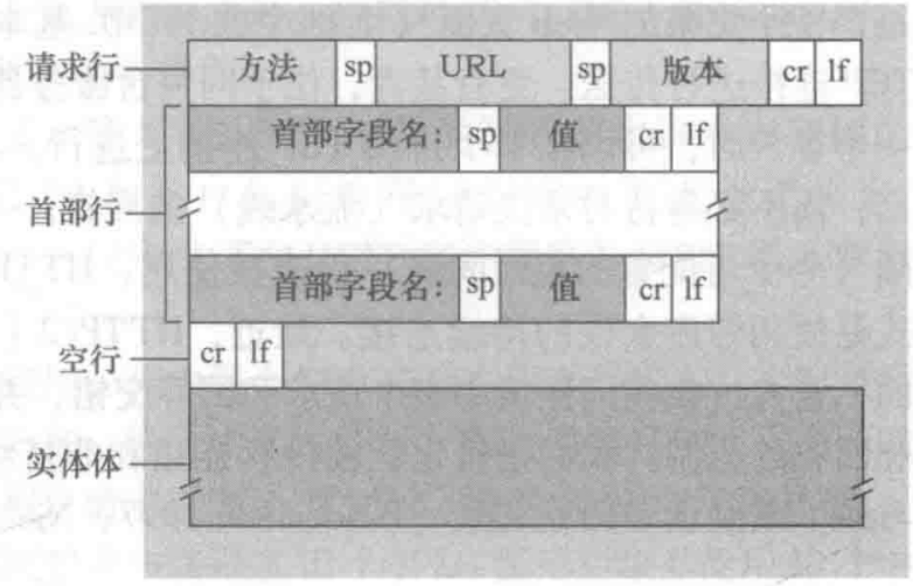
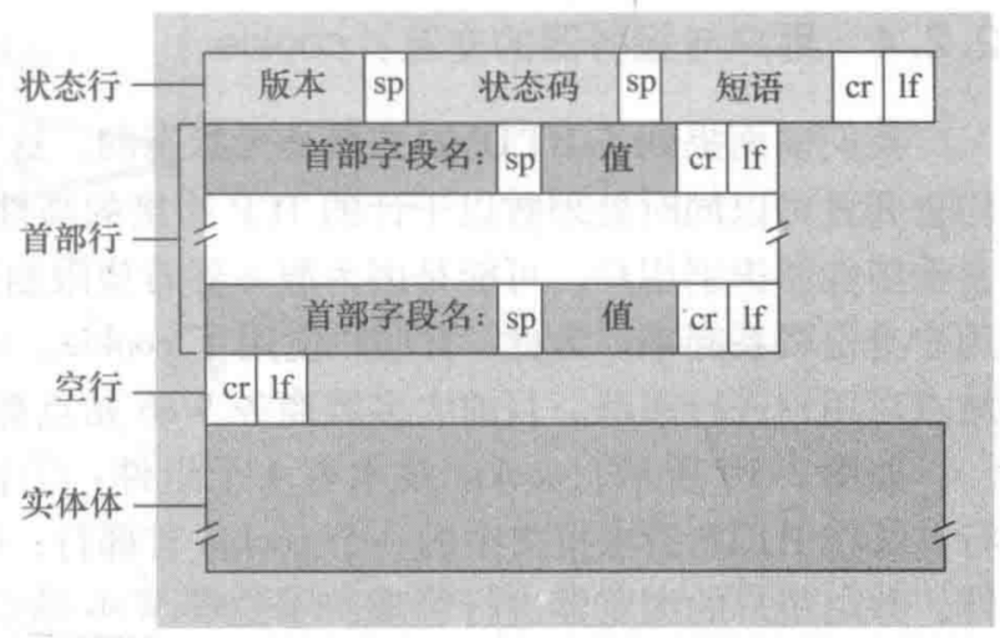
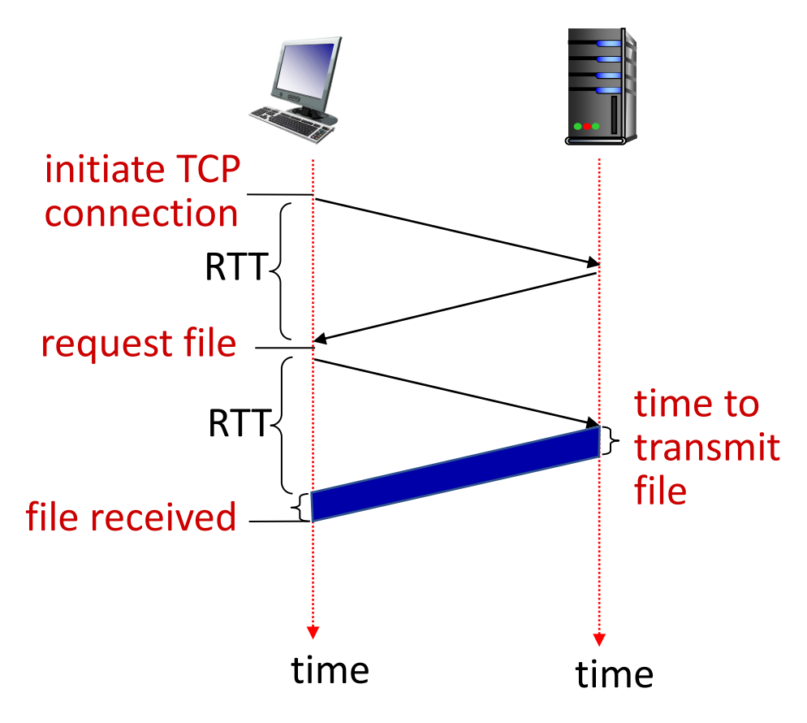
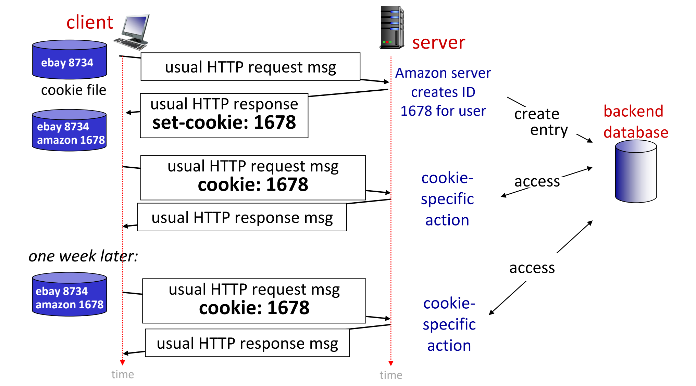
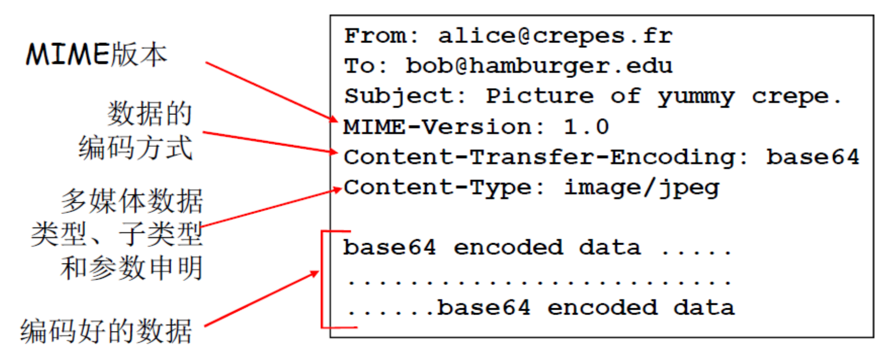
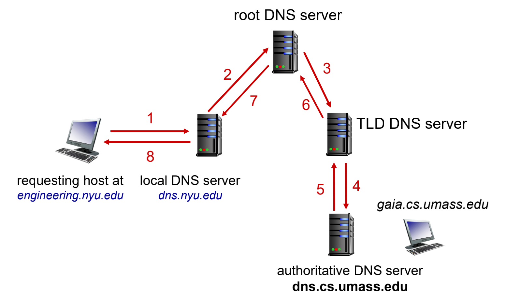
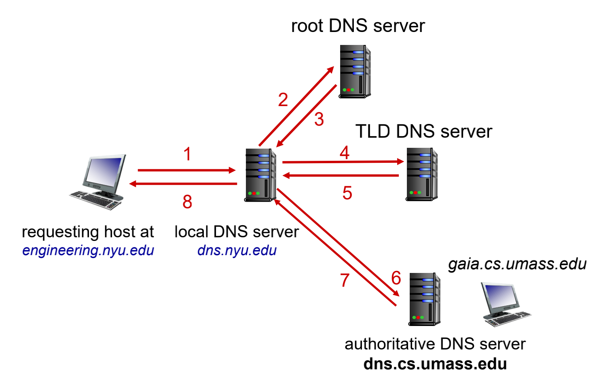
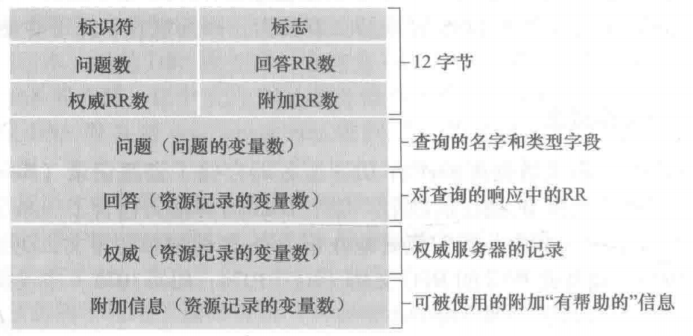

[TOC]

---

# § 第二章 应用层

## § 2.1 应用层协议原理

### 应用程序体系结构 (application architecture) 

> - 由应用程序研发者设计, 规定了如何在各种端系统上组织该应用程序;

#### 1. 客户-服务器体系结构 (client-server architecture)

> ###### 概念
>
> - 服务器 (server): 一个总是打开的服务器, 用于服务于来自许多其他客户 (client) 的主机的请求;
> - 数据中心 (data center);
>
> ---
>
> ###### 特点
>
> 1) 客户相互之间不直接通信;
> 2) 服务器具有固定的、周知的 IP 地址;

#### 2. P2P体系结构 (P2P architecture)

> ###### 对等方
>
> - 应用程序在**间断连接**的主机对之间使用**直接通信**, 这些主机对被称为对等方;
> - 例如: 最常见的对等方是用户电脑到用户电脑;
>
> ---
>
> ###### 特点
>
> - 对等方之间直接通信;
> - 对服务器依赖很小或没有依赖;
> - 具有**自拓展性 (self-scalability)**, 直接成因是: 对等方除了是比特的消费者外还是他们的重新分发者;

---

### 进程通信

#### 进程 (process)

> ###### 概述
>
> - 一个进程可以被认为是运行在端系统中的一个程序;
> - 网络应用程序由成对的进程组成, 这些进程互相发送报文;
>
> ---
>
> ###### 客户与服务器进程的区分
>
> - 在网络应用程序的进程对中, 一个进程被标识为客户, 另一个进程被标识为服务器: 
>     - 发起通信 (即在该会话开始时, 发起与其他进程的联系)  的进程被标识为客户;
>     - 在会话开始时等待联系的进程是服务器;

#### API (应用程序编程接口, Application Programming Interface;套接字, socket)

> ###### 概述
>
> - 同一台主机内应用层与运输层之间的接口, 它是建立网络应用程序的可编程接口;
> - 应用程序开发者对运输层的控制权仅限于: 
>     - 选择运输层协议;
>     - 设定几个运输层参数 (或许可以);
>
> ---
>
> ###### 进程寻址方式: IP 地址 + 端口号
>
> -   IP地址: 主机由其 IP 地址唯一标识;
>
> -   端口号 (port number): 指定运行在接收主机上的 API, 因为一条主机能够运行多个网络应用程序;

---

### 运输层提供的运输服务

> ###### 应用的一些需求
>
> 1. 可靠数据传输 (reliable data transfer)
>    - 如果一个协议能保证: 由应用程序的一端发送的数据正确、完全地交付给该应用程序的另一端, 就说该协议提供了可靠数据传输;
> 2. 吞吐量
> 3. 定时: 对数据交付具有严格的时间限制;
> 4. 安全性

#### 因特网提供的运输服务 1: TCP服务

> ###### TCP服务模型包括的内容
>
> - 面向连接服务;
> - 可靠的数据传输服务;
>
> ---
>
> ###### TCP连接
>
> - 建立在两个应用 API 之间的连接, 是**全双工**的;
>
>     - 连接双方的进程可以在此连接上同时进行报文收发;
>
>
>     - 当应用程序结束报文发送时,  必须拆除该连接;
>
> ---
>
> ###### TCP 的加强: 安全套接字层 (SSL, Secure Sockets Layer)
>
> - SSL 是对 TCP 的加强;
> - SSL 在做到传统的 TCP 所能做到的一切的同时, 还提供进程到进程的安全性服务;
>     - 可提供如: 加密、数据完整性、端点鉴别;
> - 使用SSL的数据传递过程: 进程 $\rightarrow$ SSL $\rightarrow$ TCP $\rightarrow$ 运输层 $\rightarrow$ TCP $\rightarrow$ SSL $\rightarrow$ 进程

#### 因特网提供的运输服务 2: UDP服务

> ###### 概述
>
> - UDP 是一种**不提供不必要服务**的轻量级运输协议, 它**仅提供最小服务**;
> - 是**无连接的**, 即两个进程通信之前没有握手过程;
> - 不可靠的数据传送服务, 且到达接收进程的报文也可能是乱序到达的;
> - 没有拥塞控制机制;

---

### 应用层协议 (application-layer protocol) 

> ###### 概述
>
> 应用层协议**定义了运行在不同端系统上的应用程序进程如何相互传递报文**;
>
> ----
>
> ###### 应用层协议所定义的具体内容
>
> - 交换的报文类型,  如: 请求报文和响应报文;
> - 各种报文类型的语法, 如: 报文中的各个字段及这些字段是如何描述的;
> - 字段的语义, 即: 这些字段中的信息的含义;
> - 确定一个进程何时以及如何发送报文, 以及对报文进行响应的规则;

---

## § 2.2 Web 和 HTTP

> | 概念                                                       | 说明                                                         |
> | ---------------------------------------------------------- | ------------------------------------------------------------ |
> | 无状态协议 (stateless protocol)                            | HTTP 服务器并不保存关于客户的任何信息, 因此 HTTP 是**无状态协议**; |
> | 持续连接 / 非持续连接 ( (non-) persistent connection) | 客户-服务器的每一次交互是通过一个单独的 TCP 连接发送, 则是非持续连接; 若所有的请求和响应是通过相同的 TCP 连接发送, 则是持续连接; |
> | 往返时间 (Round-Trip Time, RTT)                       | 一个短分组从客户到服务器然后再返回客户所花费的时间; RTT 包括: 传播时延、排队时延以及分组处理时延等; |

---

### HTTP (超文本传输协议, HyperText Transfer Protocol) 

> ###### 概述
>
> - Web 的应用层协议是 HTTP, 它是 Web 的核心;
> - 采用 TCP 协议, 80 端口;
> - 是无状态协议;
>
> ---
>
> ###### 为什么 HTTP 无状态: 维持状态的协议会很复杂
>
> - 过去的状态都需要维持和保存;
> - 如果客户端 / 服务端崩溃, 它们之间的 "状态" 可能产生不一致;
>     - 需要通过复杂的机制同步状态;
> - 采用无状态协议的服务器能支持更多的连接;

#### A. HTTP 请求报文

> <left></left>
>

##### 1. 请求行 (request line)

> ###### 概述
>
> - HTTP请求报文的第一行;
> - 构成:  `(方法字段 | URL字段 | HTTP版本字段)` 
>
> ---
>
> ###### 方法字段
>
> - GET 方法
>
>     - 绝大多数的 HTTP 请求使用 GET 方法;
>
>     - 请求一个对象: URL 字段带有请求对象的标识;
>
>     - 使用 GET 方法时, 实体体为空;
>
> - POST 方法
>
>     - 请求一个 Web 页面, 该页面的特定内容依赖于用户**在表单字段中输入的内容**;
>
>     - **实体体中包含用户输入的内容;**
>
>     - 用表单生成的请求报文不必须是 POST 方法;
>         - 可以使用 GET 方法, 在 URL 中包含输入的数据;
>         - 例如: 搜索引擎搜索时, 搜索框输入的内容在 URL 中存在;
>
> - HEAD 方法
>
>     - 类似于 GET 方法, 但是服务器收到后, 会响应, 但**响应报文中不包含请求的对象**;
>
>     - 一般用于程序开发者的调试, 故障跟踪;
>
> - PUT 方法
>
>     - 允许用户上传对象到指定路径;
>         - 如已存在则替换;
>     - 一般搭配 Web 发行工具使用;
>
> - DELETE 方法: 允许用户或应用程序删除 Web 服务器上的对象;

##### 2. 首部行 (header line)

> | 首部字段名      | 其值的含义                                              |
> | --------------- | ------------------------------------------------------- |
> | Host            | 指明对象所在的主机;                                     |
> | Connection      | 告诉服务器使用持续连接 / 非持续连接;                    |
> | User-agent      | 用来指明用户代理 (即: 向服务器发送请求的浏览器) 的类型; |
> | Accept-language | 用户想要得到的语言版本;                                 |
> | cookie          | 唯一标识用户, 用来保存状态;                             |
>

##### 3. 空行

> - 一段空白行;
>

##### 4. 实体体 (entity body)

> - 使用 GET 方法时, 该部分为空;
> - 使用 POST 方法时, 该部分包含用户在表单字段的输入值;

---

#### A\*. 条件 GET 请求报文

> ###### 概述
>
> - 使用 GET 方法的请求报文;
>- 特点: 首部行中包含: `If-Modified-Since` ;
> 
>---
> 
>###### 工作过程
> 
>- 初始服务器检查 `If-Modified-Since` 字段 (代表内容何时被缓存到代理服务器), 判断请求的内容在被缓存到代理服务器后是否被修改过:
>     - 如果被修改过: 初始服务器将重新发送该内容到代理服务器;
>    - 如果没有被修改过: 返回 `304 Not Modified` , 代表可以继续使用代理服务器中的该对象;

---

#### B. HTTP 响应报文

> <left></left>
>

##### 1. 状态行 (status line)

> ###### 构成
>
> - `(协议版本 | 状态码 | 状态信息)`
>
> ---
>
> ###### 常见的状态码
>
> | 状态码                         | 含义                                                         |
>| ------------------------------ | ------------------------------------------------------------ |
> | 200 0K                         | 请求成功, 信息在返回的响应报文中;                            |
>| 301 Moved Permanently          | 请求的对象已经被永久转移了; 新的 URL 定义在响应报文的 `Location` 首部行中, 客户软件将自动获取新的 URL; |
> | 400 Bad Request                | 一个通用差错代码, 指示该请求不能被服务器理解;                |
> | 404 Not Found                  | 被请求的文档不在服务器上;                                    |
> | 505 HTTP Version Not Supported | 服务器不支持请求报文使用的 HTTP 协议版本;                    |
> | 304 Not Modified               | 用于回复条件 GET 请求报文; 说明自条件GET请求报文中 `If-Modified-Since` 所示的时间后, 该请求的对象没有被更改过; |
> 

##### 2. 首部行 (header line)

> | 首部字段名     | 其值的含义                                                   |
>| -------------- | ------------------------------------------------------------ |
> | Connection     | 使用持续还是非持续 TCP 连接发送内容; |
>| Date           | 指示服务器产生并发送该响应报文的日期和时间;                  |
> | Server         | 指示产生报文的服务器;                                        |
>| Last-Modified  | 指示了对象创建或者最后修改的日期和时间;                      |
> | Content-Length | 指示了发送对象的字节数;                                    |
>| Content-Type   | 指示了实体体中的对象类型;                                    |
> | Set-cookie     | 设置cookie值, 以标识客户, 维持状态;                          |
>

##### 3. 空行

> - 一段空白行;

##### 4. 实体体 (entity body)

> - 报文的主要部分, 包含了所请求的对象本身;

---

#### HTTP 协议相关说明

> ###### 持久 HTTP : 流水方式 / 非流水方式
>
> - 非流水方式的持久 HTTP
>
>     <left></left>
>
>     - 客户端只有在收到前一个请求的响应后, 才能发出新的请求;
>
>     - 每个引用对象需要花费 1 RTT;
>
>     - **响应时间**: `2 RTT + 文件传输时延` ;
>
> - 流水方式的持久 HTTP
>
>     - HTTP/1.1 的默认模式;
>     - 客户端每遇到一个引用对象就立刻产生一个请求;
>     - 所有引用对象 (如果较小的话) 可能只需要花费 1 RTT 时间即可全部收到响应;
>
> ---
>
> ###### 不同版本的 HTTP 协议
>
> - HTTP/1.0
>     - 非持续的 HTTP , 每个 TCP 连接最多传输一个对象;
> - HTTP/1.1
>     - 新特性
>         - 引入通过 TCP 持续连接, **流水线**传输对象;
>         - 流水线采用 **FCFS 调度**, **先到先得**, 按照请求的顺序返回;
>         - 丢失恢复: 出错则中断所有对象的传输, 重传;
>     - 不足
>         - 容易**队头阻塞 (head-of-line blocking, HOL blocking)**: 小对象需等待大对象传输完;
>         - 因为通过单个 TCP 连接传输, 因此出错需要阻塞其他所有对象的传输;
> - HTTP/2
>     - 目标: 减少多对象 HTTP 请求的延迟;
>     - 新特性
>         - 基于客户端指定的**优先级调度**请求的返回顺序: 减轻 HOL blocking;
>         - 将未请求的对象**提前推送**到客户端 (**预测**可能请求的对象, 命中则能降低延迟);
>         - 将对象划分为帧, 安排帧的顺序减轻阻塞;
>     - 不足
>         - 同 HTTP/1.1 一样, 通过单个 TCP 连接传输, 仍会在出错时阻塞其他所有对象的传输;
>         - 同一个域名只使用一个 TCP 连接, TCP HOL blocking 问题会更大;
> - HTTP/3
>     - 新特性
>         - 安全性增强;
>         - 针对单对象错误的改进;
>         - 更好的拥塞控制 (通过更多的流水线);
>         - 基于 UDP 和 Google 的 QUIC 协议;
>     - 链接: [更多 HTTP/3 的信息](https://www.upyun.com/tech/tags/HTTP3)

---

### 用户与服务器的交互: cookie

> ###### 概述
>
> - 第一次访问某服务器, 服务器为用户设置 cookie, 用户主机保存该 cookie;
> - 后续访问中, 在 HTTP 请求中增加 cookie, 从而让服务器识别出用户身份;
>
> ---
>
> ###### cookie 技术的 4 个部件
>
> - HTTP 响应报文中的 `Set-cookie` 首部行 , 首次访问时为用户设置唯一标识码;
> - HTTP 请求报文中的 `cookie` , 用于向服务器说明自己的身份信息;
> - 用户端系统中保存的 `cookie` 文件, 由浏览器管理;
> - 位于 Web 站点的后端数据库, 保存用户的标识信息 (cookie 及其对应的状态);
>
> ---
>
> ###### 工作步骤
>
> <left></left>
>
> 1) 用户首次访问网站, 网站使用 `Set-cookie` 给用户分发识别码;
> 2) 用户端系统在 cookie 文件中添加该识别码, 这由浏览器管理;
> 3) 用户端每次向服务器请求, 都会在 HTTP 请求报文中添加一行对应的首部行 `cookie` , 服务器端以此唯一识别用户;

---

### Web 缓存器 (Web cache; 代理服务器, proxy server)

>###### 概述
>
>- 能够代表初始 Web 服务器来满足 HTTP 请求的网络实体;
>- 代理服务器中有自己的存储空间, 可以保存最近请求过的网络对象的副本;
>
>---
>
>###### 工作过程
>
>对于配置了代理服务器的浏览器, 其 HTTP 请求过程如下: 
>
>1. 浏览器建立到代理服务器的 TCP 连接;
>2. 浏览器通过 TCP 发送 HTTP 请求到 Web 服务器;
>3. 代理服务器接收到浏览器的HTTP请求, 检查自身的存储空间中是否有所请求内容的副本: 
>    1. 如果有, 则向浏览器返回内容, 结束;
>    2. 如果没有, 则:
>        1. 与该请求对应的初始服务器建立 TCP 连接, 发送新的 HTTP 请求, 请求该内容;
>         2. 得到该内容后, 在代理服务器中存储该副本;
>            - 初始服务器返回的报头中, 包含 `Cache-Control` 字段, 用于告诉代理服务器: 该内容的最长 "年龄" (多久失效), 或者是否允许缓存等;
>         3. 将该副本通过 HTTP 响应报文发送至客户浏览器 (此响应过程使用的TCP仍然是步骤 (1) 中建立的TCP连接);
>
>---
>
>###### 特点
>
>- 可以大大减少对客户请求的响应时间;
>    - 特别是客户到初始服务器的带宽较小时;
>- 可以减少配备代理服务器的机构的接入链路到因特网的通信量, 从而减少带宽需求, 降低成本;
>- 可以从整体上大大降低因特网上的 Web 流量, 从而改善所有应用的性能;

---

### FTP 文件传输协议

> ###### 概述
>
> - 向远程主机上传输文件或从远程主机接收文件;
> - 典型 C/S 模式, 基于 TCP;
> - 端口号为 21 (控制连接), 数据连接使用 20 端口;
> - 缺点
>     - 安全问题: 用户名/密码明文传输;
>     - 性能落后

---

## § 2.3 电子邮件

### SMTP (简单邮件传输协议, Simple Mail Transfer Protocol) 

> ###### 概述
>
> - 应用层协议, 是因特网电子邮件的核心, 用来将邮件从发送方的邮件服务器传输到接收方的邮件服务器;
> - 每个邮件服务器运行一个 SMTP 客户端和一个 SMTP 服务器端;
> - 在同一次 TCP 连接中, 两个建立连接的邮件服务器互相交换收到的 / 要发送的邮件;
>
> ---
>
> ###### SMTP 报文格式
>
> <left></left>
>
> - 必须包括: `From` , `To` ;
> - 可能包括: `Subject` ......
> - 后面紧跟一个空白行, 然后是报文体;
>     - 报文体必须是 7bit ASCII 形式;
>
> ---
>
> ###### 工作步骤
>
> 假设 A 向 B 发送邮件:
>
> 1) A 调用邮件代理程序, 并提供 B 的邮件地址;
> 2) A 的邮件代理程序将报文发送给与自己对应的邮件服务器 (A 服务器), 该报文被放入 A 服务器的队列中;
> 3) A 服务器与 B 服务器建立 TCP 连接 (如果 B 服务器没有开机, 则该邮件会被放在 A 服务器上, 一段时间后, A 服务器将重试与 B 服务器建立 TCP 连接), 经过一些初始的 SMTP 握手, A 对应的邮件服务器开始向 B 对应的邮件服务器发送报文;
> 4) B 服务器收到报文, 将报文放到 B 的邮箱中;
> 5) B 在使用邮件代理程序时, 通过调用用户代理阅读该邮件;
>
> ---
>
> ###### SMTP 与 HTTP 对比
>
> -   HTTP
>
>     -   是一个**拉协议 (Pull Protocol)** , 一般是**由想接受文件的机器发起 TCP 连接, 从服务器拉取信息**;
>
>     2) HTTP 不受类似 SMTP 的 ASCII 码的限制;
>     3) HTTP 将每个对象封装到自己的报文中;
>
> -   SMTP
>
>     -   基本上是一个**推协议 (Push Protocol)**, 一般是**由发送邮件的服务器将数据推向接收方服务器**;
>     -   SMTP 要求报文 (包括体部分) 都采用 **7bit 的 ASCII 码**的格式, 如果是图片等文件, 必须要进行编解码;
>     -   SMTP 将所有的报文对象都放在一个报文之中;
>     -   SMTP 使用持久 TCP 连接;
>     -   SMTP 使用 `CRLF` 确认报文的结尾;
>
> ---
>
> ###### 多媒体扩展: MIME (Multimedia mail extension)
>
> <left></left>

---

### 邮件访问协议

#### 1. POP3 (第三版的邮局协议, Post Office Protocol-Version 3)

> ###### 概述
>
> - 功能有限;
> - 无状态的, 简化了实现;
>
> ---
>
> ###### 工作的三个阶段
>
> 1) 特许: 用户代理以明文形式发送用户名和密码;
> 2) 事务处理: 用户代理取回报文, 同时用户代理还能对邮件添加或取消删除标记, 但服务器暂时不会删除对应的邮件;
>     - 删除存在的问题: 无法从第二个设备上继续访问该邮件;
> 3) 更新: 客户发出 `quit` 命令, POP3 会话结束, 邮件服务器将会删除被标记删除的报文 (即 “更新”) ;

#### 2. IMAP (因特网邮件访问协议, Internet Mail Access Protocol)

> - 提供远程文件夹 (目录, 可远程管理)、查询、返回邮件的一部分 (适合低带宽连接) 等功能;
> - 保存用户**状态**信息: 目录名, 报文 ID 与目录名的映射......
> - 实现更为复杂;

#### 3. 基于 Web 的电子邮件

> - 普通浏览器作为用户代理;
> - 用户与邮箱服务器之间采用 HTTP 进行通信, 但是邮件在服务器之间交换的过程使用的仍然是 SMTP 协议;

---

## § 2.4 DNS

### 域名 (Domain Name)

> ###### 概述
>
> - 从本域往上, 直到树根, 中间使用 “.” 间隔不同的级别
> - 例如: `sysu.edu.cn` , `sse.sysu.edu.cn` , `www.sse.sysu.edu.cn`;
>
> ---
>
> ###### 作用
>
> - 域的域名: 可以用于表示一个域;
> - 主机的域名：表示一个域上的一个主机;
>
> ---
>
> ###### 管理
>
> - 一个域管理其下的子域:
>     - `.jp` 被划分为 `ac.jp` , `co.jp` ;
>     - `.cn` 被划分为 `edu.cn` , `com.cn` ;
>     - ......
> - 创建一个新的域, 必须征得它所属域的同意;
>
> ---
>
> ###### 特点: 与物理网络无关
>
> - 域遵从组织界限, 而不是物理网络: 域的划分是逻辑的, 而不是物理的;
>
>     - 一个域的主机可以不在一个物理网络;
>
>     - 一个物理网络的主机不一定在一个域;

---

### 域名系统 (DNS, Domain Name System)

> ###### 概述
>
> - 核心的 Internet 功能, 但以应用层协议实现;
>     - 在网络边缘处理复杂性;
>     - 是运行在 UDP 之上的, 端口号为 53 的应用服务;
> - 域名系统是一个由分层的 DNS 服务器实现的分布式数据库;
>     - 每个区域都有一个名字服务器: 维护着它所管辖区域的权威信息 (authoritative record);
>     - 名字服务器允许被放置在区域之外, 以保障可靠性;
> - DNS 协议是使得主机能够査询分布式数据库的应用层协议;
> - 区域的划分
>     - 由区域管理者自己决定;
>     - 将 DNS 名字空间划分为互不相交的区域, 每个区域都是树的一部分;
>
> ---
>
> ###### 目的
>
> - 主要目的: 实现主机名 - IP 地址的转换 (name / IP translate)
> - 其它目的
>     - 主机别名 (Host aliasing) 到规范主机名的转换;
>     - 邮件服务器别名 (Mail server aliasing) 到邮件服务器的规范主机名的转换;
>     - 负载均衡: Load distribution;

#### 分布式、层次数据库

> ###### 为什么不适用单一的DNS服务器
>
> - 单点故障: 单点式的 DNS 服务器瘫痪将导致整个互联网瘫痪;
> - 通信容量: 每天的 DNS 查询数量很大;
> - 远距离的集中式数据库: 远距离的请求时延严重;
> - 维护: 数据库庞大, 文件管理, 查找, 发布麻烦, 且需要频繁更新;
>
> ---
>
> ###### 结构
>
> -   `根 DNS 服务器`
>     -   `客户` 首先与 `根 DNS 服务器` 联系;
>     -   它能返回对应的 `顶级域 DNS 服务器` 的 IP 地址;
> -   `顶级域 (Top-Level Domain, TLD) DNS 服务器`
>     -   能返回 `权威 DNS 服务器` 的地址, 或者是所需的 IP 地址 (如果能解析);
>     -   例如: `.com` DNS 服务器、`.org` DNS 服务器......
> -   `权威 DNS 服务器`
>     -   组织机构的 DNS 服务器, 提供组织机构的服务器所能访问的主机和 IP 地址的映射;
>         -   可由组织机构自己维护, 或者由第三方实现;
>     -   它能返回主机名的 IP 地址, 这是**客户最终所需要的**;
>     -   例如: `facebook.com` DNS 服务器......
>
> ---
>
> ###### 本地 DNS 服务器 (local DNS server)
>
> -   并不严格地属于该层次结构中;
> -   每一个 ISP 都有一台本地 DNS 服务器;
> -   进行 DNS 缓存 (DNS caching)
>     -   起到 “DNS 的缓存” 的作用;
>     -   在服务器本地缓存最近返回的域名映射, 该映射将会在一段时间后被丢弃 (一般设置为2天) , 以防止该映射失效;
>         -   映射可能过期, 且无法马上得知;
>         -   属于尽最大努力翻译;

#### 域名解析 (查询)

> ###### DNS 查询方式 1: 递归查询
>
> <left></left>
>
> -   发出**一次查询**请求, 然后**等待最终结果返回**, 而不是中间结果, 即: 不需要多次请求查询;
>     -   例如: 本地端的用户向 LDNS 服务器请求, 就是递归查询;
>         -   如果 LDNS 服务器找不到该映射, 就会以 DNS 客户端的身份向别的 DNS 服务器请求映射, 直到得到结果后返回给本地端的用户;
>     
> -   递归查询对高层的 DNS 服务器有较高压力;
>
> ---
>
> ###### DNS 查询方式 2: 迭代查询
>
> <left></left>
>
> -   例如: LDNS 服务器依次向根 DNS 服务器、顶级域 DNS 服务器、权威 DNS 服务器的查询、返回的过程, 就是迭代查询;
> -   因为根 DNS 服务器返回的 IP 地址, 指示的是下一步 LDNS 服务器该向谁去查, **是中间结果**, 而不是最终结果;
>
> ---
>
> ###### 域名解析过程
>
> 1. 用户请求一个 URL;
> 2. 用户主机依次在 `浏览器缓存` ,  `系统的 hosts 文件` 中查找映射;
> 3. 如果都没有, 则向 `本地DNS服务器 (LDNS; 即所设置的首选DNS服务器)` 请求映射, 进行**递归查询**: 
>     1. 如果要查询的域名, 包含在 **LDNS 服务器** 的本地配置区域资源中, 则 `LDNS 服务器` 返回解析结果给客户机, 完成域名解析, 此解析**具有权威性**;
>         - 本地配置区域资源是指 LDNS 对应的域下的域名解析, 即: 将 LDNS 视为权威 DNS 服务器;
>     2. 如果要查询的域名, 不由 LDNS 服务器区域解析, 但该服务器**已缓存**了此网址映射关系, 则调用这个 IP 地址映射, 完成域名解析, 此解析**不具有权威性**;
> 4. 如果 `LDNS 服务器` 的本地区域文件和缓存解析都不包含此映射, 则根据 LDNS 服务器是否设置了转发模式, 分两种情况:
>     - 情况 1: 如果 `LDNS 服务器` 采用转发模式, 则向 LDNS 服务器的上一级 DNS 服务器发送请求, 进行**递归查询**;
>         - `LDNS 服务器的上一级服务器` 也可以采用转发或者不转发的方式;
>     - 情况 2: 如果 `LDNS 服务器` 不采用转发模式, 则进行**迭代查询**:
>         1. `LDNS` 将请求发至 13 台 `根 DNS 服务器`, `根 DNS 服务器` 返回负责该顶级域的 `顶级域名服务器` 的一个 IP;
>             - 例如: 返回 `.com` 的顶级域 DNS 服务器;
>         2. `LDNS` 将请求发给 `步骤 (4.情况2.1)` 中指定的 `顶级域 DNS 服务器` , 它将返回原请求对应的 `权威 DNS 服务器` 的IP地址;
>         3. `LDNS` 将请求发给 `步骤 (5.情况2.2)` 中指定的 `权威 DNS 服务器` , 它将返回原请求对应的 IP 地址给 `LDNS 服务器`;
>         4. `LDNS 服务器` 将得到的映射关系缓存, 并设置 TTL (寿命), 同时发送给用户, 解析完成;

#### DNS 提供的其他服务

> ###### 主机别名 (host aliasing)
>
> -   一个服务器有一个规范主机名 (canonical hostname) , 可能还有多个主机别名;
> -   DNS 可以解析主机别名: 获取别名对应的规范主机名以及 IP 地址;
>
> ----
>
> ###### 邮件服务器别名 (canonical hostname)
>
> -   解析邮件服务器的别名, 以获取其规范主机名;
> -   除了解析邮件服务器的规范主机名, 还可以允许一个公司的 Web 服务器和邮件服务器使用同一个主机名;
>
> ---
>
> ###### 负载分配 (load distribution)
>
> -   通过循环地返回冗余的各个服务器的 IP 地址, 使得各个服务器的负载较为均衡;

#### DNS 资源记录 (Resource Record, RR)

>  ###### 概述
>
>  - 提供了主机名到 IP 地址的映射的记录;
>  - 每个 DNS 回答报文包含了一到多条 RR;
>
>  ---
>
>  ###### 格式
>
>  `(Name, Value, Type, TTL)` 
>
>  - `TTL` 为该缓存记录将被删除的时间;
>  - `Type` 决定了 `Name` 和 `Value` 的意义;
>
>  ----
>
>  ##### Type 及其含义
>
>  | Type  | 含义                                                         |
>  | ----- | ------------------------------------------------------------ |
>  | A     | `Name` 为主机名, `Value` 为 IP 地址;                         |
>  | NS    | `Name` 为域 (例如: `baidu.com`) , `Value` 是对应的权威DNS服务器的主机名 (该权威DNS服务器知道如何获取该域内的主机的 IP 地址) ; |
>  | CNAME | `Name` 为其他服务器 (不包含邮件服务器) 的别名, `Value` 为规范主机名, 该类型用于获取 (除邮件服务器以外其他) 服务器的规范主机名; |
>  | MX    | `Name` 为邮件服务器的别名, `Value` 为规范主机名, 该类型由于获取邮件服务器的规范主机名; MX 记录允许邮件服务器具有与其他服务器相同的别名; |
>
>  - `Type = NS` 时, 具有 NS 型记录的 DNS 服务器, 还有一条对应于该 NS 型记录中 Value 值的主机名对应的 IP 映射的 A 型记录, 即有如下两条: 
>     1. `(域名 A , 域名 A 对应的权威 DNS 服务器主机名, NS, TTL)`
>     2. `(域名 A 对应的权威 DNS 服务器主机名, 对应的权威 DNS 服务器的 IP 地址, A, TTL)`

#### DNS 报文格式

> <left></left>
>
> | 名称     | 位数                  | 说明                                                         |
> | -------- | --------------------- | ------------------------------------------------------------ |
> | 标识符   | 16 bit                | 用于识别各个请求/回答之间的对应关系;                         |
> | 标志     | 多个占 1 bit 的标志位 | 例如: 查询/回答, 是否是权威的, 希望递归, 递归可用......      |
> | 问题     | /                     | 查询的 `Name`、`Type` 字段;                                  |
> | 回答     | /                     | 一到多条 RR (资源记录, Resource Record) ;                    |
> | 权威     | /                     | 包含了其他权威服务器的记录;                                  |
> | 附加信息 | /                     | 一些附加信息; 如: MX 请求的附加信息部分, 含有该邮件服务器的规范主机名对应的 IP 地址; |

#### 向 DNS 数据库插入记录: 增加一个域

> 1. 向商业实体: 注册登记机构 (registrar) 请求注册域名, 并支付一定费用;
> 2. 因特网名字和地址分配机构 (ICANN) 向注册登记机构授权;

---

### DNS 相关安全问题

> 待补充;

---

## § 2.5 P2P 体系结构

> ###### 特点
>
> - 自拓展性: 具有 P2P 体系结构的应用程序是自拓展的;
>     - 新的对等方加入, 不仅带来新的需求, 也带来新的服务能力;
>
>     - 直接成因是: 对等方除了是比特的消费者, 还是它们的重新分发者;
>
> - 不是常开的;
>
> - 端系统之间直接通信, 不经过服务器;

### BitTorrent

> ###### 概述
>
> - 一种用于文件分发的流行 P2P 协议;
>
> ---
>
> ###### 相关概念
>
> -   洪流 (torrent): 参与一个特定文件分发的所有对等方的集合;
> -   追踪器 (tracker)
>     -   每个洪流中都存在的一个基础设施节点;
>     -   当一个对等方加入洪流时, 该对等方需要向追踪器注册自己, 并且周期性地通知追踪器自己仍在当前洪流中;
>
> ---
>
> ###### 工作过程
>
> 1) A 加入了洪流, 向追踪器注册自己, 并且在之后会周期性通知追踪器自己还在洪流当中;
>
> 2) 追踪器向 A 发送一个**所有**参与该洪流的**对等方**的一个**子集**的 IP 地址列表;
>
> 3) A 尝试向所获得的列表中的所有对等方建立 TCP 连接, 成功建立 TCP 连接的对等方称为 “邻近对等方”;
>     - 邻近对等方的数量是随时间波动的, 因为对等方可以在任何时间离开该洪流;
>
> 4) A 周期性地向自己的每个邻近对等方, 经过 TCP 连接, 询问对方所拥有的块列表 (该洪流所分享的文件会被分成许多块) , 然后仍然通过 TCP 连接, 向拥有自己所没有的块的邻近对等方请求该块;
>
> ---
>
> ###### 两个重要的原则
>
> - A 应当先请求哪些块: “最稀缺优先 (rerest first)”
>     - 优先请求在 A 的邻居中副本数量最少的块, 从而使得稀缺的块更快地被分发, 从而均衡每个块在洪流中的副本数量;
> - A 应当先响应众多请求中的哪一个: “一报还一报 (tit-for-tat)”
>     - A 总共响应 5 个请求: 
>         1) 4 个对自己贡献最大的
>             - A 的响应的优先权, 将会优先给到向 A 自身提供数据速率排名最高的 4 个邻近对等方;
>                 - 该机制能够让人们更加愿意去分享比特, 而不是总是 “白嫖” 比特;
>             - 每过 10s 重新计算一次排名;
>             - 这 4 个对等方被称为: unchoked (疏通?);
>
>         2) 1 个随机的
>             - 每过 30 s 刷新一次的随机一名邻近对等方;
>             - 这样能够保证新加入的对等方得到块, 也能让 A 可能找到与自己更加匹配的对等方来进行交换;

---

## § 2.6 视频流和内容分发网

### HTTP流

> 1) 客户与服务器通过 TCP 连接, 用 HTTP GET 发送请求、接受 HTTP 响应报文中的视频文件;
> 2) 在客户端, 字节将被缓存, 当缓存中的字节数量超过一定的门限后, 视频便会开始播放, 缓存还会缓存视频后面部分的帧;
> 3) 客户端的视频应用周期性地从缓存中抓取帧、解压缩、播放;

---

### 经 HTTP 的动态适应性流 (Dynamic Adaptive Streaming over HTTP , DASH) 

> - 用户动态地根据自身可用带宽, 通过某些速率决定算法, 使用 HTTP GET 请求报文, 请求合适的编码速率的版本的短视频段数据块;
> - HTTP 服务器存在告示文件 (manifest file) , 来标明一个视频各个版本的 URL 及其比特率;
>     - 使用 DASH 时, 用户与内容服务器建立 TCP 连接后, 服务器会先向用户返回对应的告示文件;

---

### 内容分发网 (CDN, Content Distribution Network) 

> ###### 概述
>
> - CDN 管理分布在多个位置上的服务器, 在它的服务器中存储视频等内容的副本;
> - CDN 试图将用户的请求定位到能够提供最好的用户体验的 CDN 位置;
> - CDN 分为两类
>     - 专用CDN (private CDN): 内容提供商自己拥有的CDN;
>     - 第三方CDN (third-party CDN): 代表多个内容提供商分发内容;
>
> ---
>
> ###### 不同的CDN的服务器安置原则
>
> -   深入 (Enter Deep)
>     -   通过在遍及全球的接入 ISP 中部署服务器集群, 深入到 ISP 接入网中;
>         -   靠近用户, 减少用户到 CDN 的路由和链路数量, 改善用户感受到的时延和吞吐量;
>     -   这种方式成本高, 维护和管理难;
> -   Bring Home (邀请做客!)
>     -   在少量的关键位置建立大型集群, 这些 CDN 通常将它们的集群放在 IXP (因特网交换点);
>     -   此方法的维护和管理开销低, 但是会牺牲用户感受到的时延和吞吐量;
>
> ---
>
> ###### 内容存放位置管理
>
> -   拉策略
>     当用户请求一个内容, 如果被请求的集群没有存储该内容, 则该集群会从中心仓库或另一个集群检索找到该内容, 在向客户传输该内容的同时, 还会将该内容存在本集群的存储空间中 (类似于缓存策略, 优先删除访问最少的内容) ;
> -   推策略
>     在非高峰时段的预定时间, 将流行的内容推入服务器;
>
> ---
>
> ###### CDN操作细节
>
> 假设用户访问 A 网站的视频内容, A 使用第三方CDN: B;
>
> 1) 用户访问位于 A 的 Web 网站, 网站上有视频内容 URL;
>
> 2) 用户点击一个视频链接: `http://vedio.A.com/123456`, 进而发送了一个对于 `video.A.com` 的 DNS 请求;
>
> 3) 用户的 LDNS 发送 DNS 请求, 该 DNS 请求被层层中继, 到达了用于 A 的权威 DNS 服务器 ADNS;
>
> 4) ADNS 观察到地址中的 vedio, 发现该内容位于第三方 CDN: B, 于是 ADNS 没有像通常情况一样返回一个对应的 IP 地址, 而是返回对应于 B 的主机域的域名, 例如: `abc.B.com`;
>
> 5) 客户发送新的 DNS请求, 继续层层中继, 最终请求被移交来到了 B 的专用 DNS 基础设施, 最终 B 的权威 DNS 服务器向用户的 LDNS 返回了指向 B 的 CDN 服务器的 IP 地址;
>
> 6) LDNS 向用户返回该 IP 地址, 进而用户从该服务器接受所请求的视频内容;
>

#### CDN 集群选择策略 (CDN cluster selection strategy)

> ###### 概述
>
> - 动态地将用户定向到 CDN 中的某个服务器集群或数据中心的机制;
> - CDN 通过客户的 DNS 请求, 得知客户的 LDNS 的 IP地址, 进而选择一个适当的集群的 IP 地址返回;
>
> ---
>
> ###### 选择方法
>
> - 地理上最为临近 (geographical closest)
>
>     -   使用商用地理位置数据库, 将每个 LDNS 的 IP 地址映射到一个地理位置, 进而 CDN 选择一个地理位置上距离最近的集群的 IP 地址返回;
>     -   优点: 简单, 且大多数时候是有效的;
>
>     -   缺点
>         -   用户可能配置了距离自己很远的 LDNS 服务器;
>         -   这种策略忽略了时延和可用带宽随着因特网路径、时间而变化的问题;
>
> - 实时测量 (real-time measurement)
>     -   CDN 能够对其集群和客户之间的时延、丢包性能, 执行周期性地测量;
>     -   例如: 让 CDN 的各个集群, 周期性地向世界各地的 LDNS 发送探测分组, 如 ping 或 DNS 请求, 进而测量性能;
>     -   优点: 解决了地理上最为临近测量中的一些问题;
>     -   缺点: 许多 LDNS 被配置为不响应这些探测;

---