[TOC]

---

# § 第五章 网络层: 控制平面

## § 5.1 概述

> ###### 控制平面的两种主要实现方法
>
> 1. 每路由器控制
>     <left></left>
>
>     - 每台路由器都包含转发功能和路由选择功能;
>     - 每个路由器都有一个路由选择组件, 用于**与其他路由器中的路由选择组件通信**, 以计算转发表项;
>
>     - OSPF 和 BGP 协议都是基于这种方法进行控制的;
>
> 2. 逻辑集中式控制
>     <left>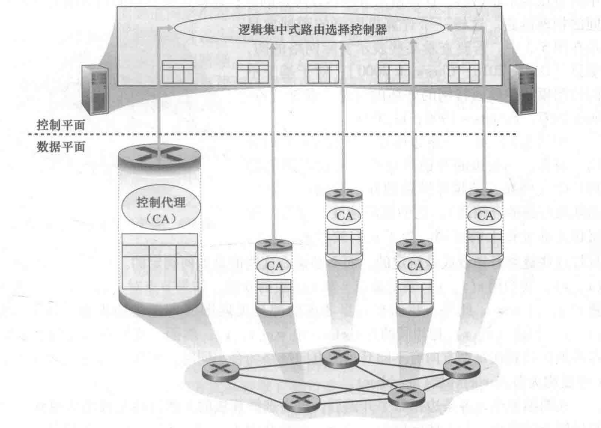</left>
>
>     - 采用通用的 "匹配加动作" 抽象, 由逻辑集中式控制器负责计算并分发转发表;
>     - 经过一种定义好的协议, 每台路由器与控制代理 (CA) 进行交互, 进而配置和管理转发表;
>         - 控制代理 (CA) 的任务是与控制器通信, 并按照控制器的命令执行相应动作;
>     - 与 "每路由器控制" 的关键差异:
>         - 不同 CA 之间**不直接相互交互**;
>         - CA **不主动参与**转发表的**计算**;

---

## § 5.2 路由选择算法 (routing algorithm)

> ###### 有关计算机网络抽象图模型的约定
>
> - 链路开销看做是给定的, 不必关心它是如何计算得来的;
> - 只考虑无向图;
> - 如果节点对不属于边集 $E$ , 则该节点对对应的代价置为 $\infty$ ;
>
> ---
>
> ###### 目的
>
> - 从发送方到接收方过程中, 确定一条通过路由器网络的较好的路径;
>     - 等价于路由;
>     - 好的路径: 具有最低开销的路径;
>     - 通常还需要包括一些规则/策略, 例如: 某路由器不应转发某些特定的分组;
>
> ---
>
> ###### 相关概念
>
> - 最低开销路径 (least-cost path) / 最短路径 (shortest path)
>     - 最低开销路径是指路径开销的和最低的路径;
>     - 最短路径是指经过物理链路数量最少的路径;
>
> ---
>
> ###### 原则
>
> - 正确性 (correctness):
>     - 算法必须是正确的和完整的, 使分组一站一站接力, 正确发向目标站;
>     - 完整: 所有的目标地址, 在路由表中都能找到相应的表项, 即没有处理不了的目标地址;
> - 简单性 (simplicity):
>     - 算法在计算机上应简单: 最优但复杂的算法, 时间上延迟很大, 不实用, 不应为了获取路由信息增加很多的通信量;
> - 健壮性 (robustness):
>     - 算法应能适应通信量和网络拓扑的变化: 通信量变化, 网络拓扑的变化等, 算法能很快适应;
>     - 不向很拥挤的链路发数据, 不向断了的链路发送数据;
> - 稳定性 (stability): 产生的路由不应该摇摆;
> - 公平性 (fairness): 对每一个站点都公平;
> - 最优性 (optimality): 某一个指标的最优: 时间, 费用等指标, 或综合指标;
>     - 实际上, 获取最优的结果代价较高, 可以是次优的;
>
> ---
>
> ###### 分类
>
> - 根据算法是集中式还是分散式分类
>
>     - 集中式 (centralized)
>         - 在某个位置, **使用完整的, 全局性的网络知识**计算源到目的地之间的最低开销路径;
>             - 这个位置可以是逻辑集中式控制器, 也可以是在每个路由器的控制组件中重复进行;
>         - 这种具有全局状态信息的算法被称为链路状态 (Link State, LS) 算法;
>
>     - 分散式 (decentralized)
>         - 路由器以**迭代**, **分布式**的方式, 计算出最低开销路径;
>             - 每个节点只具有与其直接相连的链路的开销的知识;
>         - 这种算法更加适合路由器之间直接交互的控制平面;
>         - 这种算法叫做距离向量 (distance vector) 算法;
>
> - 根据算法是静态还是动态分类
>
>     - 静态 (static)
>         - 路由随着时间的变化缓慢, 通常是人工配置;
>         - 是非自适应性 (non-adaptive algorithm) 算法;
>     - 动态 (dynamic)
>         - 随着网络流量负载或网络拓扑的变化而改变路由选择路径;
>         - 周期性运行, 或响应网络拓扑/流量负载变化而运行;
>         - 是自适应 (adaptive algorithm) 算法;
>
> - 根据算法的负载敏感性分类
>
>     - 负载敏感的 (load-sensitive)
>         - 链路开销动态变化, 以反应底层链路的拥塞水平;
>         - 若一条链路开销较大, 则算法趋向于绕开该链路;
>     - 负载迟钝的 (load-insensitive)
>         - 当今的路由选择算法都是负载迟钝的, 因为开销并不明确反应当前的拥塞水平;

### 链路状态 (Link-State, LS) 路由选择算法

> ###### 总步骤
>
> 1. 获得网络拓扑和链路代价信息;
>     - 通过链路状态广播 (link state broadcast) 完成, 它可以让网络中所有节点都具有该网络的统一的, 完整的视图;
> 2. 使用最短路由算法, 得到路由表;
>     - 例如: Dijkstra 算法, Prim 算法......
>
> ---
>
> ###### 算法复杂度
>
> - 链路状态广播
>     - 每个路由器需要将 LS 分组广播给其他所有路由器;
>     - 每个 LS 分组将穿过 $O(n)$ 个链路, 则全局的 message complexity = $O(n^2)$ ;
> - Dijkstra 算法
>     - 最差情况下, 需要 $\frac{n(n+1)}{2}$ 次比较, 即: $O(n^2)$ ;

#### 链路状态广播

> ###### 目的
>
> - 让网络中所有路由器获得网络拓扑和链路的代价信息;
>
> ---
>
> ###### 步骤
>
> 1. 发现相邻节点, 并获知对方的网络地址;
> 2. 测量相邻节点之间的代价;
> 3. 组装 LS 分组, 用于描述相邻节点之间的代价信息;
> 4. 将 LS 分组通过扩散 (泛洪) 的方式发送到其他的所有路由器;
>
> ----
>
> ###### LS 分组 (链路状态分组)
>
> <left>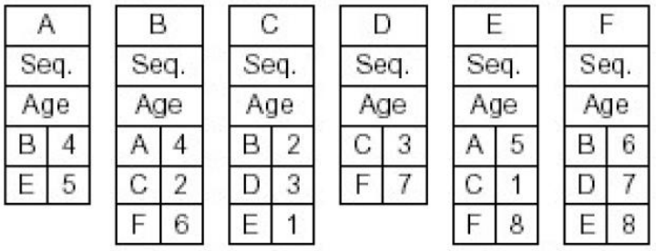</left>
>
> - 包括从产生该 LS 分组的路由器到其邻居路由器的代价信息;
> - Seq 字段和 Age 字段: 解决泛洪可能导致的广播风暴问题;
>     - 广播风暴: 例如遇到了环路导致分组无限在环中传播;
>     - Seq : 版本号, 每个路由器可以记录是否发送过该分组;
>     - Age :  类似于 TTL ;

#### Dijkstra 算法

> ###### 特点
>
> - 集中式的: 整个网络拓扑, 网络中所有链路的代价作为已知的算法输入;
> - 可以计算得到从一个源到达所有其他节点的最短路径;
> - 当进行 $k$ 次迭代后, 可以得到从源到 $k$ 个目的节点的最短路径;
>
> ---
>
> ###### 术语规定
>
> - $C_{x,y}$ : <u>direct</u> link cost from node $x$ to $y$ ;
>     - $C_{x,y}=\infty$ if $x$ and $y$ are not direct neighbors;
> - $D(v)$ : <u>current estimate</u> of cost of least-cost-path from source to destination $v$ ;
> - $p(v)$ : predecessor node along path from source to $v$ ;
> - $N^\prime$ : set of nodes whose leastcost-path <u>definitively known</u> ;
>
> ---
>
> ###### 伪代码
>
> <left>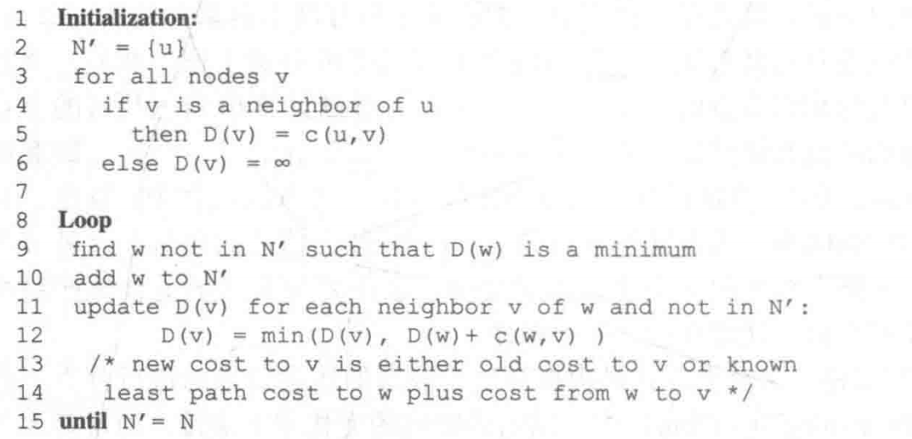
>
> 1. 初始化
>
>     1. 最低开销路径已知的节点集合 $N^\prime$ , 初始化为源 $u$ ;
>     2. 对于所有其他节点 $v$ :
>         - 如果 $v$ 是 $u$ 的邻居: 初始化 $D(v)=c(u,v)$ , $p(v) = u$;
>         - 否则: 初始化 $D(v)=\infty$ , $p(v)$ 待定;
>
> 2. 循环, 直到所有最短路径都被确定 ( $N^\prime==N$ )
>
>     1. 对于所有不在 $N^\prime$ 中的节点 $w$ : 取 $D(w)$ 最小的一个 $w^\prime$ , 将该 $w^\prime$ 加入 $N^\prime$ ;
>
>     2. 对于 $w^\prime$ 的所有邻居 $v$ , 使用下述公式更新 $D(v)$ , 如果需要则同时更新 $p(v)$
>         $$
>         \large D(v)=min\{~D(v)~,~~D(w^\prime)+c(w^\prime,v)~\}
>         $$
>
> 3. 当 $N^\prime==N$ 时, 从源 $u$ 到其余所有节点的最短路径及其开销就已经确定, 路径可由 $p(v)$ 向前推导得到;
>
> ---
>
> ###### 震荡问题
>
> - 当链路的代价与其承载的流量密切相关时, 可能出现震荡问题;
> - 举例说明
>     - 假设有两个方向可以发送分组: 方向 A / B
>     - 第一次运行 LS 算法, 在 LS 算法的 "指导" 下, 大量的分组沿着 A 方向发送, 导致 A 方向不再是一个最优路径, 代价变高;
>     - 第二次运行 LS 算法, 在 LS 算法的 "指导" 下, 大量的分组沿着 B 方向发送, 导致 B 方向不再是一个最优路径, 代价变高;
>     - 第三次运行 LS 算法, 在 LS 算法的 "指导" 下, 大量的分组沿着 A 方向发送, 导致 A 方向不再是一个最优路径, 代价变高;
>     - ......
>     - 如此不断反复, 造成 "震荡" 问题;
> - 解决方法
>     - 不实际的方法 1: 强制使得链路开销不再依赖于链路所承载的流量;
>     - 可行的方法 2: 确保并非所有的路由器都同时运行 LS 算法;

---

### 距离向量 (Distance-Vector, DV) 路由选择算法

> ###### 特点
>
> - 迭代的: 这个过程需要持续到邻居之间没有更多信息需要交换为止;
> - 自我终止的: 没有一个显式的计算停止信号;
> - 异步的: 不要求每个节点相互之间步伐一致
> - 分布式的
>     - 每个阶段只维护一张局部的路由表;
>     - 每个节点都需要从一个或多个**直接相连的邻居**接收一些信息, 执行计算, 然后将计算结果分发给邻居;
>
> ---
>
> ###### Bellman-Ford 方程
>
> $$
> \large d_{x}(y)=\min _{v}\left\{c(x, v)+d_{v}(y)\right\}
> $$
>
> - 是迭代的, 即如果要求出最小的 $d_x(y)$ , 就要先求出所有的 $d_v(y)$ , 其中 $v$ 是 $x$ 的邻居节点;
>
> ---
>
> ###### 每个节点所维护的信息
>
> - 该节点 ($x$) 到其邻居的链路的开销 $c(x,v)$
> - 自身的距离向量 $\vec{\boldsymbol{D}}_x=[D_x(y):y\in N]$
>     - 其中 $D_x(y)$ 为从 $x$ 到 $y$ 的开销的估计值;
> - 该节点的每个邻居的距离向量 $\vec{\boldsymbol{D}}_v=[D_v(y):y\in N]$
>
> ---
>
> ###### 伪代码
>
> <left>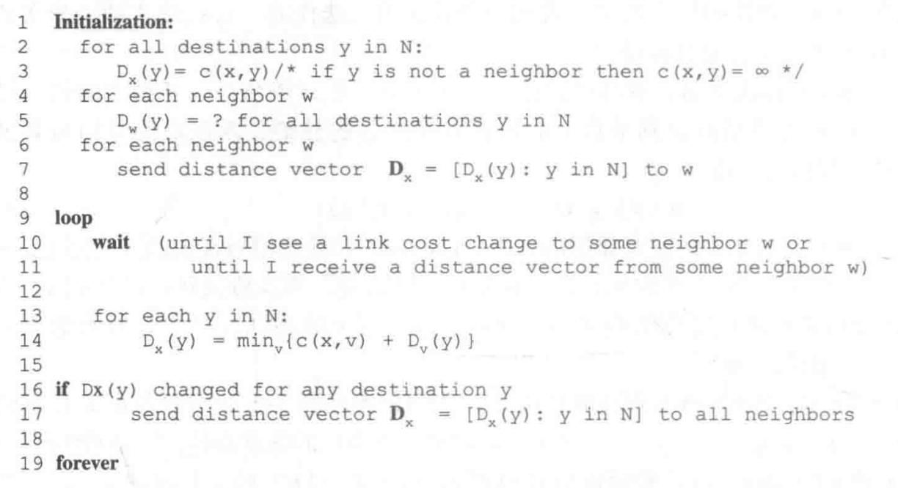</left>
>
> 1. 初始化
>
>     1. 对于自身 ($x$) 的所有邻居节点 $w$ , 将距离向量中的对应值置为两者之间链路的开销 $c(x,w)$ , 非邻居节点则初始化开销为 $\infty$ ;
>     2. 对于自身 ($x$) 的所有邻居节点 $w$ , $\vec{\boldsymbol{D}}_w$ 暂时未知;
>     3. 向自身 ($x$) 的所有邻居节点 $w$ 发送自己的距离向量 $\vec{\boldsymbol{D}}_x$ ;
>
> 2. 不断循环
>
>     1. 等待, 直到下列条件之一成立时退出等待, 执行下一步:
>
>         - 自身周围的链路开销改变;
>         - 自己收到一个来自邻居节点的距离向量;
>
>     2. 遍历网络中的每个节点, 按照 Bellman-Ford 方程的形式更新自身的距离向量 $\vec{\boldsymbol{D}}_x$ ;
>         $$
>         \large D_{x}(y)=\min _{v}\left\{c(x, v)+D_{v}(y)\right\}
>         $$
>
>     3. 如果在 `步骤 2.2` 中改变了距离向量 $\vec{\boldsymbol{D}}_x$ , 则将其发送给自己的所有邻居节点;
>
> ---
>
> ###### 算法说明
>
> - 只要所有节点以异步的方式不断更新距离向量, 则开销的估计值 $D_x(y)$ 将收敛于真实的最低开销 $d_x(y)$ ;
> - 如果没有链路的更新, 将逐渐不会再有更新报文被发送, 所有的节点都停留在 `步骤 2.1` 的循环等待中;
>
> ---
>
> ###### 存在的问题
>
> - 路由选择环路 (routing loop) 与无穷计数
>
>     - 当链路开销变坏时, y 为了以最小开销到达 x , 从而选择将分组路由至 z , 而 z 尚未得知这一链路的变化, 即没有更新路由表, 因此 z 又将分组路由回 y 以获得最小开销, 进而形成一个环, 分组在 y 与 z 之间不停来回往复, 这一坏消息需要很多次迭代才能完成传递;
>
>     - 无穷计数: 如果问题更加严重, 比如某些链路断开, 则可能需要无穷的迭代次数 DV 算法才能收敛, 即无穷次迭代后, 一些节点才发现某处不可达;
>         <left>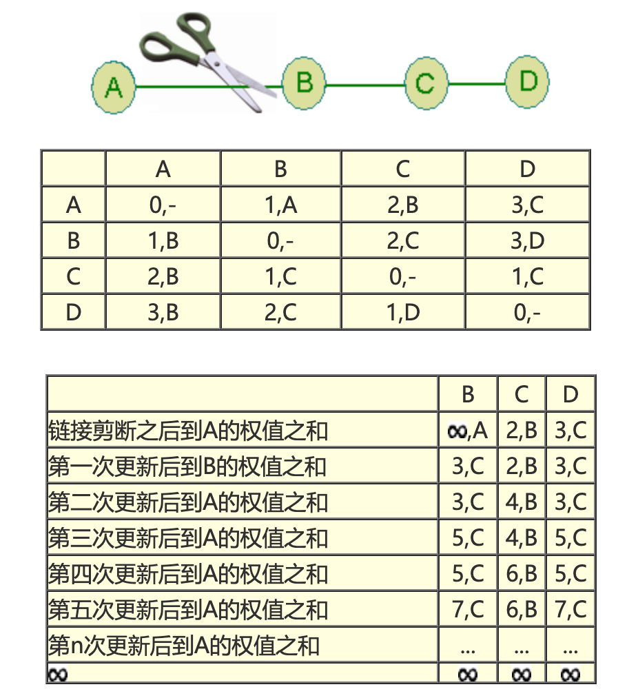</left>
>
> - 好消息传递很快, 坏消息传递很慢;
>
>     - 好消息: 如某个路由器的接入, 或是某条链路代价的减少;
>     - 坏消息: 某个链路的断开, 或是某条链路代价的增加;
>
> - 详见课本 P252 的讨论;
>
> ---
>
> ###### 路由选择环路问题的部分解决: 毒性逆转 (poisoned reverse)
>
> - "善意的谎言" : 如果 z 通过 y 以路由分组至目的地 x , 则 z 将这样向 y 说谎: 谎称自己到目的地 x 的开销 $D_z(x)=\infty$ ;
> - 局限性: 该方法只能解决两个邻居节点之间的路由选择环路问题, 当涉及 3 个或更多节点, 而不是仅仅一对邻居节点的环路时, 该方法将失效;

---

### LS 与 DV 算法比较

> ###### 报文复杂度
>
> - LS 算法
>     - 需要全局的信息;
>     - 需要发送 $O(|N| \cdot |E|)$ 个报文来广播网络信息;
>     - 当一条链路发生变化时, 需要向所有节点发送该变化;
> - DV 算法 (👍🏻)
>     - 每次迭代时, 距离向量只在相邻节点之间传播;
>     - 当一条链路开销改变时, 只有这一改变导致了某些最短路径的改变 (距离向量的改变), 才向周围传播新的距离向量;
>
> ---
>
> ###### 收敛速度
>
> - LS 算法 (👍🏻) : 要求 $O(|N| \cdot |E|)$ 个报文的 $O(|N|^2)$ 算法, 但有可能震荡;
> - DV 算法: 收敛较慢, 可能遇到路由选择环路, 甚至遇到无穷计数问题;
>
> ---
>
> ###### 健壮性
>
> - 假设: 一台路由器发生故障 / 行为错乱 / 受到蓄意破坏;
> - LS 算法 (👍🏻)
>     - 一个节点可以将错误的 LS 分组向整个网络广播, 但是其他节点可以丢弃收到的 LS 分组;
>     - 每个路由器自己计算自己的转发表, 即计算是分离的, 错误只影响局部, 提供了一定程度上的健壮性;
> - DV 算法: DV 算法每次迭代计算得到的结果会逐渐传递给越来越远的路由器, 进而扩散到整个网络;

---

## § 5.3 AS 内部的路由选择: OSPF

> ###### LS / DV 算法无法直接应用
>
> - 规模: 路由器数目越来越大;
>     - LS 所需的整个网络拓扑和所有链路代价将占据极大地存储 / 传输资源;
>     - DV 的迭代将永远无法收敛;
> - 管理自治: 组织应当能够按照自己希望的方式运行路由器, 管理内部网络, 对外隐藏内部网络信息, 且将内部网络与外部互联;
>
> ---
>
> ###### 相关概念
>
> - 自治系统 (Autonomous System, AS)
>     - 每个 AS 由一组通常处在相同管理控制下的路由器组成;
>     - 通常在一个 ISP 中的路由器, 以及互联这些路由器的链路构成一个 AS ;
>     - 一个 AS 由一个 AS 号 (ASN) 标识, 它由 ICANN 分配;
>     - 方便管理
>         - 不同的 AS 可以运行不同的网络协议;
>         - AS 内部的网络细节不对外透露;
>     - 易于扩展
>         - 增加一个 AS 对于其他 AS 来说只是增加了一个表项;
>         - 规模过大的 AS 可以分解为多个小的 AS ;
>         - 总体规模的增大不会对性能影响很大;
> - 自治系统内部路由选择协议 (intra-autonomous system routing protocol)
>     - 在一个自治系统内部运行的路由选择算法;
>     - 相同 AS 中的路由器都运行相同的路由选择算法, 并且拥有路由器彼此的信息;

### 开放最短路优先 (OSPF, Open Shortest Path First) 路由选择

> ###### 概述
>
> - 是一种 LS 协议, 被用于 AS 内部的路由选择;
>     - 每个节点保存区域内部的网络拓扑和链路代价信息;
>     - 基于洪泛链路状态信息 (本地区域内部进行) 和 Dijkstra 算法 (每个路由器中运行) ;
> - 网络管理员可以配置链路的权值;
>     - 将所有链路权值置为 1 , 则为最小跳数优先;
>     - 将链路权值设为带宽的倒数, 则鼓励多走高带宽链路;
>     - 可以根据所期望的路由路径, "反向操作": 人为计算并设置权值, 使得 OSPF 能够得出这个所期望的路由路径;
>     - ......
> - 当链路状态发生变化, 路由器会向 AS 内的所有路由器广播路由选择信息;
> - 即使链路状态没有变化, 也会周期性地广播一次, 这有利于提高算法的健壮性;
> - OSPF 报文直接由 IP 层承载, 协议号 89 , 而不是 TCP/UDP ;
> -  需要自己实现可靠报文传输, 链路状态广播等功能;
>
> ---
>
> ###### 支持单个 AS 中的层次结构
>
> <left>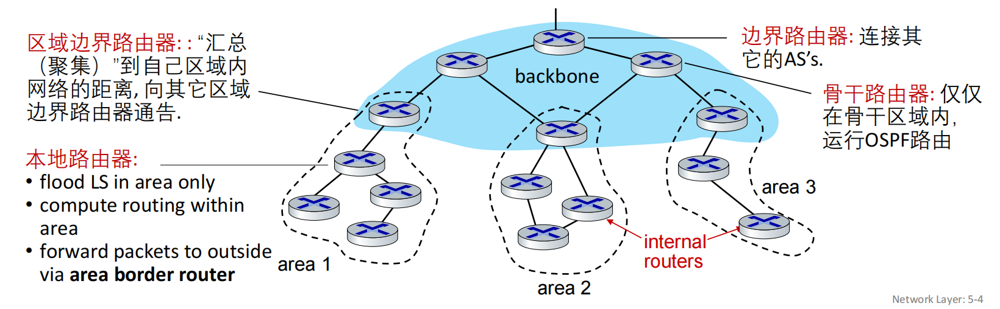</left>
>
> - 区域 (area)
>     - 区域边界路由器
>         - 一台或者多台;
>         - 为流向区域外的分组提供路由选择;
>         - 向其他的区域边界路由器在骨干区域进行通告, 从而与其他的区域互联;
>     - 区域内路由器
>         - 即普通的 AS 内服务器, LS 泛洪 (链路状态报告) 只会在本区域内进行;
>         - 只具有该区域 (本地) 的网络拓扑信息;
>         - 向本区域外发送的分组都需要经过区域边界路由器;
> - 骨干区域 (backbone area)
>     - 区域边界路由器
>         - 同上;
>     - 骨干 (主干) 路由器
>         - 在骨干区域内运行 OSPF 的路由器;
>     - 边界路由器
>         - 位于骨干区域的边界, 负责连接其他更外层的 AS ;
>
> ---
>
> ###### 优点
>
> - 安全
>     - 可以使用例如 MD5 等技术进行认证/鉴别, 防止恶意信息被注入路由表;
> - 允许同时使用多条相同开销的路径
>     - 转发过程中, 当多条路径具有相同开销时, OSPF 允许同时使用这些路径, 而不必只选择一个承载所有流量;
>     - RIP 只能选择一个;
> - 对单播和多播路由选择的综合支持: 对现有 OSPF 链路状态广播机制增加了一种新型的链路状态通告;
> - 支持设置多重代价矩阵:
>     - 不同的服务类型 (实时 / 尽力而为) 使用不同的代价;
>     - 支持按照不同的代价计算不同的最优路径;
> - 支持单个 AS 中的层次结构 (详见上方讨论), 大型网络中也支持层次性的 OSPF;

---

### RIP (Routing Information Protocol)

> - 经典的 DV 算法, 每 30 秒交换一次距离向量;
> - 目前已经较少使用了;

---

## § 5.4 ISP (AS) 之间的路由选择: BGP

> ###### 概述
>
> - BGP (Border Gateway Protocol, 边界网关协议), 是 ISP (AS) 间的路由选择协议;
> - 因特网中, 所有的 AS 都运行 BGP, 以协调 AS 间的路由;
> - BGP 是分布式的异步的协议, 与 DV 路由选择协议一脉相承;
> - 两个 BGP 路由器 (peers) 通过半永久的 TCP 连接 (179 端口号) 交换路由选择信息 (BGP 报文);

### BGP 的作用

> ###### 概述
>
> - 目的地不是一个具体的地址, 而是 CIDR 化的一个前缀 (如: 138.16.68/22);
> - 路由器的转发表将有这样的形式: `(x, I)`
>     - `x` : CIDR 化的前缀;
>     - `I` : 路由器的接口号;
>
> ---
>
> ###### 作用
>
> - 从邻居 AS 获取前缀的可达性信息;
>     - BGP 允许每个子网向因特网的其他部分进行通告: 让因特网中的所有 AS 知道该子网的存在;
> - 确定到达一个前缀的最好的路由;

---

### 通告 BGP 路由信息

> ###### 相关概念
>
> <left>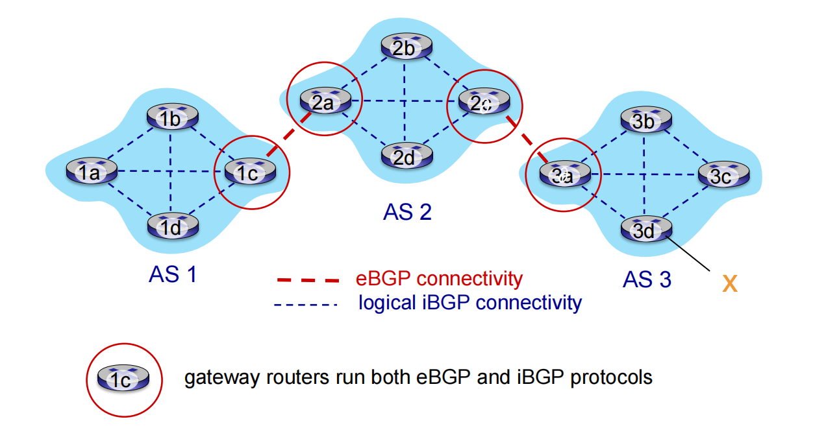</left>
>
> - 网关路由器 (gateway router): 位于 AS 边缘的路由器, 直接与其他 AS 的一台或多台路由器;
> - 内部路由器 (internal router): 位于 AS 内部的路由器, 只连接自己 AS 中的主机和路由器;
> - BGP 连接 (BGP connection): 每条直接连接以及所有通过该连接发送的 BGP 报文称为 BGP 连接;
>     - 外部 BGP 连接 (eBGP connection): 跨越两个 AS 的 BGP 连接;
>     - 内部 BGP 连接 (iBGP connection): 同一 AS 内部的两台路由器之间的 BGP 连接;
>         - iBGP 连接并不总是与一条单独的物理链路相对应 (因为是基于 TCP 连接);
>
> ---
>
> ###### BGP 属性 (BGP attributes)
>
> - BGP 术语: 路由 (route) = 前缀 (prefix) + 属性 (BGP attributes)
> - BGP 属性
>     - `AS-PATH` : 该前缀的通告已经经过的 AS 列表;
>         - 可用于检测和防止通告环路
>             - 当一个 AS 发现 `AS-PATH` 中包含自己时, 说明遇到了环路, 该通告将会被此 AS 拒绝;
>
>         - 可用于实现多路径选择;
>         - 在使用 eBGP 报文转发时, 需要在前面加上自己的 ASN (AS 号);
>
>     - `NEXT-HOP` : `AS-PATH` 起始的路由器接口的地址;
>         - 仅在使用 eBGP 进行转发时修改, 改为 eBGP 发送方发送端口的地址, 从而指示 eBGP 接收方如何转发分组;
>             - 向前述更改后的地址转发, 即这条 eBGP 发来的方向倒回去转发;
>         - 使用 iBGP 时不修改此属性;
>         
>     - 其他属性: 例如路由偏好等;
>
>
> ---
>
> ###### 例子 1
>
> - 同样使用上图, 假设 AS 3 中包含 CIDR 前缀为 x 的子网;
> - 通过以下步骤, AS 1/2/3 中的所有路由器都将得知该子网 x 的存在以及路由路径;
>     1. 3a 通过 eBGP, 向 2c 通告 `AS3 x` , 并将 `NEXT-HOP` 修改为本通告的发送端口的 IP 地址;
>     2. 2c 通过 iBGP, 向 AS 2 中的所有其他路由器通告 `AS3 x` , 不修改 `NEXT-HOP` 字段;
>     3. 2a 通过 eBGP, 向 1c 通告 `AS2 AS3 x` , 并将 `NEXT-HOP` 修改为本通告的发送端口的 IP 地址;
>     4. 1c 通过 iBGP, 向 AS 1 中的所有其他路由器通告 `AS2 AS3 x` , 不修改 `NEXT-HOP` 字段;
>
> ---
>
> ###### 例子 2
>
> - 一般情况下, 可能有不同的路径, 下图存在两条路径
>     <left>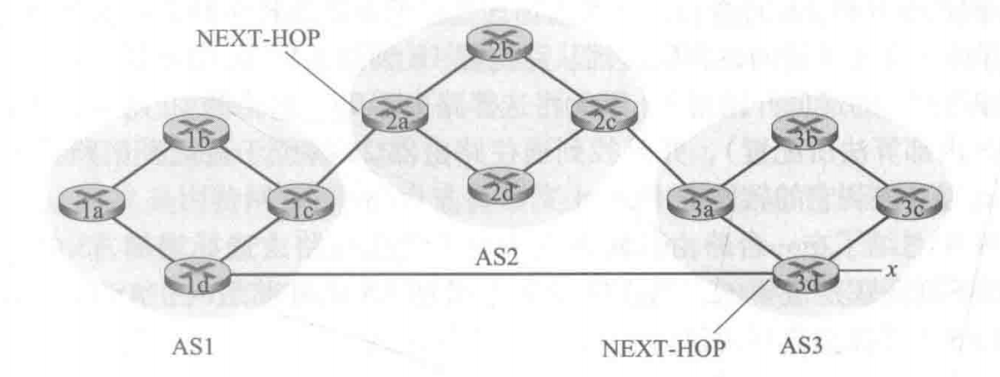</left>
>
>     - `AS2 AS3 x`
>     - `AS3 x`

----

### 确定最好的路由的方法

#### 简单的方法: 热土豆路由选择 (hot potato routing)

> ###### 思路
>
> - 选择具有最小的 AS 内部开销的网关, 作为最终的出口;
> - 不关心域间的开销, 只关心 AS 内部开销;
>
> ---
>
> ###### 步骤
>
> 1. 根据 AS 间协议 (BGP), 得知经过哪些 AS 可以到达子网 x , 进而得知可以经由本地 AS 的**哪些**网关可以路由至子网 x ;
> 2. 根据 AS 内的路由选择协议, 计算到达这些网关的最低开销;
> 3. 在这些最低开销之间, 选择最小的一个;
> 4. 从转发表 (转发表已提前由 AS 内路由选择算法确定) 确定端口 `I` , 该端口通往该最小最低开销对应的网关, 进而从转发表中记录表项 `(x, I)` ;
>
> ---
>
> ###### 例子
>
> <left></left>
>
> - 从 1b 到子网 x ;
> - 步骤
>     1. 根据 BGP, 得知 `AS2 AS3 x` 或 `AS3 x` 两条路径可以到达 x ;
>     2. 确定 1b 到达这些路径对应的网关的最低开销:
>         -  `AS2 AS3 x` : 假设 1b -> 1c 开销最低, 假设为 5 ;
>         -  `AS3 x` : 假设 1b->1c->1d 开销最低, 假设为 7 ;
>     3. 选择这些最低开销中最小的一个: $min\{5, 7\}=5$ , 对应网关 1c ;
>     4. 根据已经确定好的转发表, 得知要想将分组从 1b 转发至网关 1c, 需要转发分组至端口 `I` , 则记录转发表项: `(x, I)` ;

#### BGP 实际使用的算法: 路由器选择算法

> ###### 输入
>
> - 到某个前缀 x 的所有路由的集合: 通过 BGP 协议得到的不同路径;
>
> ---
>
> ###### 筛选
>
> - 如果输入只有一条路径, 则只能选用该路径;
> - 如果输入具有多条路径, 则通过以下规则顺序不断筛选, 直到只剩下一条路径;
>     1. 本地偏好 (local preference) 属性
>         - 是 BGP 属性之一 (与 `NEXT-HOP` , `AS-PATH` 并列);
>         - 具有最高本地偏好值的路由将被选择;
>         - 当多个路由都具有相同的最高的本地偏好值时, 进入下一条规则;
>     2. `AS-PATH` 跳数
>         - 优先选择具有最少 `AS-PATH` 跳数的路由;
>         - 本规则是否是唯一的规则
>             - BGP 将使用类似 DV 算法的方法, 计算路径长度, 只是这里的测度是 AS 跳数, 而不是路由器跳数;
>         - 如果 `AS-PATH` 跳数仍相同, 进入下一条规则;
>     3. 最低内部开销 (同热土豆)
>         - 到达此处的所有路由具有相同的本地偏好值和 `AS-PATH` 跳数;
>         - 使用热土豆算法, 选用内部最低开销最小的网关;
>         - 如果仍然剩下多条路由, 则进入下一条规则;
>     4. BGP 标识符

---

### IP 任播 (IP anycast)

> ###### 概述
>
> - 多个服务器通告相同的 IP 地址, 这些服务器可能位于不同的物理位置;
> - BGP 收到后, 会产生针对相同目的 IP 的多个转发表项;
>     - 虽然目的 IP 相同, 但是实际导向的服务器是不同的;
> - 当客户访问该 IP 时, 在路由层面上 (网络层), 分组会在路由选择协议的引导下, 导向一些开销更低的服务器;
> - 被用在 DNS 系统: 将 DNS 请求指向距离用户最近 (一般近的开销就低) 的 DNS 根服务器;
>     - DNS 根服务器只有 13 个 IP 地址, 但却有上百个服务器分布在世界各处;
>
> ---
>
> ###### 优点
>
> - 冗余, 提高可靠性;
> - 提高用户体验;
> - 防范 DoS 攻击, 且提升安全性;

---

### 路由选择策略

> <left>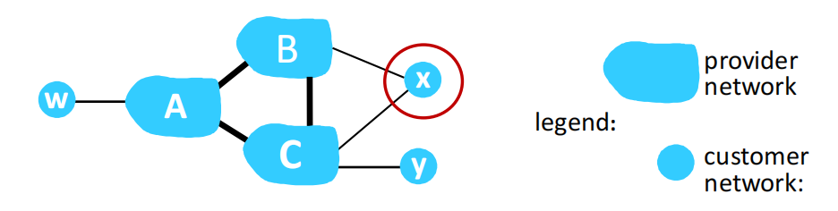</left>
>
> - x, y, w 是桩网络 (stub networks; 端网络);
> - 情况 1: A 向 B, C 通告路径 Aw
>     - B 决定不再继续向 C 通告路径 BAw, 因为 B 无法从 CBAw 的路由上获取利益 (因为 C, A, w 都不是 B 的客户);
>     - C 只能通过 CAw 到达 w, 而无法经过 B;
> - 情况 2: x 不想路由 B 与 C 之间的分组
>     - x 是多宿桩网络: 接入了两个 ISP;
>     - x 选择不向 B 通告路径 BxC, 因为那是 ISP 主干网的工作, 自己是客户;

---

## § 5.5 SDN 控制平面

> ###### 概述
>
> - 概念: (分组) 交换机 = (网络层) 路由器 and 链路层分组交换机;
> - SDN 控制平面的功能: 计算, 管理和安装所有网络交换机中的流表项;
>
> ---
>
> ###### SDN 控制平面的两个组件
>
> <left>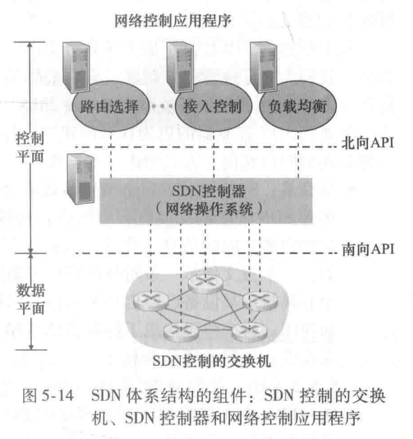</left>
>
> - SDN 控制器 (或网络操作系统)
>     - 功能: 维护准确的网络的状态信息, 例如: 链路, 交换机和端系统的状态等, 并向网络控制应用程序提供这些信息;
> - 网络控制应用程序
>     - 有多个, 是可编程的;
>     - 例如: 负载均衡, 路由选择, 接入控制, 访问控制......
>
> ---
>
> ###### SDN 体系结构的四个特征
>
> 1. 基于流的转发
>     - SDN 控制的交换机的分组转发工作, 能够基于运输层, 网络层或链路层首部中任意数量的首部字段值进行;
>     - 例如: OpenFlow 1.0 允许基于 11 个不同的首部字段值进行转发, 而传统的 IP 数据报转发仅仅基于目的 IP 地址;
> 2. 数据平面与控制平面分离;
>     - 数据平面: 由网络交换机组成, 交换机执行 "匹配+动作";
>     - 控制平面: 服务器 + (用于决定和管理交换机中的流表的)软件;
> 3. 网络控制功能位于数据平面交换机的外部
>     - SDN 控制平面由运行在服务器上的软件实现, 与数据平面的交换机分离;
> 4. 可编程的网络
>     - 网络控制应用程序是可以编程的;
>     - 交换机, SDN 控制器, 网络控制应用程序相互分离, 可以来自不同的厂商, 带来的丰富且开放的生态系统;

### SDN 控制器

> ###### 结构
>
> <left>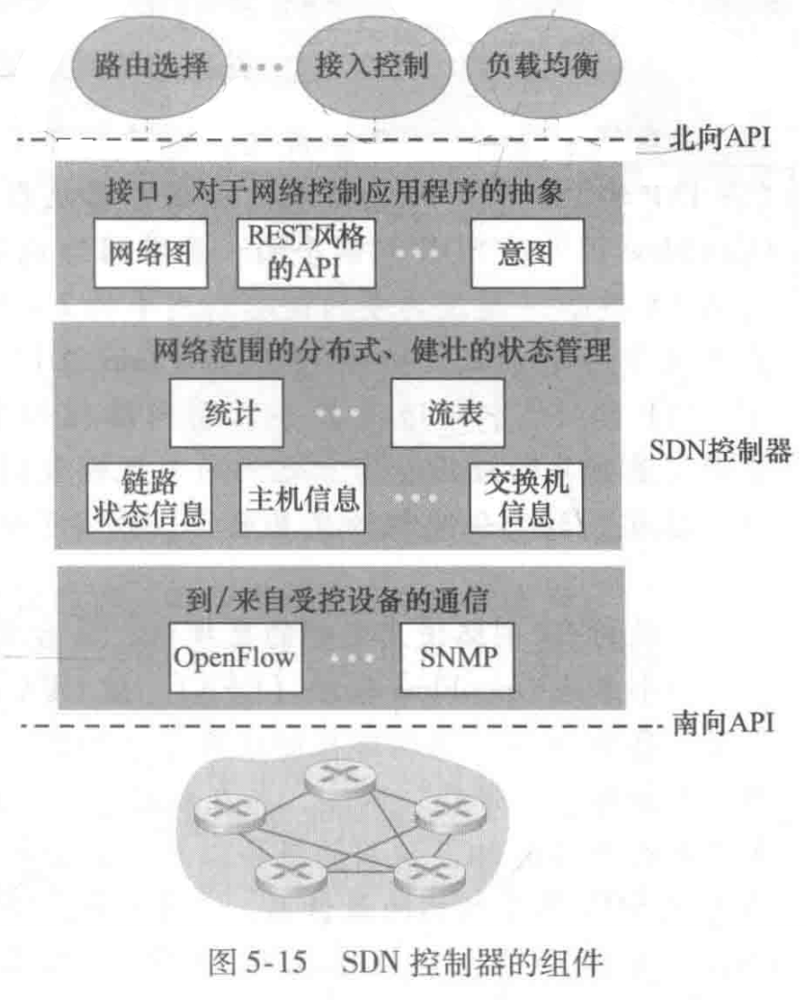</left>
>
> - 第一层: 对网络控制应用程序的接口
>     - SDN 控制器与网络控制应用程序之间的接口 (提供给其他厂家进行接入和管理的接口), 被称为**北向接口 (北向 API)**;
>         - 北向 API 允许网络控制应用程序管理网络状态和流表;
>         - 例如: REST 请求响应接口;
> - 第二层: 网络状态管理层
>     - 维护各种统计信息, 状态信息, 流表的拷贝, 实现网络范围的, 分布式的, 健壮的状态管理;
> - 第三层: 通信层
>     - 使用特定的协议, 负责在 SDN 控制器和受控设备之间传递信息;
>         - 通过该 "特定的协议" :
>             - SDN 控制器可以向受控设备发送控制信息;
>             - 受控设备可以观察到事件 (例如: 新的链路或者设备的接入), 并主动上报 SDN 控制器以维护最新的网络视图;
>         - OpenFlow 就是提供这种功能的协议, 为大多数 SDN 控制器使用;
>     - 受控设备和 SDN 控制器之间的接口, 被称为**南向接口 (南向 API)**;
>
> ---
>
> ###### 实现
>
> - 逻辑上视为单一的, 整体的服务;
> - 实际上, 这些保持状态信息的数据库一般通过分布式的服务器实现;
>     - 保证健壮性, 可用性, 高性能;
>     - 因为是分布式系统, 所以需要考虑控制器内部的一致性, 逻辑时间顺序, 意见一致等问题;

---

### OpenFlow 协议

> ###### 概述
>
> - 运行在 SDN 控制器, 受控的分组交换机, 以及一些实现 OpenFlow API 的设备之间;
> - 运行在 TCP 上, 使用 6653 默认端口号;
>
> ----
>
> ###### 报文内容
>
> - SDN 控制器 $\rightarrow$ 受控设备
>
>     - 配置: 查询并设置交换机的配置参数;
>
>     - 修改状态: 增加 / 删除 / 修改 交换机流表中的表项, 并且设置交换机端口特性;
>
>     - 读状态: 从交换机的流表和端口收集统计数据和计数器值;
>
>     - 发送分组: 在受控交换机从特定的端口发送出一个特定的报文;
>
> - 受控设备 $\rightarrow$ SDN 控制器
>
>     - 流删除: 通知控制器已删除一个流表项;
>         - 例如: 由于超时, 或作为收到 “修改状态” 报文的结果;
>     - 端口状态: 向控制器通知端口状态的变化;
>     - 分组入: 用于将分组发送给控制器;
>         - 当一个分组到达交换机端口, 并且不能与任何流表项匹配, 那么这个分组将被发送给控制器进行额外处理;
>         - 匹配的分组也可能被发送给控制器, 作为匹配时所采取的一个动作;

---

## § 5.6 ICMP (Internet Control Message Protocol, 因特网控制报文协议)

> ###### 概述
>
> - 用于在主机和路由器之间沟通网络层的信息;
> - 通常被认为是 IP 的一部分, 但是它承载在 IP 报文中, 作为 IP 报文的有效载荷, 所以是工作在 IP 之上的;
>
> ---
>
> ###### ICMP 报文
>
> - 类型字段 + 编码字段:
>
>     | 类型字段 | 编码字段 | 含义                       |
>     | -------- | -------- | -------------------------- |
>     | 0        | 0        | 回显回答 (对 ping 的回答); |
>     | 3        | 0        | 目的网络不可达;            |
>     | 3        | 1        | 目的主机不可达;            |
>     | 3        | 2        | 目的协议不可达;            |
>     | 3        | 3        | 目的端口不可达;            |
>     | 3        | 6        | 目的网络未知;              |
>     | 3        | 7        | 目的主机未知;              |
>     | 4        | 0        | 源抑制 (拥塞控制);         |
>     | 8        | 0        | 回显请求;                  |
>     | 9        | 0        | 路由器通告;                |
>     | 10       | 0        | 路由器发现;                |
>     | 11       | 0        | TTL 过期;                  |
>     | 12       | 0        | IP 首部损坏;               |
>
> - 引发错误的报文的首部和前 8 Byte: 用于方便发送方确定引发错误的数据报;
>
> ---
>
> ###### 应用
>
> - Traceroute 程序;
>     - 使用 UDP, 向目的主机发送一系列 IP 数据报, 分别设置 TTL = 1, 2, 3, ......
>         - 该数据报包含一个不可达的端口号, 当收到来自目标主机的目的端口不可达的 ICMP 报文时, 停止发送这些探测分组;
>     - 会收到路径上路由器的 ICMP 报文, 指示 TTL 过期, Traceroute 据此获得路径上的路由;
> - Ping;

---

## § 5.7 网络管理和 SNMP

> ###### 网络管理
>
> - 网络管理包括了硬件、软件和人类元素的设置、综合和协调, 以监视、测试、轮询、配置、分析、评价和控制网络及网元资源, 用合理的成本满足实时性、运营性能和服务质量的要求;

### 网络管理框架

> <left>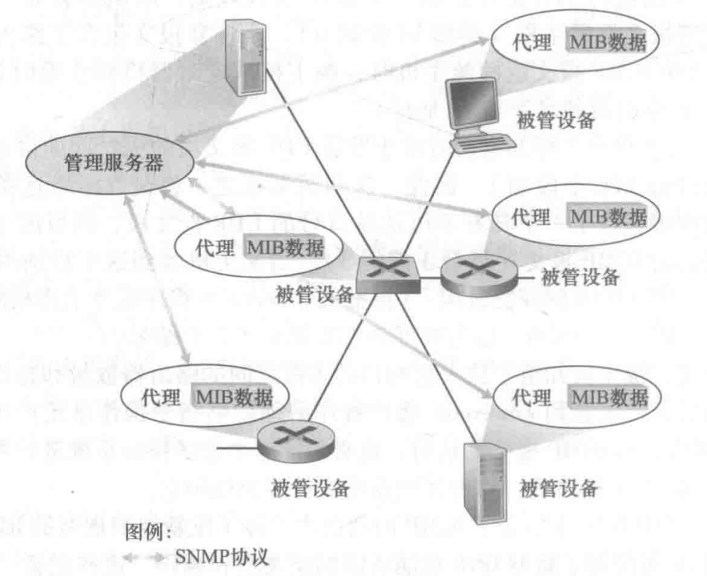</left>
>
> - 管理服务器 (managing server): 是执行网络管理的软件, 管理员在这里发起控制动作;
> - 被管设备 (managed device): 其中包含 被管对象 (managed object), 例如: 设备中的一个接口卡, 一个配置参数;
> - 管理信息库 (Management Information Base, MIB): 收集被管对象的关联信息, 供管理服务器使用;
>     - MIB 对象称为 SMI (Structure of Management Information);
> - 网络管理代理 (network management agent): 运行在被管设备中的一个进程, 与管理服务器通信并使设备执行对应的控制动作;
> - 网络管理协议 (network management protocol): 协议本身不能管理网络, 但是能够让网络管理员管理网络;

---

### SNMP (Simple Network Management Protocol, 简单网络管理协议)

> ###### 概述
>
> - 应用层协议, 其报文通常作为 UDP 的有效载荷进行传输;
>     - 使用请求 ID (类似于 TCP 中的序号), 在使用 UDP 的前提下实现对丢失的请求或响应的检测;
> - 用于管理服务器和网络管理代理之间,传递网络管理控制和信息的报文;
>
> ---
>
> ###### 两种经典的模式
>
> - 请求响应模式: SNMP 管理服务器向 SNMP 代理发送请求, 代理收到请求后执行动作, 然后对该请求发送一个响应;
> - 陷阱 (trap) 模式
>     - SNMP 代理向 SNMP 管理服务器发送一种非请求报文 (被称为: 陷阱报文, trap message), 用于通知由于异常情况而导致的 SMI 的改变;
>     - 陷阱报文是异步产生的, 是为了响应管理服务器所要求通知的事件而产生的;
>
> ---
>
> ###### SNMPv2 的报文 (协议数据单元, PDU) 类型
>
> <left>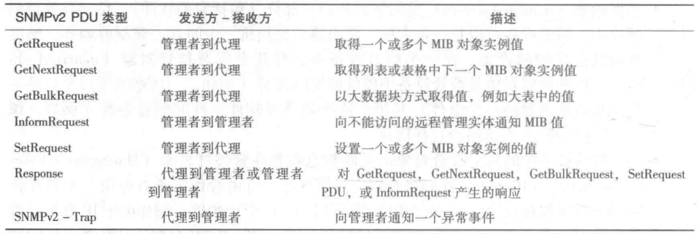</left>
>
> ---
>
> ###### SNMP PDU 格式
>
> <left>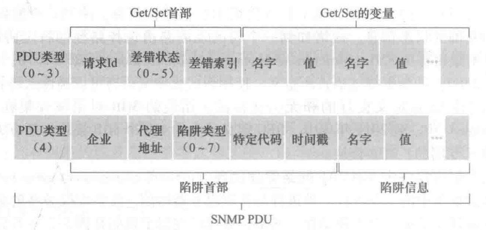</left>

---

