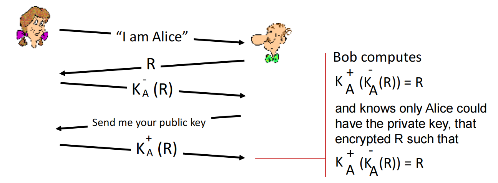
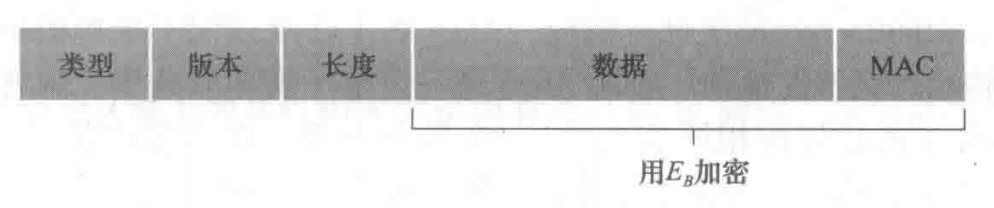

[TOC]

---

# § 第八章 计算机网络中的安全

> ###### 安全相关概念
>
> <left></left>
>
> - 网络安全: 分布式系统安全;
> - 网络空间安全: 人-机-物融合的情况下的安全;
> - 计算机安全: 桔皮书;
> - 信息安全: 鸡毛信, 文件安全;

## § 8.1 什么是网络安全

> ###### 安全通信 (secure communication) 所具有的特点
>
> - 机密性 (confidentiality)
>     - 只有发送方和所希望的接收方能够理解报文的内容;
>     - 需要进行数据的加密/解密;
> - 报文完整性 (message integrity)
>     - 报文在传输过程中没有被改变 (恶意的或是意外的);
> - 端点鉴别 (end-point authentication; 真实性, Authentication)
>     - 发送方和接收方能够互相确认对方确实是对方所声称的身份;
> - 仅 PPT 出现: 可用性 (access and availability)
>     - 服务必须可供用户访问和使用;
> - 仅课本出现: 运行安全性 (operational security)
>     - 防止恶意安防蠕虫, 勘探内部网络信息, 获取内部数据等;
>     - 如: 防火墙, 入侵检测系统等;
>
> ---
>
> ###### 网络安全的目标: FIPS199 提出的计算机安全的主要目标 "CIA"
>
> - `C` : 机密性 (Confidentiality), 即数据不泄露;
>     - 应用场景举例
>         - 对连接中的全部数据进行加密 (针对有连接服务), 如: SLL/TLS;
>         - 对单次数据访问进行加密 (针对无连接服务), 如: 预置共享密钥, 数字信封;
>         - 对流量信息进行保护, 以对抗流量分析;
> - `I` : 完整性 (Integrity), 即数据未篡改;
>     - 有连接服务应用场景举例
>         - 数据损坏是否可以恢复?
>         - 如: TCP 数据完整性校验可在传输层进行;
>     - 无连接服务应用场景举例
>         - UDP 服务的数据完整性一般依赖于具体的应用;
> - `A` : 可用性 (Availability), 即系统服务可用;
>     - 应用场景举例
>         - 通过冗余设计提升性能和容错能力;
>             - 例如: 集群, 灾备, CDN;
>         - 对抗 DoS 攻击;
>
> ---
>
> ###### 其他相关概念
>
> - 认证 (Authentication)
>     - 有连接服务应用场景举例
>         - 建立连接时, 为通讯方提供对等实体身份认证;
>         - 有单向认证, 双向认证;
>     - 无连接服务应用场景举例
>         - 提供数据来源认证, 以防止伪造, 重放攻击;
> - 不可抵赖性 (Non-repudiation)
>     - 应用场景举例
>         - 数据源发证据 (proof of origin): 保护接收者, 用于证明收到的数据确实来自发送者;
>         - 数据接收证据 (proof of delivery): 保护发送者, 证明其发送的数据确实被接收;

---

## § 8.2 密码学原则

> ###### 相关概念
>
> - 明文 (plaintext, cleartext): $m$
> - 密文 (ciphertext)
> - 密钥 (Key)
> - 加密/解密算法
>     - 加密算法 (encryption algorithm)
>         - 对于密钥 $K_A$ 输入 $m$, 输出 $K_A(m)$
>     - 解密算法 (decryption algorithm)
>         - 对于密钥 $K_B$ 和密文 $K_A(m)$ , 输入密文, 输出明文 $m=K_B(K_A(m))$ ;
> - 密钥系统
>     - 对称密钥系统 (symmetric key system)
>         - A 与 B 的密钥是相同且保密的;
>     - 公开密钥系统 (public key system, 公钥系统)
>         - 有一个所有人都知道的公钥, 和一个只有 A 和 B 知道的密钥;
>
> ---
>
> ###### Kerckhoff 原则
>
> - 一个密码系统在除了密钥以外的所有信息都公开的情况下, 也应当是安全的;

### 分组密码工作模式

> ###### ECB (Electronic Codebook)
>
> <left></left>
>
> - 优点: 可以并行计算;
> - 缺点: 同样的明文块会被加密为相同的密文块;
>
> ---
>
> ###### CBC (Cipher-Block Chaining)
>
> <left></left>
>
> - 加密不能并行, 但是解密可以并行;
>
> ---
>
> ###### CFB (Cipher Feedback Mode)
>
> <left></left>
>
> - 加密不能并行, 但是解密可以并行;
> - 对流式数据支持较好, 因为最后一块的长度不需要定长;
>
> ---
>
> ###### OFB (Output Feedback Mode)
>
> <left></left>
>
> - 解密可以部分并行;
> - 对流式数据支持较好, 因为最后一块的长度不需要定长;
>
> ---
>
> ###### CTR (Counter Mode)
>
> <left></left>
>
> - 加密和解密都可以并行;

---

### 解密攻击方法

> - 唯密文攻击: 入侵者只能直到密文, 但是不知道明文的内容;
>     - 语言的统计分析可以帮助唯密文攻击;
> - 已知明文攻击: 攻击者已经知道部分的 "明文-密文" 对应关系;
> - 选择明文攻击: 入侵者能够选择一段明文, 并且得到密文;

---

### 随机数所需要具备的性质

> - 随机性
>     - 均匀分布 (Uniform Distribution): 0 和 1 出现的频次应当相同;
>     - 独立性 (Independence): 基于任意子序列不能推出来其它部分;
> - 不可预测性: 在随机数序列中, 每一个随机数与前序随机数无关;
> - 真正的随机数是使用物理现象产生的
>     - 比如掷钱币、骰子、转轮、使用电子元件的噪音、核裂变等, 这样的随机数发生器叫做物理性随机数发生器;

---

### A. 对称加密算法 (symmetric encryption algorithm)

> <left></left>
>
> - 加密/解密方使用同一密钥, 或者知道其一可以推知另一;
> - 算法公开, 计算量小, 加密速度快;

#### 1. 凯撒密码

> <left></left>
>
> - 加密: 将明文中的字母替换为字母表中其后第 $k$ 个字母;
> - 解密: 将密文中的字母替换为字母表中其前第 $k$ 个字母;

#### 2. 单码代替密码

> <left></left>
>
> - 使用一个字母代替另一个字母;

#### 3. 多码代替密码

> 建立多个替换表, 按照一定的顺序 (如: $M_1,~M_3,~M_2,~M_4$), 每个字母使用其中一个替换表, 如此循环得到密文;

#### 4. DES (Data Encryption Standard)

> ###### 概述
>
> - 54 bit 的对称密钥, 64 bit 的明文输入;
>
> ---
>
> ###### 缺点
>
> - 不安全;

#### 5. 3DES

> ###### 概述
>
> - 使用不同的密钥, 进行 3 次 DES;
>
> - 加密与解密
>     <left></left>
>
>     - 注意并不是连续 3 次加密/解密, 而是交替的;
>
> ---
>
> ###### 优缺点
>
> - 优点: 密钥空间增大
>     - 当 $K_1=K_3$ 时, 密钥空间有 $2^{(56\times2)}$
>     - 当 $K_1\ne K_3$ 时, 密钥空间有 $2^{(56\times3)}$
> - 缺点: 速度慢, 大约需要 3 倍的 DES 耗时;

#### 6. AES (Advanced Encryption Standard)

> ###### 概述
>
> - 明文输入为 128 bit 的块;
> - 密钥可选多种长度
>     - 128 bit: 10 round
>     - 192 bit: 12 round
>     - 256 bit: 14 round

---

### B. 非对称加密算法 (asymmetric cryptographic algorithm; 公开密钥加密算法)

> <left></left>
>
> - 不共享密钥, 而是接收者拥有一个广而告之的公钥和一个只有自己知道的私钥;
> - $K_{B}^{-}\left(K_{B}^{+}(m)\right)=K_{B}^{+}\left(K_{B}^{-}(m)\right)=m$ ;

#### RSA

> ###### 模 $n$ 算术的一些性质
>
> - $[(a \bmod n)+(b \bmod n)] \bmod n=(a+b) \bmod n$ 
> - $[(a \bmod n)-(b \bmod n)] \bmod n=(a-b) \bmod n$ 
> - $[(a \bmod n) \cdot(b \bmod n)] \bmod n=(a \cdot b) \bmod n$
> - $(a \bmod n)^{d} \bmod n=a^{d} \bmod n$
>
> ---
>
> ###### 产生 "公钥/私钥" 的算法
>
> 1. 选择 2 个很大的素数
>     - 例如, 这两个素数都在 1024 bit 的数量级;
> 2. 计算 $n,~z$
>     - $n=pq$
>     - $z=(p-1)(q-1)$
> 3. 选择 $e\lt n$, 且 $e$ 和 $z$ 互素;
>     - 互素: 最大公约数为 1;
> 4. 求一个数 $d$ , 使得 $ed\bmod z=1$ ;
>     - 即: $ed-1$ 能够被 $z$ 整除;
> 5. 产生公钥/私钥
>     - 公钥: $(n,~e)$
>     - 私钥: $(n,~d)$
>
> ---
>
> ###### 加密算法
>
> $$
> \Large c=m^e\bmod n
> $$
>
> - 所有的比特串都等价于一个十进制整数 $m$ , 因此假设 A 要向 B 发送整数 $m~(m\lt n)$;
>
> ---
>
> ###### 解密算法
>
> $$
> \Large m=c^d\bmod n
> $$
>
> ---
>
> ###### 原理
>
> $$
> \large
> \begin{aligned}m&=(m^e\bmod n)^d\bmod n\\&=m^{ed}\bmod n\\&=m^{de}\bmod n\\&=m^{ed~\bmod~z}\bmod n\\&=m\bmod n\\&=m\end{aligned}
> $$
>
> - 数论: 如果 $p$ 和 $q$ 是素数, 且有 $n=p q$ 和 $z=(p-1)(q-1)$, 则 $x^{y} \bmod n$ 与 $x^{(y \bmod z)}$ $\bmod n$ 是等同的, 应用这个结论, 对于 $x=m$ 和 $y=e d$, 可得 $m^{e d} \bmod n=m^{(e d \bmod z)} \bmod n$ ;
>
> ---
>
> ###### 特点
>
> - 对于原始数据 $m$ , 先加密后解密, 先解密后加密, 都能得到原始数据 $m$ 本身;

---

## § 8.3 报文完整性和数字签名

### 密码散列函数

> - 以 $m$ 为输入, 计算得到一个称为**散列**的固定长度的字符串 $H(m)$ ;
>     - 需要保证 "找到两个不同的报文 $x$ 和 $y$ , 使得 $H(x)=H(y)$" 在计算上不可能;
> - 检验和可以视为一个劣质的密码散列函数;
> - 常用的密码散列函数有 MD5 散列算法, SHA-1 散列算法;

---

### 报文鉴别码 (MAC, Message Authentication Code)

> ###### 概述
>
> - 一对一的方式, 双方持有同一个 "共享秘密";
> - 使用密码散列函数对全文 $m + s$ 计算散列, 附在报文后面, 来防止报文在中途被篡改, 也防止假的发送方;
> - 为什么要加 $s$ : 防止假的发送方
>     - 如果不加 $s$ 就进行散列计算, 则只能验证报文完整且未被篡改地传输了, 不能验证这份报文发送者的身份;
>         - 因为密码散列函数是公开的, 攻击者可以对其生成的假的报文进行相同的散列计算;
>     - 加上 $s$ , 这个 $s$ 只有正确的收发双方知道, 计算散列值时在原文的基础上加上 $s$, 这样就能保证攻击者难以伪造散列 $H(m+s)$;
>
> ---
>
> ###### 步骤
>
> <left></left>
>
> - $s$ 是一个 "共享秘密", 类似于对称加密中的密钥, 但是 MAC 技术中实际并没有用到任何对称/非对称加密技术, 只用到了密码散列函数;
> - 密码散列函数是公开的;

---

### 数字签名 (digital signature)

> ###### 概述
>
> - 全文地签名
>     - 发送方 A 使用非对称加密算法 (如 RSA), 对全文 ==使用 A 的私钥== 进行计算 (RSA 本质就是数学计算), 生成签名的密文;
>     - 如果接收方 ==使用 A 的公钥== 解密出报文, 就说明这个报文确实来自于 A 而不是其他人, 且未被篡改;
> - 改进
>     - RSA 加密整个报文效率不高, 一般使用散列函数先得到原报文的散列 (相当于原始数据的唯一的指纹), 然后将散列进行上述操作, 作为数字签名附在报文中;
>     - 接收方 ==使用 A 的公钥== 解密出原散列值 (原始数据的指纹), 然后对收到的报文数据部分进行相同的散列函数运算, 得出报文数据部分的散列 (收到的数据的指纹), 比较这两个散列, 如果相同就能保证这条报文来自 A 而非其他人, 且未被篡改;
>
> ---
>
> ###### 可以保证
>
> - 可证实的: 可以证明确实是某人签署的;
> - 无法伪造的: 只有这个人能够签署;
> - 不可抵赖: 签署了这份文件, 而不是其他的;
>
> ---
>
> ###### 步骤图示 (改进后的数字签名)
>
> <left> </left>
>
> ---
>
> ###### 数字签名与 MAC 的区别
>
> - 数字签名
>     - 使用 RSA 非对称加密技术 + 散列函数;
> - MAC
>     - 不涉及对称/非对称加密技术;
>     - 收发双方之间具有 "共享秘密 $s$ ";
>

---

### 公钥认证 (public key certification)

> ###### 概述
>
>
> <left>  <--- 获取 CA 认证    <--- 从 CA 认证中获取对应的公钥</left>
>
> - 数字签名的具体应用, 用来证明一个公钥属于某个特定的实体;
>     - CA 可以证明: 自己目前手中持有的且认为其主人是 A 的公钥 $K_A^\prime$, 确实就是 A 的公钥 $K_A$, 而不是其他人的公钥;
> - CA (认证中心, Certification Authority)
>     - 一个机构, 将一个实体 E 的唯一识别代码 $P_E$ (如: 一个人的身份证号, 一个 IP 地址), 与其真正对应的公钥 $K_E$ 绑定, 将这个绑定后的内容 $(P_E,~K_E)$ 通过 CA 机构的私钥进行加密, 生成证书 (certificate);
>         - 正当的 CA 机构应当对这个对应关系进行审核;
>     - 人们可以使用这个 CA 机构的公钥进行解密, 得到经过这个 CA 机构认证的对应关系 $(P_E,~K_E)$;
>         - 人们可以选择信任或者不信任这个 CA 机构所进行的对应关系认证;
>
> ---
>
> ###### 证书验证过程
>
> 1. 浏览器收到服务器的证书 B;
> 2. 根据证书中的 CA 机构信息, 得到对应机构的 CA 证书 A;
> 3. 根据 CA 机构的证书 (A) 中的公钥, 解密证书 B, 并对证书 B 进行检查;
>     - 是不是所需要的人的公钥;
>     - 其绑定的域名是不是浏览器所正在请求的;
>     - 证书的有效期;
>     - 证书的使用范围;
>     - ......
> 4. 验证失败则给出响应提示, 成功则可以使用该公钥;
>
> ---
>
> ###### 信任树
>
> - 根证书: 未被签名的公钥证书, 或者是自签名的证书, 用于取得一些 CA 机构的公钥;
>     - OS 自带一些数字证书;
>     - 自己下载的, 自己所信任的数字证书;
> - 信任树
>     - 从根证书开始, 得到了根 CA 机构的公钥;
>     - 根 CA 签署的数字证书中, 包含了一些根证书;
>     - 中间证书需要从服务器下载, 否则报错;

---

## § 8.4 端点鉴别 (end-point Authentication)

### 鉴别协议 (ap, Authentication Protocol)

> ###### ap1.0
>
> <left></left>
>
> - 直接发送报文声明自己的身份;
>
> ---
>
> ###### ap2.0
>
> <left></left>
>
> - 附带自身的 IP 地址;
> - IP 哄骗将会使之失效;
>
> ---
>
> ###### ap3.0 / ap3.1
>
> <left></left>
>
> - ap3.0 使用明文口令: 鉴别者和被鉴别者之间的秘密口令, 使用明文传输;
>     - 只要嗅探分组即可破解;
> - ap3.1 使用加密口令: 鉴别者和被鉴别者之间具有一个对称密钥, 传输过程中口令是被加密的;
>     - 虽然无法得知口令的明文, 但是使用回放攻击即可破解;
>     - 回放攻击: 记录 A 所发送的分组, 然后过一段时间回放它 (包含口令的加密版本) 即可假装为 A;
>
> ---
>
> ###### ap4.0
>
> <left></left>
>
> - 改进 ap3.0/3.1 中不能得知加密后的口令, 究竟是初始鉴别报文, 还是攻击者的回放报文的问题;
>
>     - 不重数 (nonce): 在一个协议的生存期中只使用一次的数;
>     - 使用不重数, 确定对方是否是正在活跃的真正的被鉴别者;
>
> - 方法
>
>     1. A 向 B 发送 "我是 A ";
>     2. B 选择一个不重数 R, 并将其发给 A ;
>     3. A 通过对称密钥加密这个不重数, 并发回给 B;
>     4. B 收到密文并解密, 发现与 R 对应, 说明这个报文就是 A 所产生的;
>         - 因为 A 正在活跃, 且知道密钥的只有 A, 所以一定是 A 产生的;
>
> - 问题: 攻击者只需要获知 R 的加密后版本即可, 恶意使用相同的不重数即可破解;
>     <left></left>
>
> ---
>
> ###### ap5.0
>
> <left></left>
>
> - 使用非对称加密系统;
>
> - 仍然存在问题, 攻击者 T 向 A 假扮为 B, 向 B 假扮为 A , 这样就能截获甚至修改内容;
>     <left></left>
>
>     - 使用 CA 可以解决公钥的伪装问题, 声明是 A , 但是经过 CA 验证发现 T 所提供的不是 A 的公钥, 进而防止内容被截获;
>     - 使用数字签名可以解决篡改问题;

---

## § 8.5 应用层安全性的例子: 安全电子邮件

### 安全电子邮件: 发送方与接收方

> ###### 需要保证
>
> - 机密性
> - 发送方鉴别
> - 报文完整性
>
> ---
>
> ###### 发送方图示
>
> <left></left>
>
> 1. 通过数字签名, 保证报文完整性, 并能为接收方提供发送方鉴别 (端点认证);
>     - 数字签名: 使用 ==发送方自己的私钥== 对散列进行加密;
> 2. 使用 ==会话密钥== (实际是一个对称密钥, 因为对称加密更快, 长报文友好), 对 `数字签名+原始报文内容` 进行加密, 然后与 RSA 加密过的会话密钥一起发送给接收方;
>     - 会话密钥: 用于对原始长报文进行对称加密, 密钥本身使用 RSA 非对称加密进行保护, 即使用 ==接收方的公钥== 加密会话密钥;
>
> ---
>
> ###### 接收方图示
>
> <left></left>
>
> 1. 使用 ==接收方自己的密钥== 得到会话密钥, 进而使用该 ==会话秘钥== 解密得到 `数字签名+原始报文内容`;
> 2. 使用 ==发送方的公钥== 解密得到发送方计算得到的原始散列, 将自己所接收到的报文内容进行进行相同的散列计算, 并对比两个散列;
>     - 如果相同, 则代表自己所收到的内容未被中途篡改, 且确实来自所期望的发送方 (与 RSA 解密散列时公钥的主人一致);
>
> ---
>
> ###### 上述过程存在的问题
>
> - 公钥的认证问题;

---

### PGP (Pretty Good Privacy): 电子邮件加密方案

> ###### 概述
>
> - 大致同上述加密/解密过程;
> - 不使用 CA 认证, 而是使用 PGP 自己的一套公钥认证机制;

---

## § 8.6 运输层安全性的例子: TCP安全性 - SSL

### 安全套接字层 (SSL, Secure Socket Layer)

> ###### 概述
>
> <left></left>
>
> - 从 SSL 技术上看, 它似乎位于应用层, 但是它在开发者的角度看, 是一个运输层协议;
>     - SSL 作为类/库被包含在应用程序代码中, 该类提供 TCP 服务: 经过 SSL 加强过的 TCP 服务;
> - SSL 的应用
>     - SSL 常用来保证 HTTP 上事务的安全性, `https` 开头就是使用了 SSL;
>     - SSL 可以保证 TCP 的安全性, 因此使用 TCP 的应用程序都能使用 SSL;
> - 问题: 不够安全, 已经于 2015 年弃用;
>
> ---
>
> ###### SSL 记录格式
>
> <left></left>
>
> - 类型: 是数据还是 SSL 握手/关闭;
> - 长度: 从 TCP 字节流中提取数据;

---

### 运输层安全性 (TLS, Transport Layer Security)

> ###### 概述
>
> <left></left>
>
> - SSL 版本 3 的一个稍加修改的版本;
> - 提供的服务
>     - 机密性: 通过对称加密实现;
>     - 报文完整性: 通过 MAC 实现 (哈希验证);
>     - 端点认证: 通过公钥加密;

#### t-TLS (并非完整的 TLS) 的步骤

> ###### 前提
>
> - B 与 A 通信;
> - B 是客户;
> - A 是服务器, 具有公钥, 私钥以及 CA 证书;
>
> ---
>
> ###### 握手
>
> <left></left>
>
> 1. B 主动与 A 创建一条普通的 TCP 连接;
>     - 进行 3 次握手;
> 2. B 验证对面的 "A" 是真实的 A;
>     1. B 向 A 发送 t-TLS hello 报文;
>     2. A 向 B 响应一个属于 A 的 CA 证书, 该证书被 CA 机构认证过, 确保其中包含的公钥确实是属于 A 的;
>         - 这个公钥确实属于 A, 就能保证后续解密出的看似正确的内容确实是曾经过 A 的密钥加密, 而只有 A 有自己的密钥, 所以保证了"端点鉴别";
> 3. B 发送给 A 一个主密钥 (MS), B 和 A 使用这个主密钥来生成 TLS 会话期间所需要的所有对称秘钥;
>     1. 将主密钥 (MS) 使用 A 的公钥 (在 `步骤 2.2` 得到) 进行 RSA 加密, 得到加密的主密钥 (EMS);
>     2. 将 EMS 经过 TCP 连接发送给 A;
>         - 保证了只有 A 和 B 知道这个主密钥 (MS);
>
> t-TLS 在实际收发数据之前, 需要 3 RTT 的时间来完成这些操作;
>
> ---
>
> ###### 密钥导出
>
> A 和 B 使用 MS 生成 4 个密钥 (MS 一般是随机数);
>
> - 一般认为: 加密和完整性检查使用不同的密钥会更加安全;
> - 四个密钥
>     - $K_{B}$ : 用于从 B 发送到 A 的数据的会话加密密钥 (对称秘钥, 加密长报文使用);
>     - $M_{B}$ : 用于从 B 发送到 A 的数据的会话 MAC 密钥 (即: 前述 "共享秘密");
>     - $K_{A}$ : 用于从 A 发送到 B 的数据的会话加密密钥 (对称秘钥, 加密长报文使用);
>     -  $M_{A}$ : 用于从 A 发送到 B 的数据的会话 MAC 密钥 (即: 前述 "共享秘密");
>
> ---
>
> ###### 数据加密
>
> - 因为 TCP 传输的是字节流, 所以必须要对字节流分段才能在 TCP 会话过程中进行验证, 否则只能在会话结束时进行验证;
>     - t-TLS 将字节流分成 "记录", 对每个记录, 使用散列函数计算 `记录+共享秘密M` 的散列, 该散列即为 MAC, 被附在记录后面;
> - `长度+类型+记录+MAC` 被使用会话加密密钥 (对称密钥 $K$ ) 进行加密, 并经过 TCP 发送给对方;
>     - MAC: 使用 `内容+共享秘密+计数器序号` 作为输入进行散列函数计算;
>         - 计数器序号的加入, 防止了 re-ordering (变更报文顺序, 因为 TCP 序号不被加密) 攻击和 replay (重放) 攻击;
>         - 上述攻击还可以使用不重数解决;
>     - 类型: 是数据, 还是握手/挥手;
>         - 在对称加密算法的输入中加入类型字段, 防止恶意的截断攻击: 伪造 TCP close 等报文段, 一端或者两端错误地认为连接已经结束;
>
> ---
>
> ###### 连接关闭
>
> - 使用特殊的报文来安全地关闭连接;
> - 关于截断攻击上面已经讨论;

#### TLS 1.3 的升级

> ###### 概述
>
> - 性能提升: 开始的准备阶段, 从 2 RTT 提升到 1 RTT 甚至 0 RTT;
> - 安全性提升: 不再支持静态密钥转换, 如: TLS_RSA;
>
> ---
>
> ###### 1 RTT 步骤
>
> <left></left>
>
> 1. client 发送 client TLS hello 报文;
> 2. server 发送 server TLS hello 报文;
> 3. client 检查证书等内容, 并生成密钥, 就可以开始发送应用层请求了;
>
> ---
>
> ###### 0 RTT 情况
>
> <left></left>
>
> - 如果之前连接过, 可以使用 "恢复主密钥" 对数据进行加密, 在 hello 过程中即可包含信息;
> - 容易受到重放攻击;
>     - 可以用于 HTTP GET 或者不更改服务器状态的相对 "安全" 的报文;

#### TLS 的安全问题

> - CA 可信性问题: CA 机构并不是 100% 安全的;
> - 弱密钥或算法
> - 协议攻击
> - 中间人攻击
> - 密钥破解
> - 软件实现漏洞

---

## § 8.7 网络层的安全性例子: IPsec

### IPsec (IP security) 协议

> ###### 概述
>
> - 是网络层协议, 与 IPv4 并列, 为任意两个网络层实体 (路由器/主机) 之间的 IP 数据报提供安全;
>     - 可以提供的安全性服务: 源鉴别 / 数据完整性 / 防止重放攻击 / 机密性;
> - 可以在公共因特网之上创建虚拟专用网 (Virtual Private Network, VPN);
>     - VPN 内部主机之间的通信, 使用传统的 IPv4 数据报, 但是当发送的需要保密的数据需要经过公共因特网时, 采用 IPsec 数据报;
>     - 并不是所有从 VPN 发送出的, 经过公共因特网的数据报都会使用 IPsec, 例如这个数据报可能是用于访问公共因特网上服务器的;
>     - IPsec 数据报具有与 IPv4 格式相同的首部, 但是源/目的地址可能被修改, 详见下述细节;
>     - 使用 IKE 协议在 VPN 内生成 SA;
> - IPsec 协议族
>     - AH (鉴别首部, Authentication Header) 协议
>         - 提供: 源鉴别 + 数据完整性;
>     - ESP (封装安全性载荷, Encapsulation Security Payload) 协议;
>         - 提供: 源鉴别 + 数据完整性 + 机密性;
>         - 更常用;

#### 安全关联 (Security Association)

> ###### 概述
>
> - 是单工的, 建立在收发双方之间的网络层逻辑连接;
>     - 单工: 从源到目的地, 单向的;
> - SA 所维护的状态信息:
>     - 安全参数索引 (Security Parameter Index, SPI): 用于标识 SA, 占 32 bit;
>     - SA 的收发双方的 IP 地址;
>     - 使用的加密类型 (如: 3DES) + 加密密钥;
>     - 使用的完整性检查类型 (如: MD5) + 鉴别密钥;
>
> ---
>
> ###### SAD (SA Database, 安全关联数据库)
>
> - 一个 IPsec 实体用于存放它所维护的所有 SA 的状态信息的数据库;
> - 是 IPsec 实体操作系统内核中的一个数据结构;

#### IPsec 数据报 (隧道模式, tunnel mode)

> ###### 将 IPv4 数据报转换为 IPsec 数据报
>
> <left></left>
>
> 1. 在初始的 IPv4 数据报的末尾加上一个 `ESP尾部` 字段;
>
> 2. 使用加密算法和 SA 所规定的密钥对 `IPv4数据报+ESP尾部` 进行加密;
>
> 3. 在 `步骤 2` 得到的加密后结果前面加上一个 `ESP首部` 字段, 现在变成了 "enchilada";
>
> 4. 对 `步骤 3` 得到的内容生成一个 MAC, 并附加到最后面;
>
> 5. 生成一个 20 Byte 长的经典 IPv4 首部, 并附加在最前面, 得到 IPsec 数据报;
>
>     - 初始的 IPv4 首部可能是 VPN 下两个主机之间的源/目的对;
>
>     - ==新的 IPv4 首部源/目的 IP 地址变了== ! 变成了位于隧道两个端点的路由器接口;
>     - 新的 IPv4 首部协议号为 50 (使用 ESP 协议的 IPsec 数据报);
>
> ---
>
> ###### IPsec 数据报组成
>
> - ESP 首部 (明文)
>     - SPI: 指示接收实体该数据报属于哪一个 SA, 也能让接收实体根据 SAD 确定适当的鉴别/解密算法和密钥;
>     - 序号: 防止重放攻击;
> - ESP 尾部 (密文)
>     - 填充 + 填充长度: 因为块密码要求被加密的报文为块长度的整数倍;
>     - 下一个首部: 指示包含在载荷字段中的数据的类型, 如 UDP;
> - 载荷数据 (密文): 通常是初始的 IP 数据报;
> - ESP MAC (明文): 对 `ESP首部+载荷数据+ESP尾部` 进行哈希进而生成 MAC;
>
> ---
>
> ###### 网关路由器收到目的 IP 地址是自身的 IPsec 数据报
>
> 1. 使用 SPI (明文), 检查数据报属于哪个 SA;
> 2. 计算 MAC, 验证是否与末尾 MAC 一致, 以防止篡改;
> 3. 检查序号字段, 防止重放攻击;
> 4. 使用与 SA 关联的解密算法和密钥, 解密得到 `初始IP数据报+ESP尾部` ;
> 5. 删除填充, 并得到初始 IP 数据报;
> 6. 向初始 IP 数据报的目的发送该初始 IP 数据报;

---

## § 8.9 运行安全性: 防火墙和入侵检测系统

### 防火墙 (firewall)

> ###### 概述
>
> - 硬件和软件的结合, 对通过防火墙的分组进行选择性过滤, 从而隔离组织的内部网络和外部网络;
> - 可以在路由器中实现, 并由 SDN 远程控制;
> - 然而, 还是无法阻止 IP 哄骗 (IP spoofing) 问题;
>
> ---
>
> ###### 目标
>
> - 从内部到外部和从外部到内部的所有流量都通过防火墙;
> - 仅被授权的流量可以通过防火墙, "授权" 由本地的安全策略定义;
> - 防火墙自身应当免于被渗透;
>
> ---
>
> ###### 作用
>
> - 阻止 DoS 攻击, 例如 SYN 泛洪攻击;
> - 防止对内部数据的非法访问/修改;
> - 只允许认证过的访问进入内网;
>
> ---
>
> ###### 分类
>
> - 传统分组过滤器 (traditional packet filter)
>
>     - 独立地检查每个数据报, 并基于一些字段匹配规则过滤数据报;
>     - 是无状态的, 分组级的粗粒度过滤 (针对 IP/TCP/UDP/ICMP 的首部);
> - 状态分组过滤器 (stateful filter)
>
>     - 分组级的粗粒度过滤 (针对 IP/TCP/UDP/ICMP 的首部);
>     - 与传统分组过滤器相区别, 是有状态的: 可以通过观察三次握手/挥手, 记录正在工作中的 TCP 连接, 从而防止针对 TCP ACK 等的恶意分组;
>     - 可以在没有观察到一条 TCP 活动持续一定时间时, 认为这个 TCP 连接已经关闭而删除对应表项;
> - 应用程序网关 (application gateway)
>     <left></left>
>
>     - 多个应用程序网关可以运行在同一台主机上;
>     - 可以对分组的数据内容进行深度的检查;
>     - 与其他过滤器配合使用, 例如所有其他过滤器都设置为只允许这一台网关向外的 Telnet 连接, 其余 Telnet 连接全部截断, 那么就在这个网关实现了对 Telnet 连接的应用程序网关, 即所有的 Telnet 连接都不得不从该网关进行 "中继";
>     - 缺点
>         - 每个应用一个应用程序网关;
>         - 对网关的性能压力大;
>         - 用户发起请求前, 软件必须知道如何联系网关;

---

### 入侵检测系统 (IDS, Intrusion Detection System)

> ###### 概述
>
> - 防范: 网络映射 (例如 nmap 扫描), 端口扫描, TCP 栈扫描, DoS 带宽洪泛攻击, 蠕虫, 病毒, 操作系统/应用程序脆弱性攻击等;
> - 使用布置在内部网络中的 IDS 传感器对分组内容进行分析, 进而在发现异常时通知管理员或者阻止可疑内容;

---