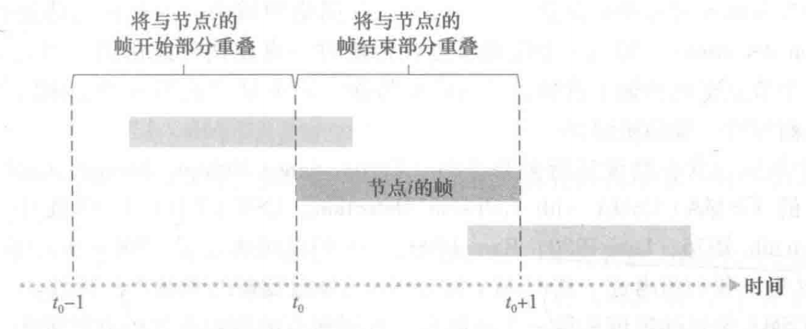
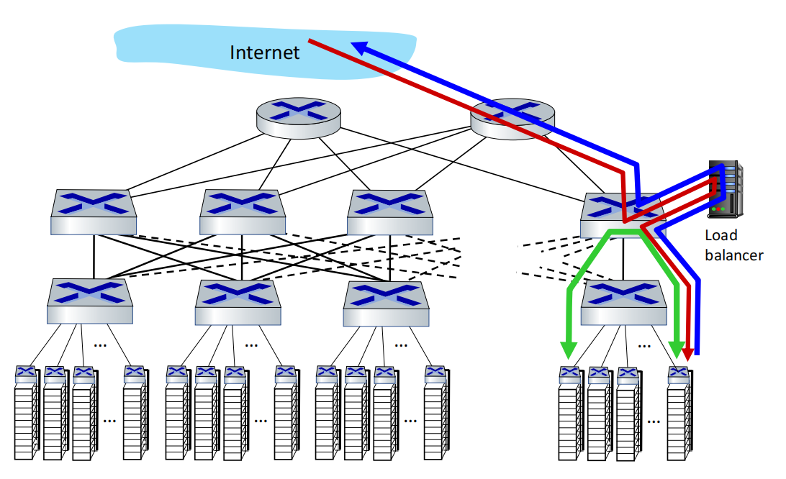

[TOC]

---

# § 第六章 链路层和局域网

## § 6.1 链路层概述

> ###### 术语约定
>
> - 节点 (node): 运行链路层协议的设备. 如: 主机, 路由器, 交换机, WiFi 接入点等;
> - 链路 (link): 沿着通信路径连接相邻节点的通信信道;
> - 链路层帧 (frame): 通过特定链路时, 传输节点将数据报根据自己的链路层协议封装在链路层帧中, 并将该帧传送到链路中;
> - LAN 网段 (LAN segments): 可以允许一个站点发送的网络范围;
>     - 一个网段是一个碰撞域, 一般同时只能允许一个站点在发送帧, 否则将发生碰撞;
>     - 通常拥有相同的前缀, 是 IP 子网下更详细的前缀;
>
>
> ---
>
> ###### 链路层可能提供的服务
>
> - 成帧 (framing)
>     - 几乎所有链路层协议都会将网络层数据报使用链路层帧封装起来;
> - 链路接入
>     - 媒体访问控制 (Medium Access Control, MAC) 协议: 规定帧在链路上的传输规则;
> - 可靠交付
>     - 保证无差错地经过链路层移动每个网络层数据报;
>         - 目的: 在差错发生的单个链路上纠错, 而不是在运输层/应用层协议被迫进行端到端的数据重传 (涉及很多链路);
>     - 该服务通常用于易产生差错的链路, 例如无线链路;
>     - 对于比特差错率低的链路, 链路层提供的可靠交付服务可能是不必要的, 于是很多链路层协议不提供此服务;
> - 差错检测和纠正
>
> ---
>
> ###### 链路层的实现位置: 硬件与软件结合, 是软硬件交接的地方
>
> - 路由器: 实现在路由器的线路卡中;
> - 主机
>     - 网络适配器 (network adapter; 网络接口卡, Network Interface Card, NIC)
>         - NIC 的核心: 链路层控制器 (实现成帧, 链路接入, 差错检测等的专用芯片);
>     - 运行在 CPU 的软件 (驱动): 实现链路层的高层功能;
>         - 发送方: 组装链路层寻址信息, 激活控制其硬件, 增加检验比特, 流量控制......
>         - 接收方: 响应链路层控制器的中断, 向网络层传递数据报, 处理差错条件, 流量控制......

---

## § 6.2 差错检测和纠正技术

> ###### 相关术语
>
> - 比特级差错检测和纠正 (bit-level error detection and correction): 对从一个节点发送到另一个物理上连接的邻近节点的链路层帧中的比特损伤进行检测和纠正;
> - 差错检测和纠正比特 (Error Detection and Correction, EDC)
> - 前向纠错 (Forward Error Correction, FEC): 在接收方检测和纠正差错的能力;
>     - 可以节省重传所需的往返时延, 适合实时网络应用和具有长传播时延的链路;

### 奇偶校验 (parity checking)

> ###### 单个奇偶校验位
>
> - 增加一位校验比特, 使得序列中的 1 比特的个数为奇数或偶数;
> - 只能检测出奇数个错误, 偶数个错误无法检验出;
>     - 如果比特错误相互独立且概率较小, 则适合使用此方法;
>     - 然而, 实践中错误往往是以 "突发" 的形式聚集在一起的, 这种情况下此方法在出错时只有 50% 的概率检出错误;
>
> ---
>
> ###### 二维奇偶校验 (two-dimensional parity)
>
> <left></left>
>
> - 可以 ==检测并纠正== 单比特位错误, 但对于两个及以上比特的错误, 只能检测不能纠正;
>     - 单个校验比特的差错也可以检测并纠正;
> - 数据被划分为 $i$ 行 $j$ 列, 总共有 $i+j+1$ 个检验比特;

---

### 检验和方法

> - 同运输层检验和的计算;

---

### 循环冗余检测 (Cyclic Redundancy Check, CRC)

> ###### 概述
>
> - CRC 编码, 又称为多项式编码 (polynomial code), 因为该编码能够将要发送的比特看作系数为 1/0 的一个多项式;
> - 纠错性能
>     - 能够检测出所有的 1 bit 错误;
>     - 能够检测出所有的 2 bit 错误;
>     - 长度  $\le r$ 比特的突发差错 (连续的) 一定可以被检测到;
>     - 长度 $=r+1$ 比特的突发差错 (连续的) 检查不出的概率为 $0.5^{r-1}$ ;
>     - 长度 $\gt r+1$ 比特的突发差错 (连续的) 检查不出的概率为 $0.5^{r}$ ;
>
> ---
>
> ###### 方法
>
> - 生成多项式 (generator): 发送方和接收方提前约定好的一串比特, 记其长度为 $r+1$ 位, 表示为 $G$ ;
>
>     - 最高比特位必须为 $1$ (最左边);``
>     - 广为使用的 $32+1$ 位生成多项式: $G_{CRC-32}=10000010~~01100000~~10001110~~11011011~~1$ ;
>
> - CRC 比特: 附在有效数据的后面, 用作检错的比特, 长度为 $r$ 位, 表示为 $R$ ;
>     $$
>     \large R=\frac{D\cdot2^r}{G}
>     $$
>
>     - 计算过程中 ==加法不进位, 减法不借位, 此时加减法都等价于 XOR== ;
>
>     - 这样计算出的 $R$ 可以保证下式成立:
>         $$
>         \large (D\cdot2^r)~~\text{XOR}~~R=n\cdot G
>         $$
>
>         - 左侧为加入 $r$ 个 CRC 检错比特的处理后的数据, 右侧代表处理后的数据是 $G$ 的整数倍 ( $n$ 倍);
>
> ---
>
> ###### 示例
>
> <left></left>
>
> - 生成多项式 $G=1001$ , $r = 3$
> - 数据: $D=101110$
> - 步骤
>     1. 将数据左移 $r$ 位, 作为被除数;
>     2. 将 $G$ 作为除数进行除法计算;
>         - 注意除法运算中的减法不借位 (直接 XOR);
>         - 即使 "被减数小于减数", 也仍然计算 "减法 (XOR)";
>     3. 除到被除数的左后一位停止, 余数 $r$ 位即为 $R$ ;
>
> ---
>
> ###### 章末 P5, 6 题
>
> <left>  

---

## § 6.3 多路访问链路和协议

### 两种类型的网络链路 + 与之对应的 MAC 协议

> - 点对点链路 (point-to-point link)
>    - 点对点协议 (Point-to-Point Protocol, PPP)
>     - 高级数据链路控制 (high-level data link control, HDLC)
> - 广播链路 (broadcast link): 多个发送和接收节点共享同一广播信道
>     - 多种多样的多路访问协议......

### MAC 协议 (媒体访问控制协议, Medium Access Control)

> ###### 概述
>
> - 解决多路访问问题: 如何协调多个发送和接收节点对一个共享广播信道的访问;
> - MAC 协议规范这些节点在同一个共享广播信道上的传输行为;
> - MAC 协议的分类
>     1. 信道划分协议
>     2. 随机接入协议
>     3. 轮流协议
>
> ---
>
> ###### 碰撞问题 (collide)
>
> - 当多个节点同时传输帧时, 所有节点同时接收到多个帧, 这些帧在所有的接收方处发生了 "碰撞";
> - 一般情况下, 碰撞帧的信号被纠缠在一起, 导致没有一个节点能够有效获得碰撞帧中的任何一个, 碰撞帧都丢失了;
> - 需要使用 MAC 协议进行协调, 以解决碰撞问题带来的信道带宽浪费;
>
> ---
>
> ###### 理想的 MAC 协议
>
> - 当仅有一个节点发送数据时, 该节点具有 $R~bps$ (广播信道的总速率) 的吞吐量;
> - 当有 $M$ 个节点发送数据时, 每个节点吞吐量为 $\frac{R}{M}~bps$ ;
>     - 这不必要求 $M$ 个节点, 每个总有 $\frac{R}{M}~bps$ 的瞬时速率, 而是每个节点在适当的时间间隔内, 都应有 $\frac{R}{M}~bps$ 的平均传输速率;
> - 协议是分散的
>     - 没有特殊的主节点协调发送;
>         - 不会因某主节点故障而使整个系统崩溃;
>     - 没有时钟和时隙同步;
> - 协议是简单的: 实现不昂贵;
>
> ---
>
> ###### 时隙多路访问协议的效率 (efficiency)
>
> - 当具有大量的活跃节点, 且每个节点总有大量的帧需要发送时, 长期运行中成功时隙的份额;

#### 1. 信道划分协议 (channel partitioning protocol)

> ###### 特点
>
> - 将信道划分为小片 (根据时间, 频率, 编码等);
> - 每个片分配给每个节点 ==专用== ;
> - 此类协议在低负载时效率低下, 高负载时能保证公平有效;

##### 时分多路复用 (TDM): 在不同的时间说话

> ###### 概述
>
> - 将时间划分为时间帧 (time frame), 每个时间帧划分为 $N$ 个时隙 (slot), 每个时隙分配给一个节点使用;
> - 节点只能在每个时间帧的属于自己的时隙中传输链路层帧;
>     - 时隙长度的选择应当足够发送一个链路层帧;
>
> ---
>
> ###### 优缺点
>
> - 优点
>     - 消除了碰撞;
>     - 公平;
> - 缺点
>     - 每个节点的最大速率只能为 $\frac{R}{N}~bps$ , 即使它是唯一一个有分组需要发送的节点;
>     - 不需要发送链路层帧的节点对应的时隙将空闲而被浪费;
>     - 在每个时间帧中, 节点必须等待 "轮到自己";

##### 频分多路复用 (FDM): 在不同的房间说话

> ###### 概述
>
> - 将总速率为 $R~bps$ 的信道划分为不同的频段, 每个频段具有 $\frac{R}{N}~bps$ 的带宽;
> - 一个频段分配给一个节点专用;
>
> ---
>
> ###### 优缺点
>
> - 优点: 同 TDM;
> - 缺点
>     - 每个节点的最大速率只能为 $\frac{R}{N}~bps$ , 即使它是唯一一个有分组需要发送的节点;
>     - 不需要发送链路层帧的节点对应的频段将空闲而被浪费;

##### 码分多址 (Code Division Multiple Access, CDMA): 以不同的语言说话

> ###### 概述
>
> - 为每个节点分配一个相互不同的编码;
> - 每个节点使用属于自己的唯一的编码来对需要发送的数据进行编码;
>     - 根据编码原理精心设计的编码, 能够使得不同节点同时传输而不必考虑其他节点的干扰, 接收方能够区分这些数据;
> - 详见第七章;

#### 2. 随机接入协议 (random access protocol)

> ###### 特点
>
> - 每个传输节点总是以信道的最大速率 ( $R~bps$ ) 向信道传输数据, **不划分信道**;
> - 允许发生碰撞;
>     - 当发生碰撞时, 所有涉及碰撞的节点反复重发碰撞帧, 直到碰撞帧成功地, 无碰撞地被接收为止;
>     - 重发不是立刻的, 而是等待一个随机的时间间隔再重发;
> - 此类协议在低负载时能够有效利用带宽, 但在高负载时冲突开销大, 导致效率很低;

##### 时隙 ALOHA 协议

> ###### 假设前提
>
> - 所有帧都是 $L~bit$ ;
> - 时隙为 $\frac{L}{R}~s$ , 即一个时隙刚好传输一帧;
> - 节点只在时隙的起点开始传输帧;
> - 节点是同步的: 每个节点都知道时隙什么时候开始;
> - 如果在一个时隙中有帧碰撞, 则所有节点在该时隙结束之前能够检测到该碰撞;
>
> ---
>
> ###### 操作
>
> <left></left>
>
> - 当节点有一个新的帧需要发送时, 在下一个时隙发送该帧;
>     - 如果成功传输, 没有发生碰撞, 则无需重传, 能够在下一个时隙继续发送新的帧;
>     - 如果发生碰撞 (根据假设, 会在该帧结束之前检测到碰撞), 则节点以概率 $p$ 在后续的每个时隙当中重传这个帧, 直到无碰撞地成功传输;
>         - 重传碰撞帧的状态下, 无法发送其他新的帧;
>         - 概率 $p$ 是一个 0~1 的数;
>
> ---
>
> ###### 效率
>
> - 当具有 $N$ 个活跃节点时, 时隙 ALOHA 的效率为: $Np(1-p)^{N-1}$ ;
>     - 当 $N\rightarrow\infty$ 时, 最大效率为 $1/e\approx37\%$ , 这是时隙 ALOHA 的效率上限, 另外 $37\%$ 是空闲的, $26\%$ 是碰撞的;
>
> ---
>
> ###### 优缺点
>
> - 优点
>     - 当只有一个节点活跃时, 它能够以 $R~bps$ 的满速率发送数据;
>     - 时隙 ALOHA 协议是高度分散的, 各节点独立检测碰撞和执行重传;
>     - 实现简单;
> - 缺点
>     - 存在冲突, 浪费时隙;
>     - 即使有帧需要发送, 仍然可能因为运气差导致时隙的空闲 (概率 $1-p$ 的情况下, 不重传);
>     - 需要对所有节点进行时隙的同步;
>     - 节点的检测冲突所需时间 $<$ 帧的传输时间;
>     - 效率较低;

##### ALOHA

> ###### 概述
>
> - 无时隙划分的 ALOHA;
>     - 实现更加简单, 无需进行时隙同步;
>
> ---
>
> ###### 操作
>
> <left></left>
>
> - 当节点有帧需要发送时, 立刻发送;
> - 当出现碰撞时: 立刻以概率 $p$ 重传
>     - 概率 $p$ : 重传成功, 继续检测碰撞;
>     - 概率 $1-p$ : 保持等待一个帧的传输时间, 而不立刻重传, 等待过后继续以概率 $p$ 重传;
>
> ---
>
> ###### 效率
>
> - 最大效率为时隙 ALOHA 的一半: $1/2e\approx18\%$ ;

##### CSMA & CSMA/CD

> ###### 概述
>
> - CSMA/CD: Carrier Sense Multiple Access with Collision Detection
>
>     - 载波侦听 (Carrier Sense)
>         - 当有其他节点正在向信道发送帧时, 等他们发送结束, 并且结束后一小段时间内没有传输时, 自己再开始发送;
>     - 碰撞检测 (Collision Detection)
>        - 节点传输时, 同时侦听信道, 如果检测到有其他节点正在同时传输帧 (干扰帧, 即发生碰撞), 则停止传输;
>         - 在有线介质上容易, 但是一些无线介质上比较困难;
>         - 因检测到碰撞而停止传输后, 再**等待一段时间**, 等待完成后继续重复上述 "载波侦听-当空闲时传输" 的循环;
>             - 等待时间的确定见下方讨论;
> - 协议族
>
>     - CSMA (载波侦听多路访问): 只具有载波侦听的特性;
>    - CSMA/CD (具有碰撞检测的载波侦听多路访问): 具有上述两种特性;
> - 性能比 ALOHA 更好, 且是分布式的, 实现简单且廉价;
> 
>---
> 
>###### 信道传播时延 (channel propagation delay) 导致碰撞的可能
> 
><left></left>
> 
>- 某些节点已经开始传输, 但位于其他空间位置上的节点因信道传播时延的存在, 没有检测到已经开始的传输而开始自己的传输, 进而导致碰撞;
> 
>---
> 
>###### 碰撞后等待的时间
> 
>- 不能等待固定的时间量, 这样会导致碰撞一直持续下去: 必须等待一个随机的时间, 且该时间的范围最好能够适应信道负载;
>     - 碰撞节点数量少时, 过长的等待时间导致信道空闲;
>    - 碰撞节点数量多时, 等待时间范围太小将导致继续碰撞;
> - 二进制指数后退算法 (binary exponential backoff)
>     - 目标: 适配器适应当前的信道负载, 在一个变化的碰撞窗口内选择一个随机的时间点重发;
>     - 操作: 当传输一个给定的帧时, 如果该帧经过了连续的 $n$ 次碰撞, 则在 $[0,~2^n-1]$ (碰撞窗口) 的范围内随机选择一个整数 $K$;
>         - 帧的连续碰撞次数越多, 就越可能选择到更长的等待时间;
>         - 以太网中, $n$ 的最大取值在 10 以内, 且等待的实际时间是: 传输 $512\times K~bit$ 所需的时间;
> 
> ---
> 
>###### 效率
> 
>$$
> \Large 效率=\frac{1}{1+\frac{5\cdot d_{pror}}{d_{trans}}}
>$$
> 
> - $d_{prop}$ : 信号在任何两个节点之间传播时延的最大值;
> - $d_{trans}$ : 传输一个最大长度的以太网帧的时间;
>    - 对于 $10~Mbps$ 的以太网, 这个值约为 $1.2~ms$ ;

#### 3. 轮流协议 (taking-turns protocol)

> ###### 特点
>
> - 节点依次轮流发送;
> - 然而具有越多数据需要传输的节点, 将会占用越多的信道使用权;
> - 集成了信道划分协议和随机接入协议的优点;

##### 集中: 轮询协议 (polling protocol)

> ###### 概述
>
> - 在信道的所有节点中指定一个主节点;
> - 主节点轮询每个节点, 告诉该节点可以开始传输, 同时告诉该个节点能够传输的帧的最大数量;
> - 主节点侦听信道是否缺乏信号, 判断一个节点是否完成了所有帧的发送;
>
> ---
>
> ###### 优缺点
>
> - 优点
>     - 消除了碰撞和空时隙, 提高了效率;
> - 缺点
>     - 引入了轮询时延;
>         - 导致即使只有一个节点活跃, 主节点也需要先轮询其他节点, 等轮询到该活跃节点才能开始传输, 导致该活跃节点的速率小于 $R~bps$ ;
>     - 单点故障: 主节点故障将导致整个信道瘫痪;

##### 分布: 令牌传递协议 (token-passing protocol)

> ###### 概述
>
> - 没有主节点;
> - 在节点之间以某种固定的次序传递令牌 (token): 一个小的特殊的帧;
> - 当一个节点收到令牌后:
>     - 如果有需要发送的帧, 则持有令牌, 发送小于一定总数限制的帧, 然后将令牌传递给其他节点;
>     - 如果没有需要发送的帧, 则立刻将令牌传出;
>
> ---
>
> ###### 优缺点
>
> - 优点
>     - 令牌的传递是分散的, 且传递效率很高;
> - 缺点
>     - 令牌传递存在开销;
>     - 存在延迟: 只有获得令牌时才能开始传输;
>     - 单点故障
>         - 如果不加以处理, 一个节点的故障可能会导致整个信道的崩溃;
>         - 一个节点忘记释放令牌, 将必须调用复杂机制来恢复令牌;

---

### 应用: DOCSIS (线缆接入网络)

> ###### 概述
>
> - 住宅电缆调制解调器 (用户猫) 与电缆调制解调器系统 (CMTS, 属于 ISP)连接;
>
> ---
>
> ###### 实现
>
> <left></left>
>
> - 下行信道: FDM
>     - 广播, 所有调制解调器都将收到所有的下行帧;
>     - 只有单一的发送方 CMTS, 所以不存在多路访问问题;
>     - 发送 MAP 报文, 显式地指定了哪个用户处的调制解调器能够在一个微时隙中的哪个特定时间间隔内传输上行帧;
> - 上行通道: FDM
>     - 许多用户共用, 需要考虑多路访问问题;
>     - 使用类似 TDM 的方式分成微时隙;
>         - 一部分: 特殊的微时隙, 用于向 CMTS 提交请求, 此微时隙采用随机接入的方式进行竞争 (可能碰撞);
>             - 用户处通过侦听 CMTS 是否响应了请求, 判断是否碰撞;
>             - 碰撞后采用二进制指数回退进行等待重传;
>             - 上行流量少时, 这部分时隙可能也会传输实际数据;
>         - 另一部分: 普通的微时隙, 在 CMTS 显式分配的指导下, 用于上行帧的传输;

---

## § 6.4 交换局域网

### 链路层寻址与 ARP

#### MAC 地址 (MAC address; LAN 地址; 物理地址)

> ###### 概述
>
> - MAC 地址是网络适配器的地址, 即网络接口的地址, 不同于网络层的地址;
>     - 即: 链路层的地址;
> - 链路层交换机的接口不具有 MAC 地址, 因为链路层交换机的任务是透明地在主机和路由器之间承载数据报;
> - MAC 地址被设计为是永久的, 但是使用软件也可以更改一个适配器的 MAC 地址;
>     - 由 IEEE 管理 MAC 地址空间, 例如: 前 24 bit 固定, 可以指示生产厂商, 后 24 bit 由厂商自己分配给所生产的设备;
> - MAC 地址具有扁平的结构, 区别于 IP 地址的层次化结构;
>     - 适配器的 MAC 地址 (类比身份证号) 不会随着适配器的位置而改变, 但是 IP 地址 (类比邮编) 会;
>
> ---
>
> ###### 格式
>
> - 长度: 6 Byte (48 bit);
> - 一般采用成对的 16 进制数表示, 中间用 "-" 隔开;
>
> ---
>
> ###### 特殊的 MAC 地址
>
> - 广播 MAC 地址: 全 1, 即 `FF-FF-FF-FF-FF-FF` ;

#### ARP (Address Resolution Protocol, 地址解析协议)

> ###### 概述
>
> - 执行在网络层地址 (例如: IP 地址) 和链路层地址 (MAC 地址) 之间转换的任务的协议;
> - 使用 ARP 表保存 IP 地址与 MAC 地址的映射关系以及 TTL (寿命) 信息;
>
> ---
>
> ###### 与 DNS 对比
>
> - DNS
>     - 将主机名解析为 IP 地址;
>     - 为位于 ==互联网任何位置== 的主机解析主机名;
> - ARP
>     - 将 IP 地址解析为 MAC 地址;
>     - 为位于 ==同一个子网下== 的主机和路由器解析 IP 地址;
>         - 如果解析的 IP 地址不在对应子网下, ARP 将返回一个错误;
>
> ---
>
> ###### ARP 表 (ARP table)
>
> <left></left>
>
> - 内容
>     - 映射关系
>     - TTL: 表项的过期时间, 一般被设置为获取表项后的 20 min 后;
> - 说明
>     - 表项中不一定包含所有的映射, 即不必包含子网下的所有主机和路由器, 因为可能从来没有用到或者过期了;
>
> ---
>
> ###### ARP 分组 (ARP packet)
>
> - 分为 ARP 查询分组和 ARP 响应分组;
>
>     - ARP 查询分组 (广播帧)
>         <left></left>
>
>     - ARP 响应分组 (标准帧)
>         <left></left>
>
> - 字段
>
>     - 发送 IP 地址 (sender IP address)
>     - 目的 IP 地址 (target IP address)
>     - 源 MAC 地址 (sender MAC address)
>         - 发送该分组的适配器自己的 MAC 地址;
>     - 目的 MAC 地址 (target MAC address)
>         - 在 ARP 查询分组中, 是广播 MAC 地址 `FF-FF-FF-FF-FF-FF` ;
>         - 在 ARP 响应分组中, 是查询方适配器的 MAC 地址;
>
> - 说明
>
>     - ARP 分组被封装在链路层帧中, 从体系结构来看位于链路层之上;
>     - ARP 分组中既包含了链路层地址, 又包含网络层地址, 因此它是一个跨越网络层和链路层的协议;
>
> ---
>
> ###### 子网内发送数据报的 MAC 地址解析过程
>
> 1. 发送方主机发送一个数据报, 需要到达本子网下的另一台主机或路由器;
> 2. 发送方发现数据报目的 IP 位于同一子网内, 检查 ARP 表:
>     - 如果 ARP 表中有对应的映射, 则将数据报封装在链路层帧中, 并且目的 MAC 地址也被放入其中, 进而发送该帧, 结束;
>     - 如果 ARP 表中没有对应的映射, 则继续;
> 3. 发送方构造一个 ARP 查询分组, 然后发送方适配器广播该分组 (广播帧);
> 4. 子网中所有适配器均收到了这个查询分组, 并且这些适配器都检查自己的 IP 地址与 ARP 查询分组中的接收 IP 地址是否一致;
> 5. 对应一致的适配器将向查询主机发送一个 ARP 响应分组 (标准帧);
> 6. 发送方收到 ARP 响应分组, 并使用该映射封装帧, 进而正确发送该帧;

#### 将分组发往子网之外

> <left></left>
>
> 1. 发送方主机 `111.111.111.111` 发送一个数据报, 需要到达本子网外的另一台主机 `222.222.222.222` ;
> 2. 发送方发现数据报目的 IP 位于本地子网 `111.111.111/24` 外, 根据网络层的决定, 应当先发往 `111.111.111.110` ( ==一般是默认网关== );
>     - 它是第一跳的目的 IP , 该目的 IP 对应的 MAC 地址根据 ARP 获得;
> 3. 发送方将数据报封装进链路层帧, 该帧的目的 MAC 是第一跳路由器对应的 MAC 地址, 但目的 IP 不变 (位于网络层数据报中, 所以不变);
> 4. 路由器的 `111.111.111.110` 对应的端口适配器将帧解封装, 并送至路由器的网络层;
> 5. 路由器的网络层根据转发表将数据报路由至 `222.222.222.220` 对应的端口, 并交给其端口适配器;
> 6. `222.222.222.220` 对应的端口适配器将数据报封装进链路层帧, 继续上述类似过程;
>     - 下一站的 MAC 地址同样由 ARP 获得;

---

### 以太网

> ###### 发展历史: 集线器到链路层交换机
>
> - 集线器 (hub)
>     - 用于星形拓扑的以太网的安装;
>     - 早期的 ==物理层设备== , 作用于所有的比特 (而不是帧), 收到一个比特后, 将该比特信号复制并放大, ==发送到其他所有接口== ;
>         - 因为能放大信号, 所以能够扩展节点之间的最大距离;
>     - 所有接口的 ==速率必须保持一致== ;
>     - 没有缓存, 没有 CSMA/CD 机制, 存在帧的碰撞问题, 碰撞帧的生成节点必须重传该帧;
> - 链路层交换机
>     - 即插即用的链路层设备, 用于星型拓扑的 ==交换== 以太网的安装, 在端口处主动执行以太网协议;
>     - 一个端口对应一个独立的网段;
>     - 取代了集线器, 它是链路层设备, 可以存储转发分组, 实现交换以太网;
>     - 使用以太网协议, 是无碰撞的, 全双工的;
>         - 对于其接入的网段, MAC 协议采用 CSMA/CD (包括二进制指数后退), 进行接入控制;
>
> ---
>
> ###### 以太网提供的服务
>
> - 所有的以太网技术都向网络层提供 ==无连接服务== ;
>     - 即: 适配器之间的发送帧不提前进行握手;
> - 所有的以太网技术都向网络层提供 ==不可靠服务== ;
>     - 当 CRC 校验通过后, 不发送确认帧;
>     - 当 CRC 检验不通过时, 直接丢弃该帧, 而不发送否定确认帧;

#### 以太网帧的结构

> <left></left>
>
> ---
>
> ###### 前同步码 (Preamble)
>
> - 长度: 8 Byte
> - 内容
>     - 前 7 Byte: 7 个 `10101010`
>     - 最后 1 Byte: `10101011`
>
> - 作用: "唤醒" 接收适配器, 同步收发双方的时钟速率, 即确定发送方发送比特的准确速率;
>     - 虽然以太网有 10Mbps, 100Mbps, 1Gbps 等不同的标准, 但是实际速率不一定完全准确, 存在漂移, 通过前 7 Byte, 接收方可以锁定发送方的发送速率, 即时钟同步, 进而保证接收内容的准确;
>     - 最后 1 Byte 的 `11` 告诉接收方适配器, 重要的数据就要来了!
>
> ---
>
> ###### 目的地址
>
> - 长度: 6 Byte
> - 作用: 指示目的适配器的 MAC 地址;
> - 说明
>     - 如果目的地址是自己的 MAC 地址或者广播地址, 则将数据字段的内容交给网络层;
>     - 如果不是, 则将该帧丢弃;
>
>
> ---
>
> ###### 源地址
>
> - 长度: 6 Byte
> - 作用: 指示传输该帧到局域网上的适配器的 MAC 地址;
>
> ---
>
> ###### 类型
>
> - 长度: 2 Byte
> - 作用: 允许以太网复用多种网络层协议, 即根据类型字段的值, 交给适当的网络层协议;
>     - 例如: ARP 协议的类型字段值为 `0x0806` ;
>
> ---
>
> ###### 数据
>
> - 长度: 46 ~ 1500 Byte
> - 作用: 承载 IP 数据报;
> - 说明
>     - 以太网的最大传输单元 (MTU) 是 1500 Byte, IP 数据报超过了 MTU 就需要对 IP 数据报进行分片;
>     - 当 IP 数据报的长度小于 46 Byte 时, 后面的部分将会被填充, 使其到达 46 Byte, 数据报和填充部分都会交给网络层, 但是网络层会根据 IP 数据报的长度字段来去除填充部分;
>
> ---
>
> ###### CRC
>
> - 长度: 4 Byte
> - 作用: 让接收适配器能够检测到帧中的一些差错;

#### 以太网技术

> ###### 有线网络
>
> <left></left>
>
> - 标准名称的规范
>     - 前面的数字: 代表速率;
>     - BASE: 指基带以太网;
>     - T: 一般是指双绞铜线;

---

### 链路层交换机

> ###### 概述
>
> - 是即插即用设备 (plug-and-play device), 是双工的 (任意端口都可以同时发送和接收);
> - 接收入链路层帧, 并将它们转发到出链路;
> - 交换机对子网中的主机和路由器是透明的 (transparent), 即子网中的主机和路由器看不到交换机进行的操作;
> - 交换机中设置缓存, 以使用分组存储转发避免碰撞;

#### 交换机转发和过滤

> ###### 概述
>
> - 转发 (forwarding): 决定一个帧应当被导向哪一个接口;
> - 过滤 (filtering): 决定将一个帧执行转发还是丢弃的交换机功能;
>
> ---
>
> ###### 交换机表 (switch table)
>
> <left></left>
>
> - 说明
>     - 交换机表中很可能并不包含该局域网下的所有主机和路由器的对应表项;
> - 包含的内容
>     - 地址 $\rightarrow$ 接口: 记录如何转发帧到达该目的 MAC 地址; 
>     - 时间: 该表项被放入交换机表的时间;
> - 一个帧从交换机的接口 $x$ 到达时的三种情况
>     1. 表中没有对应目的 MAC 地址的表项: 向除了接口 $x$ 外的所有接口转发该帧 (广播该帧);
>     2. 表中有对应目的 MAC 地址的表项, 且表项指示的转发接口同样是 $x$ : 丢弃该帧, 执行过滤功能;
>     3. 表中有对应目的 MAC 地址的表项, 但表项指示的转发接口是 $y\neq x$ : 将该帧放入接口 $y$ 的输出缓存, 执行转发功能;

#### 交换机的自学习 (self-learning)

> ###### 实现
>
> 1. 交换机表初始为空;
> 2. 当交换机表收到一个帧时, 交换机在交换机表中存储: `(该帧的源 MAC 地址, 该帧的到达接口, 该帧到达的时间)` ;
>     - 只要局域网中的某个主机 / 路由器发送了帧并经过该交换机, 它就会在交换机表中留有记录, 记录它所在的局域网网段 (对应一个交换机的接口);
> 3. 如果在老化期 (aging time) 后, 交换机没有再接收到 ==以表项中对应的 MAC 地址为源的帧== , 就将该表项从交换机表中删除;

#### 交换机与路由器

> <left></left>
>
> ---
>
> ###### 交换机实现的功能
>
> - 消除碰撞: 使用缓存保证不会在一个网段上同时传输多于一个帧, 提高了性能;
> - 异质的链路: 将不同的链路隔离, 让不同的链路能够工作在不同的速率之下;
> - 管理: 统计网络信息, 自动断开工作异常的适配器, 提高安全性;
>     - 交换机毒化 (switch poisoning): 向交换机发送大量具有伪造 MAC 地址的帧, 从而占满交换机表, 使得交换机中少有为正常用户提供的表项, 进而广播大多数帧, 使得这些帧能被同一局域网下的嗅探器嗅探到 (当有表项时, 只会向用户转发, 嗅探器无法嗅探);
>     - 集线器的无区别广播导致嗅探器很容易嗅探到他人接收的帧;
>
> ---
>
> ###### 集线器 & 交换机 & 路由器 (待补充, 待整理将比较整合)
>
> - 各自的特点
>
>     | 特点     | 集线器 | 路由器 | 交换机 |
>     | -------- | ------ | ------ | ------ |
>     | 流量隔离 | 🈚️      | ✅      | ✅      |
>     | 即插即用 | ✅      | 🈚️      | ✅      |
>     | 优化路由 | 🈚️      | ✅      | 🈚️      |
>
> - 工作的网络层
> 
>    - 集线器: 物理层设备;
>         - 对每个比特向除到达接口外的其他接口执行广播;
>    - 交换机和路由器: 都是 ==存储转发设备== ;
>         - 交换机工作在第 2 层 (链路层), 路由器工作在第 3 层 (网络层);
>         - 然而 SDN 下的交换机也能执行通用的分组转发 (也会基于网络层的首部进行转发判断);
> 
> - 转发: 都维护转发表
> 
>    - 交换机: 维护交换机表, 按照 MAC 地址进行转发;
>         - 执行过滤, 转发;
>        - 自学习;
>         - 使用生成树算法, 限制广播帧的转发;
>         - ARP 表项随站点数量的增加而增加, 且会带来可观的 ARP 流量;
>     - 路由器: 维护路由表, 执行路由算法;
>         - 提供更健壮的流量隔离方式;
>         - 对第二层的广播风暴提供了防火墙保护, 对广播分组进行了限制;
> 
> - 优缺点
> 
>    - 交换机
>         - 即插即用;
>        - 过滤, 转发的速率高;
>         - 拓扑被限制为一个生成树, 以防止广播帧的循环;
>         - 对广播风暴没有任何保护措施, 如果主机不停发送广播帧, 交换机将不停转发这些广播帧, 导致以太网崩溃;
>         - 通常适用于几百台主机+几个局域网段的小网络;
>     - 路由器
>         - 不是即插即用的, 需要人为配置 IP 地址 (子网前缀);
>         - 每分组的处理时间比交换机更长, 速率低;
>         - 正确执行的路由算法避免了环路, 不需要执行生成树算法, 路由更加 "智能", 可以更灵活地以各种拓扑构建网络;
>         - 适用于更大的网络, 交换机和路由器配合使用;

---

### 虚拟局域网 (Virtual Local Network, VLAN)

> ###### 普通的交换机拓扑的缺点
>
> - 缺乏流量隔离
>     - 效率: 携带 ARP / DHCP 报文的第二层广播帧, 以及未被交换机自学习到的帧将被广播至整个局域网;
>     - 安全性/隐私性: 希望限制广播流量, 或者让一些流量不经过某些位置;
> - 交换机的无效使用
>     - 如果每个部门一个交换机来构成拓扑, 而每个部门的人数不多, 交换机接口利用率会很低;
> - 管理用户困难
>     - 用户在不同的组之间移动时, 必须切换物理布线才能接到不同交换机上, 完成所属部门的切换;
>
> ---
>
> ###### Port-based VLAN 概述
>
> - 可以使用单一的支持 VLAN 的交换机, 实现原本多个交换机才能实现的功能;
>
> - 一个交换机中可以定义多个虚拟局域网 (VLAN);
>
>     - 基于端口定义 VLAN
>         - 一个交换机的某些端口组成一个组;
>         - 一个组构成一个 VLAN, 该 VLAN 中的端口到达的广播流量仅能到达该组中的其他端口, 无法到达 VLAN 之外;
>         - VLAN 之间相互隔离, 仿佛没有直接相连;
>
>     - 基于 MAC 地址定义 VLAN
>         - 以 MAC 地址划分 VLAN
>
> - 多个 VLAN 之间互联的方法: 将每个 VLAN 的一个接口接入到一个路由器上, 使用路由器互联 VLAN;
>
>     <left></left>
>
>     - 实践中, 厂商会售卖路由器/交换机绑定在一起的设备, 而不需要这样使用分离的外部路由器;
>
> - 同一 VLAN 分布在不同交换机上, 如何互联
>     <left></left>
>
>     1. 普通实现方法: 不同交换机上的端口, 如果属于同一 VLAN, 则树形连接起来;
>     2. VLAN 干线 (VLAN trunking): 使用特殊的 "干线端口" 互联两个交换机, 这个 "干线端口" 属于所有的 VLAN, 发送到任何 VLAN 的帧都将通过干线链路转发到其他交换机;
>         - 使用 802.1Q 以太网帧格式解决帧的目的 VLAN 的识别问题;
>
> ---
>
> ###### 802.1Q 帧
>
> - 在帧的首部中增加长度为 4 Byte 的 VLAN 标签;
>
>     - 用于保存该帧所属的 VLAN 的标识符;
>     - 发送该帧的交换机加入 VLAN 标签, 收到该帧的交换机将该标签去除, 并向其指定的 VLAN 转发该帧;
>
> - 标签内容
>     <left></left>
>
>     - 标签协议标识符 (TPID, Tap Protocol IDentifier)
>         - 长度: 2 Byte
>         - 对于 802.1Q, 取固定值 `0x8100`
>     - 标签控制信息
>         - 长度: 2 Byte
>         - 内容
>             - 优先级字段 (PRI)
>                 - 长度: 3 bit
>                 - 作用: 类似于 IP 数据报中的 TOS 字段;
>             - CFI
>                 - 长度: 1 bit
>                 - 作用: 0 表示 MAC 地址是经典格式, 1 表示不是;
>             - VID
>                 - 长度: 12 bit
>                 - 作用: VLAN 标识字段;

---

## § 6.6 数据中心网络 (data center network)

> ###### 相关概念
>
> - TOR 交换机: Top Of Rack 交换机, 位于机架顶部的交换机, 互联机架中的所有主机 (刀片, blade), 同时与其他机架以及路由器相连;

### 负载均衡 (load balance)

> ###### 负载均衡器 (load balancer)
>
> - 任务: 向主机分发请求, 以主机当前的负载信息, 决定请求发往何处;
> - 功能
>     - 类似 NAT : 将外部客户所发送请求的目的 IP 转换为数据中心网络内部的适当的 IP;
>     - 负载均衡: 根据分组的目的端口号 (第 4 层) 以及目的 IP 地址进行决策, 将该请求分发给对应的众多服务器主机中的一个;
>     - 中继: 将请求分发给主机, 主机处理完后返回结果给负载均衡器, 负载均衡器再将结果中继转发, 返回给外部客户;
>         
>         - 主机处理可能需要其他主机的服务, 这对负载均衡器是不透明的 (如图中绿线);

---

### 等级体系结构

> ###### 路由器和交换机等级结构
>
> <left></left>
>
> - 边界路由器: 连接外部网络;
>
> ---
>
> ###### 冗余
>
> - 冗余链路: 每个 TOR 可以与两台第二层交换机相连, 以提高可靠性;
> - 冗余网络设备;

---

## § 6.7 综合

> ###### 图示
>
> <left></left>
>
> ---
>
> ###### 前提
>
> - 目的: 主机 A 希望下载一个 Web 页面;
> - ISP : Comcast network;
> - 连接: 主机 - 校园网的以太网交换机 - 校园网的路由器;
>     - 校园网的路由器: 假设可分配 CIDR 块 `68.85.2.0/24` ;
>     - 假设校园网的所有 IP 都在 comcast 的地址块中;
> - DNS : 由 comcast 提供;
> - DHCP 服务器: 运行在路由器中;
>
> ---
>
> ###### 过程 1: 通过 DHCP 获取 IP 地址
>
> 当主机 A 接入校园网后, 将需要首先运行 DHCP 以获取 IP 地址;
>
> 1. A 的 OS 生成一个 DHCP 请求报文, 放入 UDP 报文段中, 并进一步封装在 IP 数据报中;
>     - 第 4 层首部
>         - 源端口号: 68 (DHCP 客户)
>         - 目的端口号: 67 (DHCP 服务器)
>     - 第 3 层首部
>         - 源 IP 地址: `0.0.0.0` , 这是因为主机 A 还没有一个 IP 地址;
>         - 目的 IP 地址: 广播 IP 地址 `255.255.255.255` ;
> 2. 包含 DHCP 请求报文的 IP 数据报被封装进以太网帧中;
>     - 第 2 层首部
>         - 源 MAC 地址: 主机 A 的 MAC 地址;
>         - 目的 MAC 地址: `FF:FF:FF:FF:FF:FF` ;
> 3. 该以太网帧被发送到校园网的以太网交换机, 该交换机广播该帧到所有出端口;
> 4. 校园网的路由器在对应的端口收到该广播帧, 并抽取出 IP 数据报;
>     - 数据报的广播目的 IP 地址指示了: 这个数据报需要交给高层协议处理;
>     - 解封装出 UDP 报文段, 进而解封装出 DHCP 请求报文, 然后运行在该路由器中的 DHCP 服务器收到这个 DHCP 请求报文;
> 5. 运行在路由器中的 DHCP 服务器分配地址, 并生成 DHCP ACK 报文, 放入 UDP 报文段 -> IP 数据报 -> 以太网帧;
>     - DHCP ACK 报文包含的内容
>         - 被分配给主机 A 的 IP 地址
>         - DNS 服务器的 IP 地址
>         - 默认网关路由器的 IP 地址
>         - 子网块 (等价于: 子网掩码) `68.85.2.0/24`
>     - 第 4 层首部
>         - 源端口号: 67 (DHCP 服务器)
>         - 目的端口号: 68 (DHCP 客户)
>     - 第 3 层首部
>         - 源 IP 地址: 路由器的 IP 地址
>         - 目的 IP 地址: 未知, 待补充;
>     - 第 2 层首部
>         - 源 MAC 地址: 路由器连接到这个归属网络的端口的 MAC 地址;
>         - 目的 MAC 地址: 主机 A 的 MAC 地址;
> 6. 该承载 DHCP ACK 报文的以太网帧经过交换机, 成功转发给主机 A ;
>     - 因为交换机是自学习的, DHCP 请求时已经学习直到如何转发给主机 A 的 MAC;
> 7. 主机 A 接收到该以太网帧, 层层解封装, 进而主机 A 的 DHCP 客户端记录并配置相关内容;
>     - 设置自己的 IP 地址和 DNS 服务器的地址;
>     - 在自己的 IP 转发表中加入默认网关的 IP 地址;
>         - 主机 A 会将所有目的地址在子网块 `68.85.2.0/24` 外的所有数据报发送给默认网关;
>
> ---
>
> ###### 过程 2: DNS 和 ARP
>
> Bob 将一个 URL 键入 Web 浏览器, 浏览器将生成一个 TCP 套接字 (用于向服务器主机发送 HTTP 请求), 而这个 TCP 套接字的生成需要服务器主机的 IP 地址, 这个域名到 IP 地址的转化需要先使用 DNS 获取;
>
> 8. 主机 A 的 OS 生成一个 DNS 查询报文, 进而封装进 UDP 报文段 - IP 数据报;
>     - 字符串 `www.google.com` 被放入该报文的问题段中;
>     - 第 4 层首部
>         - 目的端口号: 53 (DNS 服务器)
>     - 第 3 层首部
>         - 目的 IP 地址: 过程 1 中收到的 DNS 服务器的地址;
>         - 源 IP 地址: 过程 1 中被分配给的 IP 地址;
> 9. 该数据报被封装入以太网帧中, 并发往默认网关;
>     - 因为目的 IP 地址在子网块 `68.85.2.0/24` 外, 所以需要首先发往默认网关, "发往默认网关" 是指链路层的 "发往";
>     - 第 2 层首部
>         - 源 MAC 地址: 主机 A 的 MAC 地址
>         - 目的 MAC 地址: 未知 !
>             - 需要获知网关路由器的 MAC 地址, 才能实现链路层的 "发往", 所以启用 ARP 协议;
> 10. 主机 A 生成一个具有默认网关的 IP 地址的 ARP 查询报文, 并将其封装进具有广播目的地址 `FF:FF:FF:FF:FF:FF` 的以太网帧中, 然后向交换机发送该帧, 交换机将会把该帧发往所有出端口;
> 11. 默认网关 (校园网的路由器) 收到该 ARP 请求报文, 将该 ARP 请求报文中的 IP 地址 (主机 A 的默认网关的 IP 地址) 与自身接口的 IP 地址进行匹配, 发现匹配成功 (因为该 ARP 请求的对象就是自己的这个接口), 于是生成 ARP 回答报文, 其中封装了自己的该接口的 IP 地址与 MAC 地址以及主机 A 的 IP/MAC 地址, 然后发给主机 A;
> 12. 主机 A 最终收到其默认网关的对应端口的 MAC 地址, 并记录在自己的 ARP 表中;
> 13. 主机 A 将包含 DNS 查询报文的以太网帧 (已经填充好了目的 MAC 地址, 即默认网关对应接口的 MAC 地址) 发出, 最终交付给了默认网关路由器;
>
> ---
>
> ###### 过程 3: 通过域内路由选择, 到达 DNS 服务器
>
> 14. 网关路由器接收该帧, 并抽取 IP 数据报, 在自己的转发表中查找目的地址 IP, 然后重新封装一个链路层帧, 将其正确地转发到 comcast 网络中与自己连接的路由器;
>     - 第 2 层首部
>         - 源 MAC 地址: 校园网网关路由器的出端口对应的 MAC 地址;
>         - 目的 MAC 地址: comcast 网络中左边路由器连接校园网网关路由器的端口的 MAC 地址; (不再赘述其 MAC 地址的获取)
> 15. comcast 网络左边的路由器收到该帧, 解封装出 IP 数据报, 然后使用自己的转发表转发 (是一个域内的转发);
>     - 这个转发表由域内协议 (如: RIP, OSPF, IS-IS 等) 和因特网的域间协议 (即: BGP) 填写, 这里用到的是域内的转发;
> 16. 最终包含 DNS 查询报文的 IP 数据报到达 DNS 服务器, DNS 服务器抽取出 DNS 查询报文, 然后找到对应的映射 (该映射叫 DNS 源记录, 即: 已经缓存在 DNS 服务器中的记录, 这种缓存源于 `www.google.com` 的权威 DNS 服务器), 生成包含该主机名到 IP 地址映射的 DNS 回答报文, 然后封装进 UDP 报文段 - IP 数据报, 然后反向转发最终到达主机 A;
> 17. 主机 A 收到 DNS 回答报文, 最终得到了 `www.google.com` 服务器主机的 IP 地址;
>
> ---
>
> ###### 过程 4: TCP 和 HTTP
>
> 18. 有了服务器主机的 IP 地址, 终于可以生成 TCP 套接字了, 套接字先与服务器进行三次握手;
>     - 先生成 TCP SYN 报文段;
>     - 首部字段
>         - 第四层: 目的端口: 80 (针对 HTTP)
>         - 第三层: 目的 IP 地址: `步骤 17` 中得到的服务器主机的 IP 地址;
>         - 第二层: 目的 MAC 地址: 默认网关路由器对应接口的 MAC 地址;
> 19. 经过网络核心中的域间/内转发, 最终到达服务器主机;
>     - 这里不仅有域内, 还有域间转发 (由 BGP 得到转发表项);
> 20. TCP SYN 到达服务器主机, 服务器主机解封装出 TCP SYN 报文, 并进行多路分解, 送至 80 端口的欢迎套接字, 然后生成一个主机 A 与该服务器之间的套接字, 进而产生一个 TCP SYNACK 报文段并发送至主机 A;
> 21. TCP SYNACK 报文段到达主机 A, TCP 连接进入连接状态;
> 22. 主机 A 中的浏览器生成包含需要获取的 URL 的 HTTP GET 报文, 并写入套接字, 套接字会将其发送到在 `步骤 20` 中生成的套接字;
> 23. HTTP 服务器收到从 TCP 套接字读取到的 HTTP GET 报文, 进而产生一个 HTTP 响应报文, 并发送到套接字中;
> 24. 主机 A 最终收到了这个响应报文, 并抽取出了其中包含的内容, 显示了 Web 网页;
