[TOC]

---

# § 第四章 网络层: 数据平面

## § 4.1 网络层概述

> ###### 术语约定
>
> - 分组交换机
>     一台通用分组交换设备, 根据分组首部字段的值, 从输入链路接口到输出链路接口转移分组;
>     - 链路层交换机 (link-layer switch)
>         基于链路层帧中的字段值作出转发决定的分组交换机, 是链路层设备;
>     - 路由器 (router)
>         基于网络层数据报中的首部字段值作出转发决定, 是网络层设备;
> - 经常互换使用的术语: 转发 & 交换

### 数据平面与控制平面

> ###### 主要作用
>
> - 数据平面: 从输入链路向输出链路**转发**数据报;
> - 控制平面: 协调本地的每路由器的转发动作 (**路由选择**), 使得数据报沿着源-目的主机之间的路由器路径进行端到端传送;
>
> ---
>
> ###### 实现的功能
>
> - 数据平面
>     - 数据平面实现的唯一功能是**转发**: 即当分组到达某路由器的输入链路时, 路由器将分组移动到适当的输出链路;
>         - 范围: 是**每个路由器的**, **本地**的动作;
>         - 时间尺度: 很短 (几纳秒), 由硬件实现;
> - 控制平面
>     - 路由选择: 确定分组**从源流向目的地所采取的端到端路径的网络范围的处理过程**;
>         - 计算这些路径的算法叫做: 路由选择算法 (routing algorithm);
>         - 范围: 是**网络范围**的逻辑;
>         - 时间尺度: 较长 (通常为几秒), 通常由软件实现;
>     - 执行路由协议;
>     - 响应连接的上下链路;
>     - 与远程控制器通信;
>     - 执行管理功能;
>
> ---
>
> ###### 相关概念
>
> - 数据平面: 转发表 (forwarding table)
>
>     - 记录着映射关系: 首部 $\rightarrow$ 输出链路;
>     - 路由选择算法决定了插入转发表的内容 (映射项);
>
> - 控制平面: SDN 方法 (Software-Defined Networking, SDN, 软件定义网络)
>     <left></left>
>
>     - 路由选择设备 (路由器, 分组交换机) 只执行转发, 转发表的计算由远程控制器决定;
>         - 远程控制器可能实现在具有高可靠性和冗余的远程数据中心里;
>     - 路由器和远程控制器通过交换包含转发表和其它路由选择信息的报文进行通信;

---

### 网络服务模型 (network service model)

> ###### 概述
>
> - 网络服务模型定义了分组在发送端系统与接收端系统之间的端到端运输特性;
>
> ---
>
> ###### 网络层可能提供的服务
>
> | 服务                   | 说明                                                         |
> | ---------------------- | ------------------------------------------------------------ |
> | 确保交付               | 该服务确保分组将最终到达目的地;                              |
> | 具有时延上界的确保交付 | 该服务不仅确保分组的交付, 而且在特定的主机到主机时延上界内 (例如在 100 ms 内) 交付; |
> | 有序分组交付           | 该服务确保分组以它们发送的顺序到达目的地;                    |
> | 确保最小带宽           | 这种网络层服务模仿在发送和接收主机之间一条特定比特率的传输链路的行为; 只要发送主机以低于该特定比特率的速率传输比特, 则所有分组最终会交付到目的主机; |
> | 安全性                 | 网络层能够在源加密所有数据报并在目的地解密这些分组, 从而对所有运输层报文段提供机密性; |
>
> ---
>
> ###### 因特网 (Internet) 的网络层所提供的服务: 尽力而为服务 (best-effort service)
>
> - 上述 "网络层可能提供的服务" 均没有得到保证; 😅

---

## § 4.2 路由器工作原理

### 通用路由器体系结构

> <left>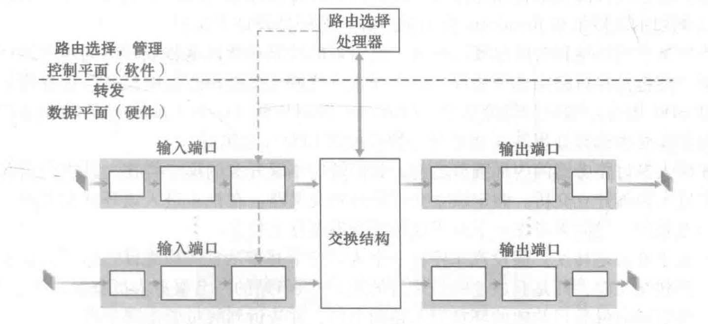</left>
>
> - 数据平面几乎都是硬件实现, 以纳秒的时间尺度运行;
> - 控制平面以毫秒或秒的时间尺度运行, 通常以软件的形式运行在路由选择处理器 (通常是一种传统的 CPU) 上;

---

### 路由器组件及其功能

#### 数据平面 (硬件): 转发

##### 输入端口 (input port)

> <left>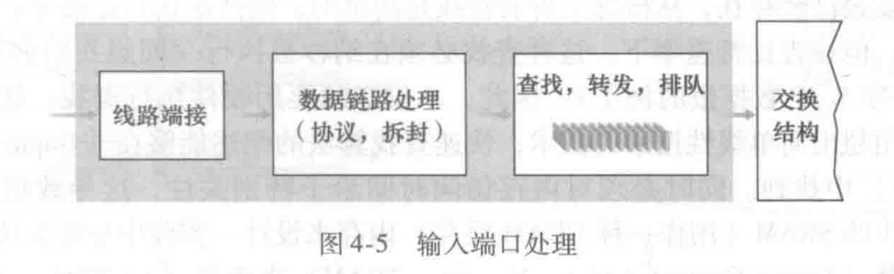</left>
>
> - 物理层, 链路层处理;
>     - 终结 `入物理链路` 的物理层功能: 左侧方框
>
>     - 与位于 `入链路` 的远端的数据链路层交互, 执行数据链路层功能: 中间方框
>     
> - 网络层处理
>     - 检查分组的 `版本号`, `检验和` 和 `寿命字段`, 并重写 `检验和` 和 `寿命字段`;
>
>     - 在输入端口执行执行**查找**功能: 通过查询转发表, 决定输出端口;
>         - 最长前缀匹配规则 (longest prefix matching rule)
>             - 根据 `目的地址范围-链路接口` 确定转发表项 `前缀匹配-链路接口` ;
>
>             - 在表中寻找最长的匹配项, 并向与最长前缀匹配相对应的链路端口转发分组;
>
>     - 将控制分组从输入端口**转发**到路由选择处理器;
>
>     - 更新用于网络管理的计数器;
>

##### 交换结构 (switch fabric)

> ###### 概述
>
> - 将路由器的输入端口连接到它的输出端口;
> - 完全包含在路由器当中, 是 "路由器中的网络";
>
> ---
>
> ###### 交换技术 1: 经内存交换
>
> <left>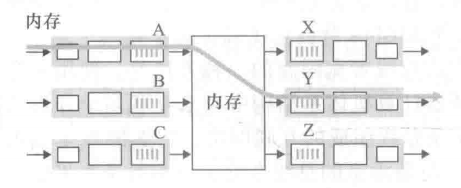</left>
>
> - 输入/输出端口类似传统操作系统的 I/O;
> - 路由选择处理器进行查找, 转发 (复制分组到对应输出端口的缓存) 等操作;
> - 不能同时转发两个分组, 因为经过经过共享系统总线一次仅能执行一个内存读/写;
>
> ---
>
> ###### 交换技术 2: 经总线交换
>
> <left>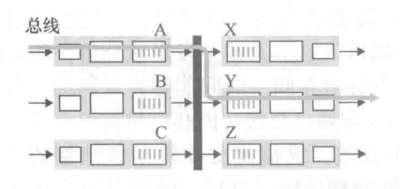</left>
>
> - 工作过程
>     1. 输入端口为分组**添加一个标签**, 仅用于标识该分组被转发到哪个输出端口;
>     2. 经过总线, 分组将到达所有输出端口, 但是只有与标签匹配的输出端口能够收到并保存该分组;
>     3. 对应的输出端口**将该标签去除**, 并放入缓存;
> - 是阻塞的: 因为总线同一时刻只能被一个分组占据;
>     - 性能受总线带宽的限制, 适用于小型局域网, 企业网等;
>
> ---
>
> ###### 交换技术 3: 经互联网络交换 (纵横式交换结构)
>
> <left>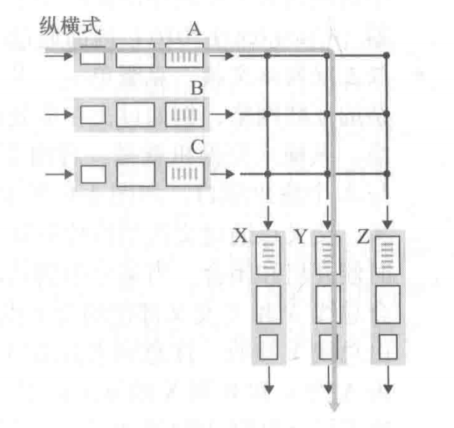</left>
>
> - 使用 $2N$ 条总线, 连接 $N$ 个输入端口和 $N$ 个输出端口;
> - 是非阻塞的: 可以并行转发分组;
>     - 在交叉结构控制器的控制下, 交叉点能够开启/闭合, 从而引导分组的流向;
>     - 只有在不同输入端口的分组, 目的端口为同一个时, 才必须等待, 否则可以并行转发;
>         - 同一输入端口缓存中, 目的端口也一致, 也需要等待, 但这不是上述 "并行" 的讨论范围;

##### 输出端口 (output port)

> <left>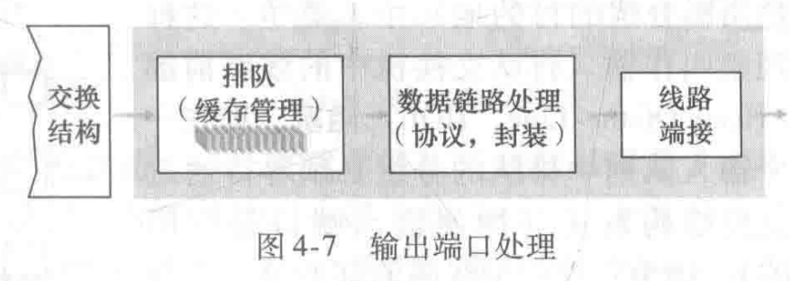</left>
>
> - 存储从交换结构接收到的分组到缓存;
> - 执行必要的链路层和物理层功能;
> - 如果一条链路是双向的, 则输出端口与输入端口往往成对出现在同一线路卡上;

#### 控制平面 (软件): 路由选择与管理

##### 路由选择处理器 (routing processor): 执行控制平面的功能

> - 维护转发表
>     - 在传统路由器中: 执行路由选择协议, 维护路由选择表, 关联链路状态信息, 并计算转发表;
>     - 在 SDN 路由器中: 与远程控制器通信, 从而接收由远程控制器计算的转发表项, 并在输入端口安装这些表项;
>
> - 执行网络管理功能
>

---

### 排队现象

> ###### 输入排队: 线路前部 (Head-Of-the-Line, HOL) 阻塞
>
> - 在一个输入队列中排队的分组, 必须等待才能通过交换结构发送, 因为它被位于线路前部的另一个分组所阻塞;
>     - 即: 多个分组 (可以来自相同/不同输入端口) 指向了同一个目的端口, 只有一个分组能够在某一时刻进入交换结构, 其他分组被阻塞;
> - 研究指出: 对于 HOL 阻塞, 只要链路上的分组到达速率达到其容量的 58%, 就会导致输入队列无限制增大;
>
> ---
>
> ###### 输出排队
>
> - 交换结构运行速度比端口输出速度快, 大量分组到达输出缓存, 引起输出排队;
> - 采用分组调度进行决策: 决定哪个排队中的分组将传输到输出链路中;

---

### 分组调度

> ###### 先进先出 (FIFO)
>
> - 最简单的调度策略: 排队;
>
> ---
>
> ###### 优先权排队 (priority queuing)
>
> <left>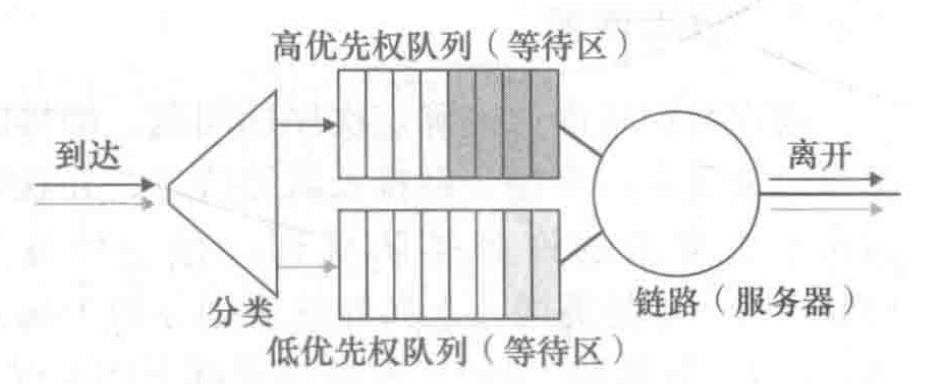</left>
>
> - 多级队列, 同一个队列中通常采用 FIFO ;
> - 每次选择优先级最高的非空队列, 从中出队一个分组, 进行传输;
>
> ---
>
> ###### 循环排队规则 (round robin queuing discipline)
>
> - 分组被分类, 但不是按照优先权;
> - 循环地从各个分类中取出一个分组进行传输;
> - 保持工作排队 (work-conserving queuing): 当循环到一个类, 该类中没有分组排队时, 不等待该类中分组到达, 而是继续检查循环中的下一个类;
>
> ---
>
> ###### 加权公平排队 (Weighted Fair Queuing, WFQ)
>
> <left>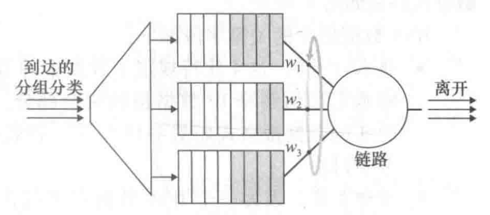</left>
>
> - 同样为分组分类, 每个类别有一个权重;
> - 循环地服务各个分类, 每次服务某个分类时, 可能连续多次取出分组并传输, 使得该类所获得的传输占比等同于权重占比;

---

## § 4.3 网络协议

### IPv4

#### IPv4 数据报格式

> <left>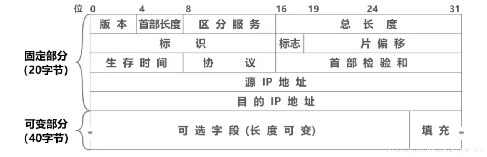</left>
>
> ---
>
> ###### 版本
>
> - 长度: 4 bit;
> - 作用: 规定了数据报的 IP 协议版本, 从而让路由器能够知道如何解释该数据报的剩余部分;
>
> ---
>
> ###### 首部长度
>
> - 长度: 4 bit;
> - 作用: 确定载荷 (该数据报中被封装的传输层报文段) 开始的地方;
> - 单位: 字 (4 bytes)
> - 范围: 最小为 5 (20 bytes), 最大为 1111 (60 bytes);
> - 说明: 大多数 IP 数据报不包含 `选项` 字段, 因此典型值为 20 字节;
>
> ---
>
> ###### 服务类型 (TOS)
>
> - 作用: 用来区分不同类型的数据报, 例如: 要求低时延的数据报, 要求高吞吐量的数据报, 要求高可靠性的数据报等;
>
> ---
>
> ###### 数据报长度
>
> - 长度: 16 bit;
> - 作用: 表示该 IP 数据报的总长度 (首部 + 数据);
> - 单位: 字节 (byte)
> - 范围: 最大 65535 字节;
>
> ---
>
> ###### 标识
>
> - 长度: 16 bit;
> - 作用
>     - 发送主机对每个数据报贴上一个标识号, 标识号逐个数据报都会加 1;
>     - 当原数据报分片时, 属于同一原数据报的片将具有相同的标识号;
>
>
> ---
>
> ###### 标志
>
> - 长度: 3 bit;
> - 作用: 目前只有前两位有效
>     - MF
>         - MF == 1: 后面还有分片;
>         - MF == 0: 这是最后一个分片;
>
>     - DF
>         - DF == 1: 不允许分片;
>         - DF == 0: 允许分片;
>
>
> ---
>
> ###### 片偏移
>
> - 长度: 13 bit;
> - 单位: 8 bytes ( 2 字 );
> - 作用: 当分片时, 指示这一片在原完整数据报的相对开头的偏移量;
>
> ---
>
> ###### 寿命 (Time-To-Live, TTL)
>
> - 长度: 8 bit;
> - 作用
>     - 防止一个数据报永远在网络中循环: 当被路由不停在环路中转发时;
>     - 每次被一个路由器处理, TTL 减 1;
>     - 当 TTL 被路由器减为 0 时, 丢弃该报文段;
>
> ---
>
> ###### 协议
>
> - 长度: 8 bit;
>
> - 作用: 该字段通常仅当该数据报到达最终目的地时才起作用, 指示了该数据报的数据部分应当交给哪个特定的运输层协议;
>
> - 说明
>
>     - 类似于运输层协议中的端口号, 只不过这里的 "端口" 是指不同的协议;
>
>     - 联系起了网络层和运输层;
>
>     - 常见的协议号
>
>         | 协议       | ICMP | IGMP | TCP  | UDP  | IPv6 | OSPF |
>         | ---------- | ---- | ---- | ---- | ---- | ---- | ---- |
>         | 协议字段值 | 1    | 2    | 6    | 17   | 41   | 89   |
>
> ---
>
> ###### 首部检验和
>
> - 长度: 16 bit;
> - 作用: 帮助路由器检测 IP 数据报**首部**中的比特错误;
> - 机制
>     1. 对于首部字段中的每 2 字节 (16 bit) 作为一个数, 累加起来, 同时注意回卷;
>         - 计算过程中忽略首部检验和字段本身;
>     2. 将计算得到的检验和与接收到的检验和相加:
>         - 得到全 1: 首部正确;
>         - 含 0: 出现错误, 丢弃该数据报;
>     3. 如果正确: 在处理完该数据报后, 计算新的首部检验和, 更新该字段, 然后发送数据报;
>         - 每次都需要重新计算: 因为路由器每次 "处理" 后, TTL 和选项字段会变化, 检验和并不是全程保持一致的;
>
> ---
>
> ###### 源 / 目的 IP 地址
>
> - 长度: 32 bit;
> - 说明: 指示源主机 / 目的主机的 IP 地址;
>
> ----
>
> ###### 选项
>
> - 长度: 可变的;
> - 说明: 很少使用, 且引入了新的变量, 即不确定数据字段从数据报的何处开始, 影响性能, 所以 IPv6 去除了选项字段;
>
> ---
>
> ###### 数据 (有效载荷)
>
> - 说明: 承载一些数据, 如: 运输层报文段 (TCP/UDP), ICMP 报文段等;

#### IPv4 数据报分片

> - 最大传送单元 (Maximum Transmission Unit, MTU)
>     - 一个链路层帧能够承载的最大数据量;
>     - 链路层协议决定 MTU, 不同的链路层协议可能具有不同的 MTU;
> - 片 (fragment): IP 数据报中的数据部分被分割, 然后形成多个较小的 IP 数据报, 这些小的 IP 数据报被称为片;
>     - 同一原数据报的每个片具有相同的 `源 / 目的 IP 地址` , `标识号` ;
>     - 片的分割和组装在端系统内完成;
>     - 标志位 MF 指示是否是最后的片, 片偏移帮助端系统完成分片报文段的重组;

#### IPv4 编址

> - 所有接口 (interface) 都具有一个 IP 地址, 采用点分十进制记法 (dotted-decimal notation) 书写;
> - 子网掩码 (network mask)
>     - 一种表示: 例如子网地址 `223.1.1.0/24` 中的 `/24` , 说明 32 bit 中的左侧 24 bit 定义了子网地址;
>     - 另一种表示: 例如 `11111111 11111111 11111110 00000000` 代表前 23 位 ( 1 ) 是子网地址, 剩余的 0 是主机部分;

##### 子网

> <left>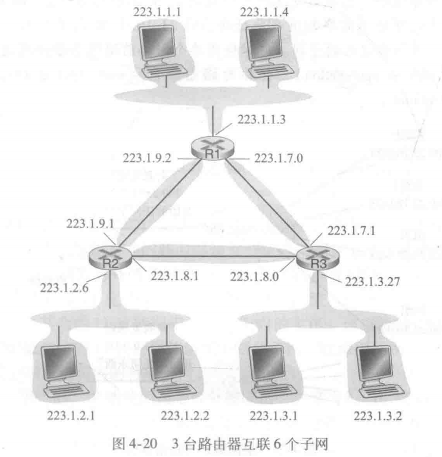</left>
>
> - 子网的确定方式
>     - 课本定义: 为了确定子网, 分开主机和路由器的每个接口, 产生几个隔离的网络岛, 使用接口端接这些隔离的网络的端点. 这些隔离的网络中的每一个都叫作一个子网 (subnet);
>     - 个人理解: 将所有接口 (物理接口) 分成多个网络岛, 每个网络岛中的接口都通过链路层交换机或者其他形式 (待补充) 互联, 而不是通过路由器进行互联, 则这个网络岛是一个子网;
> - 上图中的子网
>     - 共有 6 个子网, 分别是: `223.1.1.0/24` , `223.1.2.0/24` , `223.1.3.0/24` , `223.1.7.0/24` , `223.1.8.0/24` , `223.1.9.0/24` ;
>     - 注意: 到 R1 与 R2 之间这类网络岛也是子网;

##### 因特网的分类编址 (classful addressing)

> ###### 概述
>
> - 当 CIDR 被采用之前, 所使用的编址方案;
>
> ---
>
> ###### IP 地址分类
>
> <left>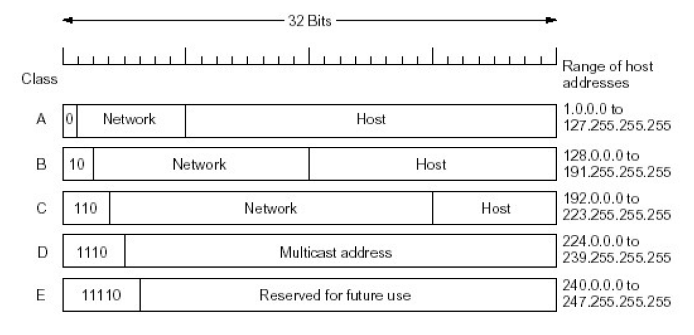</left>
>
> - A/B/C 类
>
>     | 分类 | 前缀 | 网络号                 | 主机号           | 子网掩码      |
>     | ---- | ---- | ---------------------- | ---------------- | ------------- |
>     | A 类 | 0    | 7 位 (126 个子网)      | 24 位 (？ 台)    | 255.0.0.0     |
>     | B 类 | 10   | 14 位 (16382 个子网)   | 16 位 (65533 台) | 255.255.0.0   |
>     | C 类 | 110  | 21 位 (2097150 个子网) | 8 位 (254 台)    | 255.255.255.0 |
>
> - D/E 类
>
>     | 分类 | 前缀  | 说明              |
>     | ---- | ----- | ----------------- |
>     | D 类 | 1110  | 后 28 位用于多播; |
>     | E 类 | 11110 | 预留的, 尚未使用; |
>
> ---
>
> ###### 特殊的 IP 地址
>
> - 网络号 (子网) 部分
>     - 全 0: 代表本网络;
> - 主机号部分
>     - 全 0: 代表本主机;
>     - 全 1: 代表广播, 即本网络的全部主机;
>
> ---
>
> ###### 缺点
>
> - 没有网络层次, 不够灵活: 例如一个组织下需要根据实际情况划分网络层次, 但是 IP 分类无法划分网络层次;
> - IP 地址空间利用率低: 子网下的主机号大小不一定合适, 例如: 需要容纳 2000 台主机, C 类太小, B 类太大;
> - 路由表太大: 每个物理网络分配一个网络号 (即: 不存在网络层次), 将会导致路由表变大, 增加存储和处理开销, 降低网络效率;

##### CIDR: 无类别域间路由选择 (Classless Interdomain Routing)

> ###### 改进: 地址被划分为两部分: `a.b.c.d/x`
>
> - (网络) 前缀: `x` 指示了地址的第一部分中的比特数, 这部分称为该地址的前缀;
> - 组织内部设备的地址: 后面的 `32 - x` 位是用于区分该组织的内部设备的地址;
> - 一个组织通常被分配一块连续的地址, 它们具有相同的前缀;
>
> ---
>
> ###### CIDR 实现了地址聚合 (address aggregation)
>
> <left>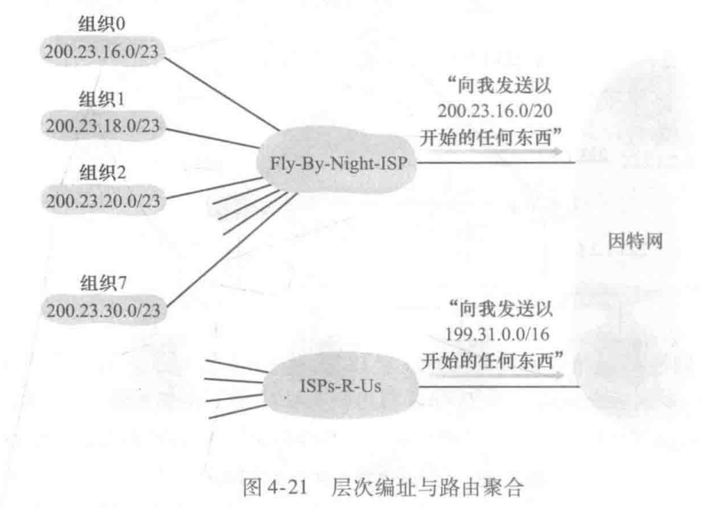</left>
>
> - 又称为: 路由聚合 (route aggregation), 路由摘要 (route summarization), 是指 CIDR 地址块 (前缀相同的 IP 地址) 中有很多 IP 地址的地址聚合功能;
> - 上图中: 16 = 0001 0000, 18 = 0001 0010, 20 = 0001 0100, 30 = 0001 1110, 这几个组织的子网地址的前 20 位 (到 0001 结束) 均相同, 不同的是第 21~23 位;
>
> ---
>
> ###### 地址聚合的适用范围
>
> - 当地址按照块被分配给 ISP , ISP 将地址按块分配给客户组织时, 地址聚合非常有效;
>
> - 如果不是这样层层按照地址块分配, 比如该 ISP 下的某个组织的开头 20 位地址与原本 ISP 通告的地址是不相同的, 则 ISP 需要通过增加通告一个更详细的地址, 这样就可以根据最长前缀匹配的方法路由到正确地组织;
>
>     <left>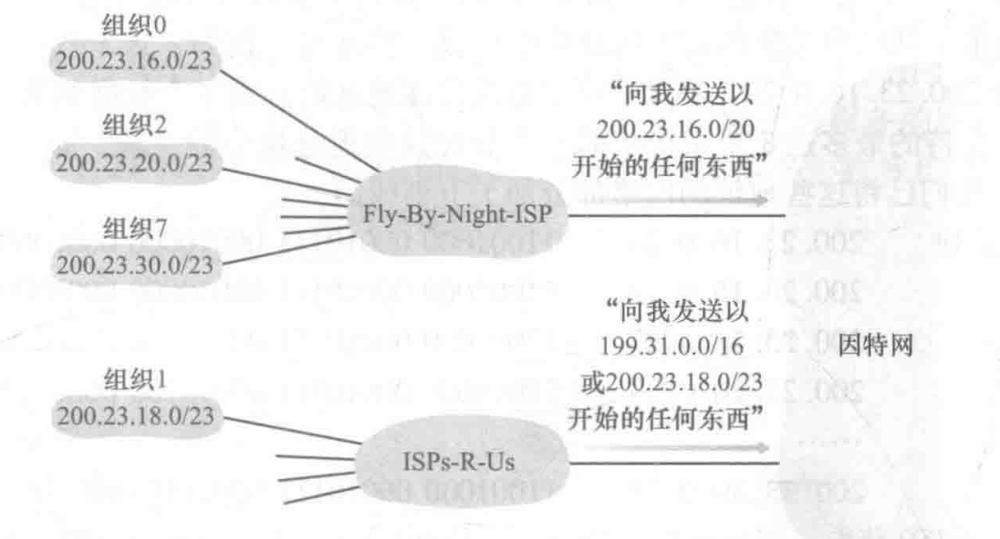</left>
>
>     - 因为最长前缀匹配, 所以发往组织 1 的分组会被路由到 ISPs-R-Us, 而不是 Fly-By-Night-ISP;
>
> ---
>
> ###### CIDR 实现了网络层次
>
> - CIDR 可以实现网络层次, 个人理解为: 子网下的子网
> - 比如: 组织 0 使用了 `200.23.16.0/23` 作为该组织的前缀, 可以进一步使用 `200.23.16.0/25` 作为该组织 (子网) 下的另一个更小的子网;
>
> ---
>
> ###### CIDR 下的 IP 地址分配: 获取一块地址
>
> - 因特网名字和编号分配机构 (Internet Corporation for Assigned Names and Numbers, ICANN) 负责管理最初的 IP 地址块分配;
>     - 还有以下职能: 解决域名纠纷, 管理根 DNS 服务器;
> - ISP 逐层分配更小的地址块给其下组织;
> - 分配地址块通过逐渐增长前缀 (也就是增大 x ) 来实现, 例如: x 增加 3, 可以增加 3 位前缀, 进而将原地址块在划分出 8 块等大的小地址块;

##### DHCP: 动态主机配置协议 (Dynamic Host Configuration Protocol)

> ###### 概述
>
> - DHCP 又称为: 即插即用协议 (plug-and-play protocol), 零配置协议 (zeroconf protocol);
>
> ---
>
> ###### 前提
>
> - 新到达的客户所在的子网中具有一个 DHCP 服务器, 或者对应的子网中具有 DHCP 中继代理 (通常是对应的路由器);
>     - DHCP 中继代理知道用于该子网的 DHCP 服务器的地址;
>
> ---
>
> ###### 分配 IP 地址的步骤
>
> 1. (不必要步骤) 发现 DHCP 服务器: 在 `UDP` 分组中向 `67` 端口发送 ==DHCP 发现报文 (DHCP discover message)== ;
>     - DHCP 发现报文使用广播目的地址 `255.255.255.255:67` , 使用 "本主机" 源 IP 地址 `0.0.0.0:68` ;
>         - 使用广播地址是因为客户不知道 DHCP 服务器地址;
>     - 该报文将会通过链路层广播, 达到该子网所连接的所有节点;
> 2. (不必要步骤) DHCP 服务器提供服务: DHCP 收到 DHCP 发现报文时, 用 ==DHCP 提供报文 (DHCP offer message)== 响应;
>     - DHCP 提供报文可能使用广播目的地址 `255.255.255.255:68` (一般情况下);
>         - 广播和单播的选择与客户端的标志位设置有关, 具体不明 (待补充);
>     - DHCP 提供报文中包括以下内容:
>         - 分配给客户的 IP 地址;
>         - 默认网关 (第一跳路由器) 的 IP 地址;
>         - DNS 服务器的域名和 IP 地址;
>         - 子网掩码;
>         - IP 地址租用期 (address lease time): 用来指示分配的 IP 地址的有效期;
> 3. (必要步骤) DHCP 请求: 从收到的 DHCP 提供报文中选择一个, 并发出 ==DHCP 请求报文 (DHCP request message)== 进行相应, 回显配置的参数;
> 4. (必要步骤) DHCP ACK: 当 DHCP 服务器收到 DHCP 请求报文时, 使用 ==DHCP ACK== 响应该请求报文, 证实所请求的参数;
>     - 收到 DHCP ACK 后, 客户即可在租用期内使用分配到的 IP 地址了;
>
> ---
>
> ###### 扩展
>
> - 如果客户在租用期超时后, 仍然希望使用该 IP 地址, 可以要求 DHCP 服务器更新对该 IP 地址的租用;
> - 移动节点在子网之间移动时, 普通的 DHCP 会频繁切换客户的 IP 地址, 导致 TCP 连接无法持续, 第 6 章中将介绍移动 IP , 它是对 IP 基础设施的扩展, 允许移动节点在子网中移动时使用单一的永久的地址;

---

### NAT: 网络地址转换 (Network Address Translation)

> ###### 概念
>
> - 专用网络 (private network; 内网; 具有专用地址的地域, realm with private address)
> - 专用地址: 地址空间的一部分, 作为专用地址使用;
>     - 永远不会被当做共用地址来分配, 不会与共用地址重复;
>     - 只在局部网络中有意义, 用于区分局部网络中的设备;
>
> ---
>
> ###### 思路使用 NAT-DHCP 路由器
>
> - 使用 NAT-DHCP 路由器
>
>     - NAT 使得路由器对外界的行为像是一个具有单一 IP 地址的单一的设备, 隐藏了家庭网络的内部细节;
>         - 所有进入内网的报文都具有同样的目的 IP 地址;
>         - 所有从内网发向内网以外地址的报文, 在出内网之后, 便具有相同的源 IP 地址: 该 NAT 路由器的 IP 地址;
>     - 该 NAT 路由器从其 ISP 通过 DHCP 获得一个对外界的单一 IP 地址;
>     - 该路由器运行一个 DHCP 服务器, 向内网中的设备分配专用地址;
>
> - 通过 NAT 转换表 (NAT translation table) 区分分组
>
>     | WAN 端                                        | LAN 端                                  |
>     | --------------------------------------------- | --------------------------------------- |
>     | 广域网一侧接口的 IP 地址 : 一个任意的源端口号 | 内网中的 IP 地址 : 该主机中初始的端口号 |
>
>     - 发送时, WAN 端将内网中的专用地址, 换为自己的在外网中的 IP 地址, 同时使用一个在 NAT 转换表中尚未使用过的端口号, 替换源主机中发送进程对应的端口号;
>         - 端口号 16 bit, 因此可以维护 6 万多个并行的单 IP 地址连接;
>     - 接受时, 反过来执行替换操作, 将分组转发给具有内网中的专用地址的主机, 进而达到对应原始的端口号的进程;
>
> ---
>
> ###### 扩展
>
> 1. NAT 是一个**中间盒**: 运行在网络层, 并具有与路由器十分不同的功能, 例如 NAT, 流量流的负载均衡, 流量防火墙等;
> 2. NAT 穿越问题: 外部无法直接与 NAT 内部的服务器端建立连接;
>     - 方案 1: 静态配置 NAT
>         - 将特定 NAT 端口固定转发到特定内网地址的特定端口, NAT 外部的设备只需连接该特定端口即可;
>     - 方案 2: 使用 UPnP (Universal Plug and Play) IGD (Internet Gateway Device) 协议
>         - 允许内网中的主机获取当前存在端口映射, 获取当前网络的公共 IP 地址, 增删端口映射 (租用有效期内) 等, 即由内网中的应用程序主动配置 NAT;
>     - 方案 3: 中继 (used in Skype)
>         - 内网中的设备先与中继服务器主动建立连接, 外部客户端与中继服务器连接, 即可实现使用中继服务器进行桥接的操作;

---

### IPv6

> ###### 相比 IPv4 的变化
>
> - 中间路由器不允许分片/重组, 只在源/目的地执行;
>     - 如果数据报太大, 导致路由器无法转发, 路由器将丢掉该分组, 然后发送 "分组太大" 的 ICMP 差错报文 (详见 § 5.6);
> - 固定的 40 bytes 基本首部;
> - 首部中去除了检验和: IPv4 每次路由首部字段的 TTL 等都会发生变化, 导致需要重新计算检验和, 这是一件十分耗时的操作;

#### IPv6 数据报格式

> <left>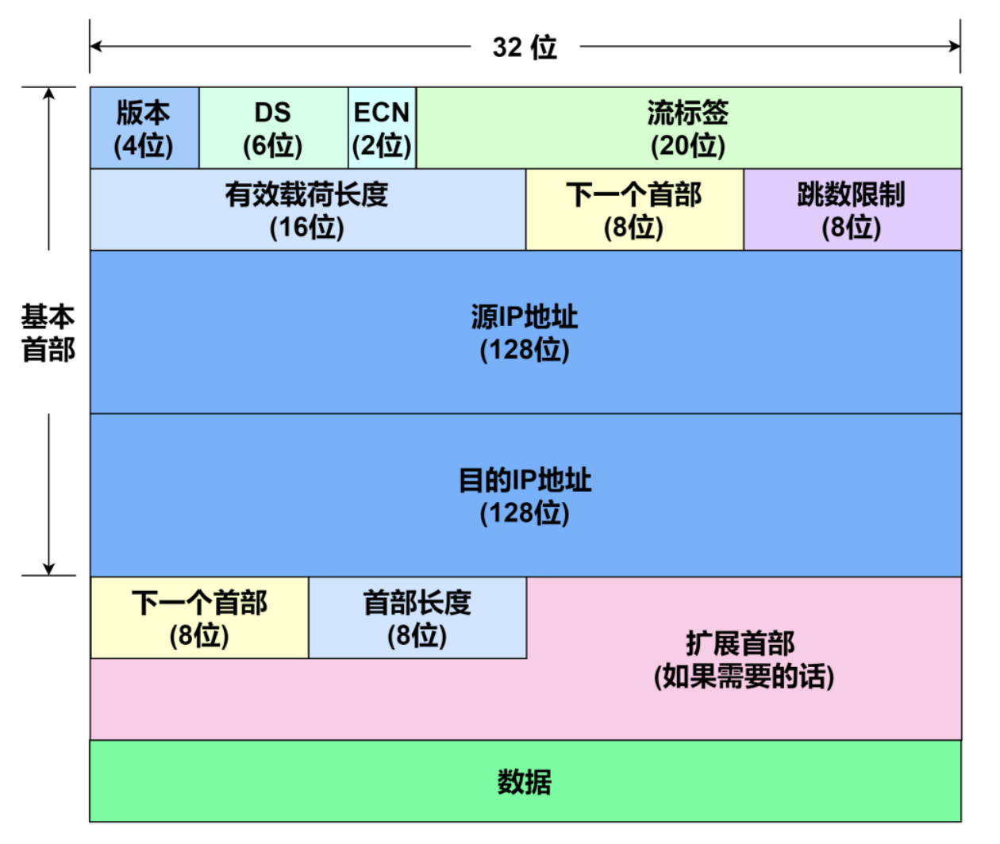</left>
>
> ---
>
> ###### 版本
>
> - 长度: 4 bit;
> - 作用: 规定了数据报的 IP 协议版本, 从而让路由器能够知道如何解释该数据报的剩余部分, IPv6 将该部分设置为 6 ;
>
> ---
>
> ###### 流量类型 (DS / ECN)
>
> - 总长度: 8 bit;
> - 作用
>     - DS (区分服务)
>         - 长度: 6 bit;
>         - 作用: (待补充)
>     - ECN (显示拥塞通知)
>         - 长度: 2 bit;
>         - 作用: (待补充)
>
> ---
>
> ###### 流标签
>
> - 长度: 20 bit;
> - 作用: 为特殊的流加上标签, 这些流特殊点在于, 它们可能需要不同的服务质量, 不同的实时性需求等;
>
> ---
>
> ###### 有效载荷长度
>
> - 长度: 16 bit;
> - 单位: byte;
> - 作用: 指示了在 IPv6 数据报的定长的 40 bytes 首部后面的数据长度;
>
> ---
>
> ###### 下一个首部
>
> - 长度: 8 bit;
>
> - 作用 1: 如果有扩展首部, 则指示扩展首部的类型
>
>     - 首部链: 层层 "下一个首部" 连成一个首部链, 图中从上到下的首部链越来越长
>         <left>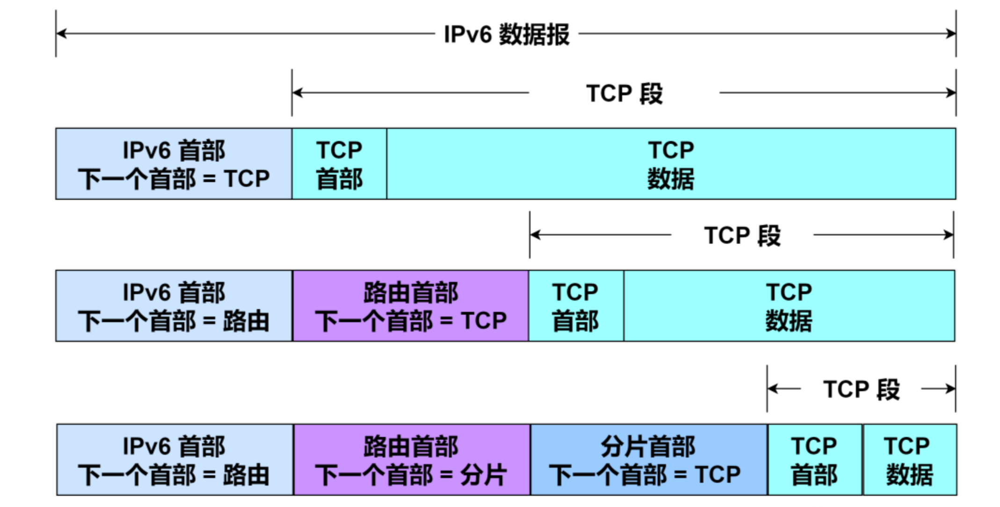</left>
>
>     - 常见的协议对应关系, 以及建议的顺序:
>
>         | 首部类型          | 顺序 |  值  |
>         | :---------------- | :--: | :--: |
>         | IPv6 首部         |  1   |  41  |
>         | 逐跳选项(HOPOPT)  |  2   |  0   |
>         | 目的地址项        | 3, 8 |  60  |
>         | 路由              |  4   |  43  |
>         | 分片              |  5   |  44  |
>         | 封装安全载荷(ESP) |  7   |  50  |
>         | 认证(AH)          |  6   |  51  |
>         | 移动(MIPv6)       |  9   | 135  |
>         | (没有下一个首部)  | 最后 |  59  |
>         | ICMPv6            | 最后 |  58  |
>         | UDP               | 最后 |  17  |
>         | TCP               | 最后 |  6   |
>         | 各种其他高层协议  | 最后 |  -   |
>
> - 作用 2: 如果没有扩展首部, 则与 IPv4 一致, 是标识数据报中的数据字段需要交付给下一个协议栈层的哪个协议 (例如: TCP 还是 UDP)
>
>     - 常见的协议对应关系
>
>         | 协议               | ICMP | IGMP | TCP  | UDP  | IPv6 | OSPF |
>         | ------------------ | ---- | ---- | ---- | ---- | ---- | ---- |
>         | "下一个首部"字段值 | 1    | 2    | 6    | 17   | 41   | 89   |
>
> ---
>
> ###### 跳数限制
>
> - 长度: 8 bit;
> - 作用: 限制数据报在网络层中的最大跳数, 防止分组在网络中因环等问题而无限转发;
>
> ---
>
> ###### 源 / 目的 IP 地址
>
> - 长度: 源 / 目的 IP 地址各占 128 位;

#### 从 IPv4 迁移到 IPv6: 建隧道 (tunneling)

> ###### 概念: 隧道
>
> - 两台将要沟通的 IPv6 设备之间的路径上包含的所有 IPv4 路由器的集合, 称为 "隧道";
>
> ---
>
> ###### 方法
>
> <left>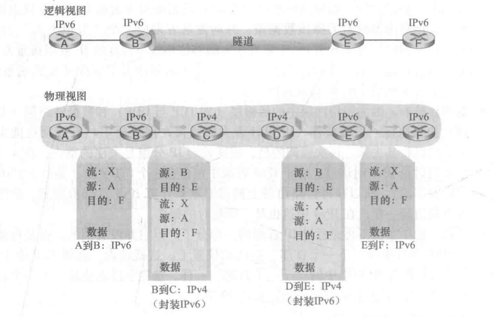</left>
>
> - 出/入隧道时, 进行解封装/封装, 在隧道中使用 IPv4 数据报的形式进行路由, 在隧道外, 使用 IPv6 的形式进行路由;
>     - IPv4 的协议字段 41 代表该数据报的数据部分为一个完整的 IPv6 数据报, 从而提示隧道出口的路由器进行解封装;
>     - 在隧道中, IPv6 数据报被作为数据部分, 封装在传统的 IPv4 数据报中, 在隧道中使用 IPv4 进行传输, 实现兼容性;

---

## § 4.4 通用转发和 SDN

### 通用转发 / 基于目的地转发

> ###### 基于目的地转发
>
> <left>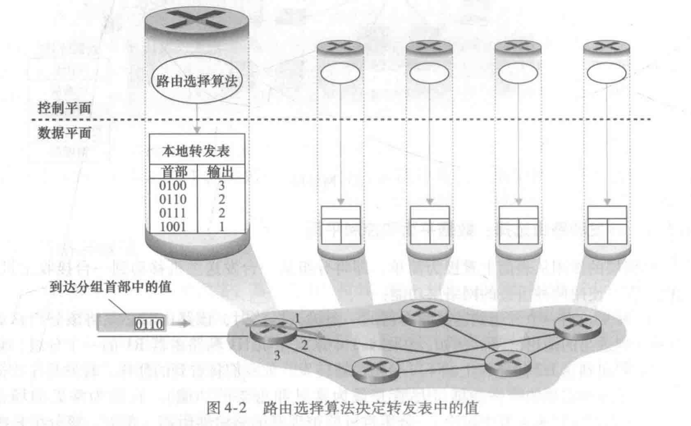 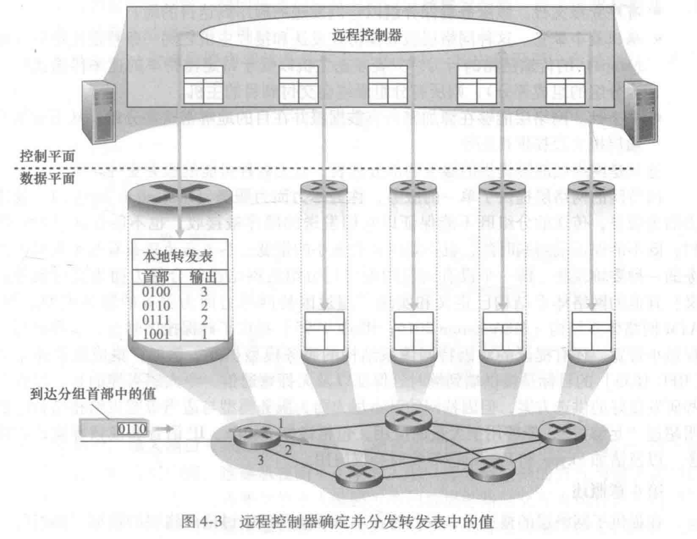</left>
>
> - 面向路由器 (网络层);
> - 只根据转发表项进行转发 (由目的 IP 地址决定), 而不考虑其他如负载均衡, NAT, 防火墙等, 它们交由中间盒完成;
>     - 匹配: 根据目的 IP 地址, 匹配特定输出端口;
>     - 动作: 发送到特定的输出端口;
>     - "匹配加动作"表: 转发表;
>
> ---
>
> ###### 通用转发
>
> <left>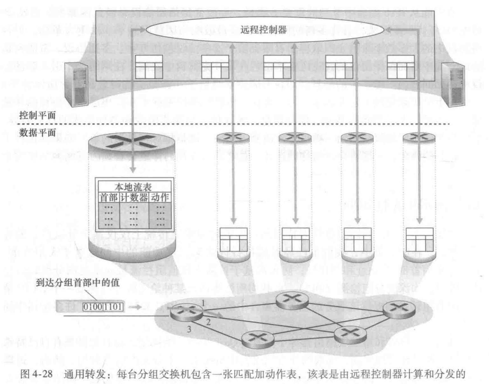</left>
>
> - 面向分组交换机 (包括链路层交换机和网络层路由器);
> - 将更多信息纳入 "匹配" 当中, 从而实现更加通用的转发;
>     - 匹配: 根据协议栈的多个首部字段, 决定动作;
>     - 动作: 以下的动作的子集;
>         - 将分组转发到一个或多个输出端口;
>         - 在多个输出端口之间进行负载均衡;
>         - 重写首部的值 (如: NAT);
>         - 像防火墙一样阻挡/丢弃某些分组;
>     - "匹配加动作" 表: OpenFlow 中的流表 (flow table)
>         - 由远程控制器进行计算, 安装和更新;
>         - 包括的表项:
>             1. 首部字段值的集合: 入分组将与其进行首部字段的匹配;
>                 - 如果找不到对应的流表项, 那么该分组将会被发往远程控制器做处理, 或者直接丢弃;
>             2. 计数器集合: 统计已经与该表项匹配过的分组的数量, 以及从该表项上次更新以来所经过的时间间隔;
>                 - 当一个分组与一个流表项匹配时, 更新该流表项的计数器;
>             3. 动作 (集合): 包含成功匹配流表项后所执行的动作的集合, 可能包含多个或 0 个动作;
>         - 流表的本质: 是一个 API , 通过抽象每台分组交换机的行为, 进行编程;

### OpenFlow 1.0

#### 匹配: OpenFlow 1.0 流表中的分组匹配字段

> <left>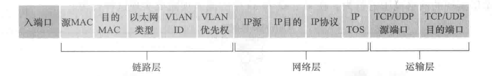</left>
>
> - 根据以上首部集合进行匹配;
> - 流表项中允许通配符 (\*);
> - 某些不在其中的首部, 比如 TTL字段, 数据报长度字段等, 是因为加入这些字段会使抽象变得臃肿, 降低效率;

#### 动作: 匹配流表项后对对应分组的处理

> ###### 一些重要的动作:
>
> - 转发
>     - 单播, 多播, 广播;
>     - 封装并发送到远程控制器, 然后远程控制器处理 (或不处理) 该分组, 如果处理, 则可能安装新的流表项, 进而可能会将该分组返回给设备, 基于新生成的流表项进行转发;
> - 丢弃: 匹配到的动作集合为空的分组, 应当被丢弃;
> - 修改字段: 在上述 OpenFlow 1.0 流表项中, 可以重写除了入端口字段和 IP 协议字段以外的所有其他 10 个字段;
>
> ---
>
> ###### 说明
>
> - 按照流表项中规定的次序执行;

---

